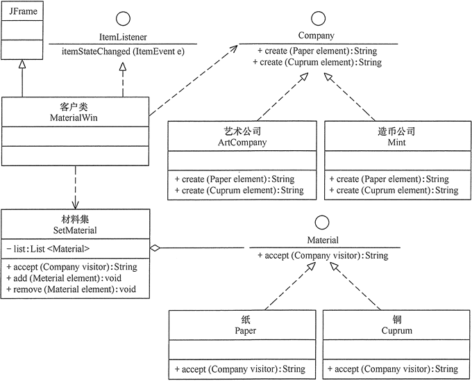
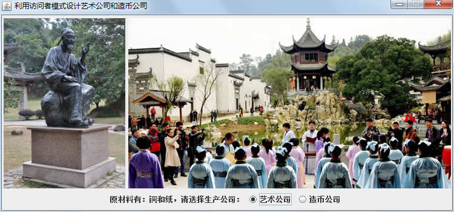
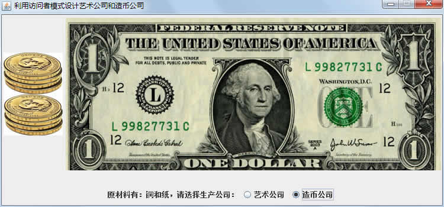

# 访问者模式（Visitor 模式）详解

在现实生活中，有些集合对象中存在多种不同的元素，且每种元素也存在多种不同的访问者和处理方式。例如，公园中存在多个景点，也存在多个游客，不同的游客对同一个景点的评价可能不同；医院医生开的处方单中包含多种药元素，査看它的划价员和药房工作人员对它的处理方式也不同，划价员根据处方单上面的药品名和数量进行划价，药房工作人员根据处方单的内容进行抓药。

这样的例子还有很多，例如，电影或电视剧中的人物角色，不同的观众对他们的评价也不同；还有顾客在商场购物时放在“购物车”中的商品，顾客主要关心所选商品的性价比，而收银员关心的是商品的价格和数量。

这些被处理的数据元素相对稳定而访问方式多种多样的数据结构，如果用“访问者模式”来处理比较方便。访问者模式能把处理方法从数据结构中分离出来，并可以根据需要增加新的处理方法，且不用修改原来的程序代码与数据结构，这提高了程序的扩展性和灵活性。

## 模式的定义与特点

访问者（Visitor）模式的定义：将作用于某种数据结构中的各元素的操作分离出来封装成独立的类，使其在不改变数据结构的前提下可以添加作用于这些元素的新的操作，为数据结构中的每个元素提供多种访问方式。它将对数据的操作与数据结构进行分离，是行为类模式中最复杂的一种模式。

访问者（Visitor）模式是一种对象行为型模式，其主要优点如下。

1.  扩展性好。能够在不修改对象结构中的元素的情况下，为对象结构中的元素添加新的功能。
2.  复用性好。可以通过访问者来定义整个对象结构通用的功能，从而提高系统的复用程度。
3.  灵活性好。访问者模式将数据结构与作用于结构上的操作解耦，使得操作集合可相对自由地演化而不影响系统的数据结构。
4.  符合单一职责原则。访问者模式把相关的行为封装在一起，构成一个访问者，使每一个访问者的功能都比较单一。

访问者（Visitor）模式的主要缺点如下。

1.  增加新的元素类很困难。在访问者模式中，每增加一个新的元素类，都要在每一个具体访问者类中增加相应的具体操作，这违背了“开闭原则”。
2.  破坏封装。访问者模式中具体元素对访问者公布细节，这破坏了对象的封装性。
3.  违反了依赖倒置原则。访问者模式依赖了具体类，而没有依赖抽象类。

## 模式的结构与实现

访问者（Visitor）模式实现的关键是如何将作用于元素的操作分离出来封装成独立的类，其基本结构与实现方法如下。

#### 1\. 模式的结构

访问者模式包含以下主要角色。

1.  抽象访问者（Visitor）角色：定义一个访问具体元素的接口，为每个具体元素类对应一个访问操作 visit() ，该操作中的参数类型标识了被访问的具体元素。
2.  具体访问者（ConcreteVisitor）角色：实现抽象访问者角色中声明的各个访问操作，确定访问者访问一个元素时该做什么。
3.  抽象元素（Element）角色：声明一个包含接受操作 accept() 的接口，被接受的访问者对象作为 accept() 方法的参数。
4.  具体元素（ConcreteElement）角色：实现抽象元素角色提供的 accept() 操作，其方法体通常都是 visitor.visit(this) ，另外具体元素中可能还包含本身业务逻辑的相关操作。
5.  对象结构（Object Structure）角色：是一个包含元素角色的容器，提供让访问者对象遍历容器中的所有元素的方法，通常由 List、Set、Map 等聚合类实现。

其结构图如图 1 所示。


图 1 访问者（Visitor）模式的结构图（[点此查看原图](http://c.biancheng.net/uploads/allimg/181119/3-1Q119101429D6.gif)）

#### 2\. 模式的实现

访问者模式的实现代码如下：

```
package visitor;
import java.util.*;
public class VisitorPattern
{
    public static void main(String[] args)
    {
        ObjectStructure os=new ObjectStructure();
        os.add(new ConcreteElementA());
        os.add(new ConcreteElementB());
        Visitor visitor=new ConcreteVisitorA();
        os.accept(visitor);
        System.out.println("------------------------");
        visitor=new ConcreteVisitorB();
        os.accept(visitor);
    }
}
//抽象访问者
interface Visitor
{
    void visit(ConcreteElementA element);
    void visit(ConcreteElementB element);
}
//具体访问者 A 类
class ConcreteVisitorA implements Visitor
{
    public void visit(ConcreteElementA element)
    {
        System.out.println("具体访问者 A 访问-->"+element.operationA());
    }
    public void visit(ConcreteElementB element)
    {
        System.out.println("具体访问者 A 访问-->"+element.operationB());
    }
}
//具体访问者 B 类
class ConcreteVisitorB implements Visitor
{
    public void visit(ConcreteElementA element)
    {
        System.out.println("具体访问者 B 访问-->"+element.operationA());
    }
    public void visit(ConcreteElementB element)
    {
        System.out.println("具体访问者 B 访问-->"+element.operationB());
    }
}
//抽象元素类
interface Element
{
    void accept(Visitor visitor);
}
//具体元素 A 类
class ConcreteElementA implements Element
{
    public void accept(Visitor visitor)
    {
        visitor.visit(this);
    }
    public String operationA()
    {
        return "具体元素 A 的操作。";
    }
}
//具体元素 B 类
class ConcreteElementB implements Element
{
    public void accept(Visitor visitor)
    {
        visitor.visit(this);
    }
    public String operationB()
    {
        return "具体元素 B 的操作。";
    }
}
//对象结构角色
class ObjectStructure
{   
    private List<Element> list=new ArrayList<Element>();   
    public void accept(Visitor visitor)
    {
        Iterator<Element> i=list.iterator();
        while(i.hasNext())
        {
            ((Element) i.next()).accept(visitor);
        }      
    }
    public void add(Element element)
    {
        list.add(element);
    }
    public void remove(Element element)
    {
        list.remove(element);
    }
}
```

程序的运行结果如下：

```
具体访问者 A 访问-->具体元素 A 的操作。
具体访问者 A 访问-->具体元素 B 的操作。
------------------------
具体访问者 B 访问-->具体元素 A 的操作。
具体访问者 B 访问-->具体元素 B 的操作。
```

## 模式的应用实例

【例 1】利用“访问者（Visitor）模式”模拟艺术公司与造币公司的功能。

分析：艺术公司利用“铜”可以设计出铜像，利用“纸”可以画出图画；造币公司利用“铜”可以印出铜币，利用“纸”可以印出纸币（[点此下载运行该程序后所要显示的图片](http://c.biancheng.net/uploads/soft/181113/3-1Q119103045.zip)）。对“铜”和“纸”这两种元素，两个公司的处理方法不同，所以该实例用访问者模式来实现比较适合。

首先，定义一个公司（Company）接口，它是抽象访问者，提供了两个根据纸（Paper）或铜（Cuprum）这两种元素创建作品的方法；再定义艺术公司（ArtCompany）类和造币公司（Mint）类，它们是具体访问者，实现了父接口的方法；然后，定义一个材料（Material）接口，它是抽象元素，提供了 accept（Company visitor）方法来接受访问者（Company）对象访问；再定义纸（Paper）类和铜（Cuprum）类，它们是具体元素类，实现了父接口中的方法；最后，定义一个材料集（SetMaterial）类，它是对象结构角色，拥有保存所有元素的容器 List，并提供让访问者对象遍历容器中的所有元素的 accept（Company visitor）方法；客户类设计成窗体程序，它提供材料集（SetMaterial）对象供访问者（Company）对象访问，实现了 ItemListener 接口，处理用户的事件请求。图 2 所示是其结构图。


图 2 艺术公司与造币公司的结构图
程序代码如下：

```
package visitor;
import java.awt.event.*;
import java.util.*;
import javax.swing.*;
public class VisitorProducer
{
    public static void main(String[] args)
    {
        new MaterialWin();       
    }
}
//窗体类
class MaterialWin extends JFrame implements ItemListener
{
    private static final long serialVersionUID=1L;   
    JPanel CenterJP;
    SetMaterial os;    //材料集对象
    Company visitor1,visitor2;    //访问者对象
    String[] select;
    MaterialWin()
    {
        super("利用访问者模式设计艺术公司和造币公司");
        JRadioButton Art;
        JRadioButton mint;           
        os=new SetMaterial();     
        os.add(new Cuprum());
        os.add(new Paper());
        visitor1=new ArtCompany();//艺术公司
        visitor2=new Mint(); //造币公司      
        this.setBounds(10,10,750,350);            
        this.setResizable(false);       
        CenterJP=new JPanel();       
        this.add("Center",CenterJP);      
        JPanel SouthJP=new JPanel();
        JLabel yl=new JLabel("原材料有：铜和纸，请选择生产公司：");
        Art=new JRadioButton("艺术公司",true);
        mint=new JRadioButton("造币公司");
        Art.addItemListener(this);
        mint.addItemListener(this);       
        ButtonGroup group=new ButtonGroup();
        group.add(Art);
        group.add(mint);
        SouthJP.add(yl);
        SouthJP.add(Art);
        SouthJP.add(mint);
        this.add("South",SouthJP);       
        select=(os.accept(visitor1)).split(" ");    //获取产品名
        showPicture(select[0],select[1]);    //显示产品
    }
    //显示图片
    void showPicture(String Cuprum,String paper)
    {
        CenterJP.removeAll();    //清除面板内容
        CenterJP.repaint();    //刷新屏幕
        String FileName1="src/visitor/Picture/"+Cuprum+".jpg";
        String FileName2="src/visitor/Picture/"+paper+".jpg";
        JLabel lb=new JLabel(new ImageIcon(FileName1),JLabel.CENTER);
        JLabel rb=new JLabel(new ImageIcon(FileName2),JLabel.CENTER);
        CenterJP.add(lb);
        CenterJP.add(rb);
        this.setVisible(true);
        this.setDefaultCloseOperation(JFrame.EXIT_ON_CLOSE);            
    }
    @Override
    public void itemStateChanged(ItemEvent arg0)
    {
        JRadioButton jc=(JRadioButton) arg0.getSource();
        if (jc.isSelected())
        {
            if (jc.getText()=="造币公司")
            {
                select=(os.accept(visitor2)).split(" ");
            }
            else
            {            
                select=(os.accept(visitor1)).split(" ");
            }
            showPicture(select[0],select[1]);    //显示选择的产品
        }    
    }
}
//抽象访问者:公司
interface Company
{
    String create(Paper element);
    String create(Cuprum element);
}
//具体访问者：艺术公司
class ArtCompany implements Company
{
    public String create(Paper element)
    {
        return "讲学图";
    }
    public String create(Cuprum element)
    {
        return "朱熹铜像";
    }
}
//具体访问者：造币公司
class Mint implements Company
{
    public String create(Paper element)
    {
        return "纸币";
    }
    public String create(Cuprum element)
    {
        return "铜币";
    }
}
//抽象元素：材料
interface Material
{
    String accept(Company visitor);
}
//具体元素：纸
class Paper implements Material
{
    public String accept(Company visitor)
    {
        return(visitor.create(this));
    }
}
//具体元素：铜
class Cuprum implements Material
{
    public String accept(Company visitor)
    {
        return(visitor.create(this));
    }
}
//对象结构角色:材料集
class SetMaterial
{   
    private List<Material> list=new ArrayList<Material>();   
    public String accept(Company visitor)
    {
        Iterator<Material> i=list.iterator();
        String tmp="";
        while(i.hasNext())
        {
            tmp+=((Material) i.next()).accept(visitor)+" ";
        }
        return tmp; //返回某公司的作品集     
    }
    public void add(Material element)
    {
        list.add(element);
    }
    public void remove(Material element)
    {
        list.remove(element);
    }
}
```

程序运行结果如图 3 所示。


(a)艺术公司设计的产品

(b)造币公司生产的货币
图 3 艺术公司与造币公司的运行结果

## 模式的应用场景

通常在以下情况可以考虑使用访问者（Visitor）模式。

1.  对象结构相对稳定，但其操作算法经常变化的程序。
2.  对象结构中的对象需要提供多种不同且不相关的操作，而且要避免让这些操作的变化影响对象的结构。
3.  对象结构包含很多类型的对象，希望对这些对象实施一些依赖于其具体类型的操作。

## 模式的扩展

访问者（Visitor）模式是使用频率较高的一种设计模式，它常常同以下两种设计模式联用。

(1)与“迭代器模式”联用。因为访问者模式中的“对象结构”是一个包含元素角色的容器，当访问者遍历容器中的所有元素时，常常要用迭代器。如【例 1】中的对象结构是用 List 实现的，它通过 List 对象的 Itemtor() 方法获取迭代器。如果对象结构中的聚合类没有提供迭代器，也可以用迭代器模式自定义一个。

(2)访问者（Visitor）模式同“组合模式”联用。因为访问者（Visitor）模式中的“元素对象”可能是叶子对象或者是容器对象，如果元素对象包含容器对象，就必须用到组合模式，其结构图如图 4 所示。


图 4 包含组合模式的访问者模式的结构图