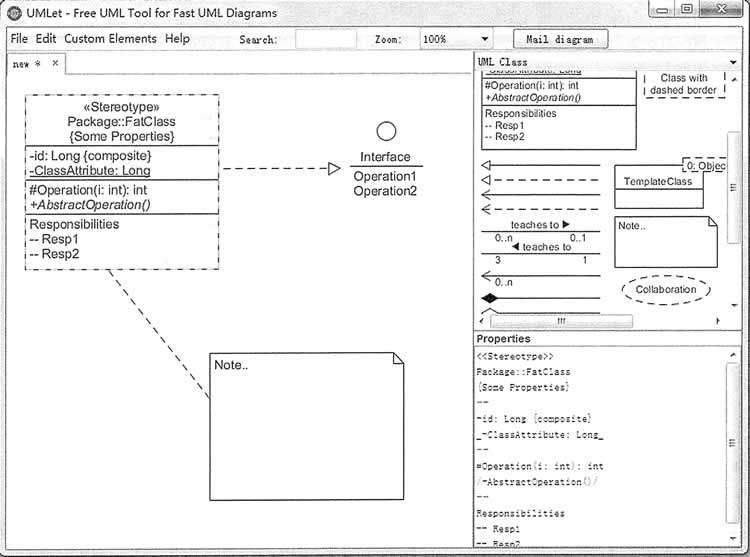
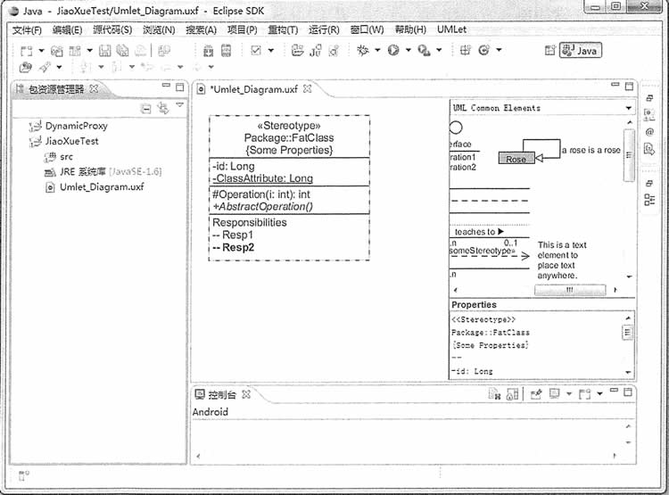
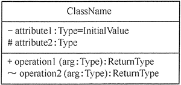
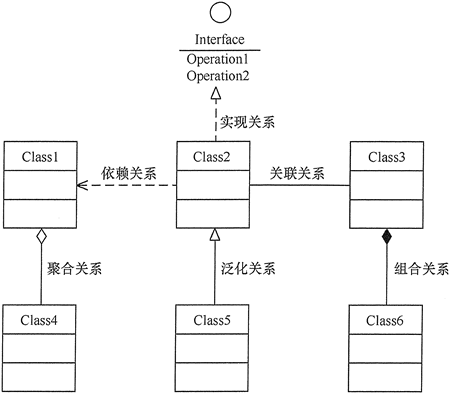
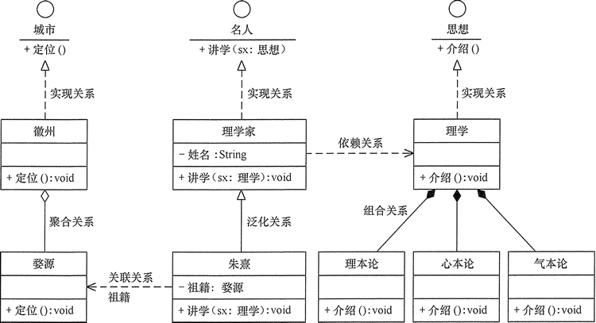

# UMLet 的使用与类图的设计

本实验是为后续实验做准备的。在本书中，各个程序实例都要画类图，所以读者必须掌握用某种 UML 建模工具来画类图，本书选择 UMLet 作为 UML 的建模工具。

## 实验目的

本实验的主要目的如下。

*   理解类的基本概念，掌握如何从需求分析中抽象出类的方法。
*   理解类之间关系，掌握如何分析具体实例中的类之间的关系。
*   掌握在 UMLet 中绘制类图的基本操作方法。

## 实验原理

### 1\. UMLet 的使用

UMLet 是一款免费且开源的 UML 建模工具，它可以将原型导出为 bmp、eps、gif、jpg、pdf、png、svg 等格式，还可以集成到 Eclipse 中，作为 Eclipse 的插件在 Windows、Mac OS 和 Linux 等平台上运行。它可在 UMLet 官网下载安装。

用 UMLet 建模非常简单，方法如下：首先打开 UMLet，然后在窗体右上侧区域内双击想要添加的对象，该对象将被自动添加到面板中；再选中刚刚添加进来的对象，并在右下角的属性面板中修改该对象的属性；最后保存创建完成的 UML 模型图。如果需要还可将结果导出为其他格式的文件，如图 1 所示。

图 1 UMLet 14.2 的运行界面
如果要在 Eclipse 中安装 UMLet 插件，其方法如下。

1.  下载相关版本的 UMLet 插件的压缩包，然后将解压的文件 com.umlet.plugin-14.2.jar 复制到 Eclipse 下的 plugins 目录下。
2.  重启 Eclipse，选择“文件(F)” — 新建(N) ” — “其他(0)…” —“UMlet Diagram”，建立 UML 模型，如图 2 所示。

图 2 在 Eclipse 中安装 UMLet 插件
UMLet 在 Eclipse 中的使用方法同前面介绍的一样。

### 2\. 类图的 UML 表示

UML 中定义了用例图、类图、对象图、状态图、活动图、时序图、协作图、构件图、部署图等 9 种图形，在“软件设计模式”中经常用到的是类图，所以本实验主要介绍类图的画法，以及类与类之间的关系。

#### (1) 类

类是面向对象系统组织结构的核心，它是对一组具有相同属性、操作、关系和语义的对象的抽象。在 UML 中，类使用带有分隔线的矩形来表示，它包括名称部分（Name）、属性部分（Attribute）和操作部分（Operation）。

其中，属性的表示形式是：[可见性]属性名:类型[=默认值]

操作的表示形式是：[可见性]名称(参数列表)[:返回类型]

注意：“可见性”包括公有（public）、私有（private）、受保护（protected）和朋友（fiiendly）等 4 种，在类图中分别用符号+、-、#、~来表示。

图 3 所示是类的 UML 图形表示方式。

图 3 类的 UML 画法

#### (2) 类之间的关系

在软件系统中，类不是孤立存在的，类与类之间存在各种关系。根据类与类之间的耦合度从弱到强排列，有依赖关系、关联关系、聚合关系、组合关系、泛化关系和实现关系等 6 种，它们的功能在 UML 中的类图及类图之间的关系一文中已经介绍，下面介绍它们在 UML 中的表示方式。

1.  依赖关系（Dependency），使用带箭头的虚线来表示，箭头从使用类指向被依赖的类。
2.  关联关系（Association），分为双向关联和单向关联两种。其中，双向关联可以用带两个箭头或者没有箭头的实线来表示，单向关联用带一个箭头的实线来表示，箭头从使用类指向被关联的类。还可以在关联线的两端标注角色名，补充说明它们的角色。
3.  聚合关系（Aggregation），用带空心菱形的实线来表示，菱形指向整体。
4.  组合关系（Composition），用带实心菱形的实线来表示，菱形指向整体。
5.  泛化关系（Generalization），用带空心三角箭头的实线来表示，箭头从子类指向父类。
6.  实现关系（Realization），用带空心三角箭头的虚线来表示，箭头从实现类指向接口。

图 4 所示是类之间的关系在 UML 中的图形表示方式。

图 4 UML 中的类的关系图
实验内容

(1) 通过对“类之间的关系”的学习，在生活中找到相关实例。

(2) 用 UMLet 对以上实例中的类的关系建模。

## 实验要求

所设计的实验必须满足以下两点。

1.  类图中至少有一个类包含相关属性和方法，目的是掌握属性和方法的画法。
2.  所举的若干实例要包含前面介绍的 UML 类与类之间的 6 种关系，并正确画出其相互关系图。

## 实验步骤

(1)进行需求分析，从生活中提取出相关实例。

(2)分析以上实例，找到相关类并确定它们之间的关系，然后利用 UMLet 画出类以及类之间的关系图，图 5 以对理学家朱熹的介绍为例介绍类图的画法。

图 5 UML 中的类之间关系实例图
(3)整理实验结果，写出实验的心得体会。