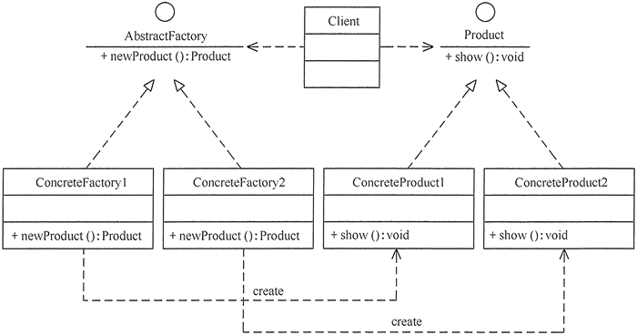
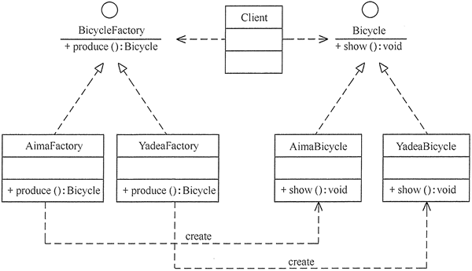
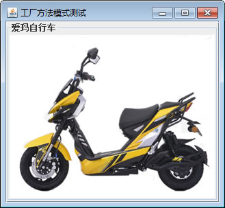

# 创建型模式应用实验

创建型模式（Creational Pattern）的主要特点是将对象的创建与使用分离，根据对象的创建与组合方式的不同，创建型模式可分为单例（Singleton）模式、原型（Prototype）模式、工厂方法（Factory Method）模式、抽象工厂（Abstract Factory）模式和建造者（Builder）模式 5 种。

本实验的主要目的如下。

1.  了解 5 种“创建型模式”的定义、特点和工作原理。
2.  理解 5 种“创建型模式”的结构、实现和应用场景。
3.  学会应用 5 种“创建型模式”进行软件开发。

## 实验原理

#### 1\. 创建型模式的工作原理

创建型模式隐藏了对象的创建细节，对象的创建由相关的工厂来完成，使用者不需要关注对象的创建细节，这样可以降低系统的耦合度。创建型模式共 5 种，它们分别是单例模式、原型模式、工厂方法模式、抽象工厂模式和建造者模式，其工作原理在各自的教程中也都有详细的介绍，每种模式的实验大概要花 2 个学时，大家可以根据实验计划来选做若干个实验，下面以工厂方法模式为例，介绍其实验过程。

#### 2\. 工厂方法模式的工作原理

工厂方法模式（Factory Method Pattern），也叫虚拟构造器（Virtual Constructor）模式或者多态工厂（Polymorphic Factory）模式。

在工厂方法模式中，工厂父类负责定义创建产品对象的公共接口，而工厂子类则负责生成具体的产品对象，这样做的目的是将产品类的实例化操作延迟到工厂子类中完成。其结构图如图 1 所示。


图 1 工厂方法模式的类图
工厂方法模式包含如下角色。

*   抽象工厂（Abstract Factory）：提供了创建产品的接口，调用者通过它访问具体工厂的工厂方法 newProduct() 来创建产品。
*   具体工厂（ConcreteFactory）：主要是实现抽象工厂中的抽象方法，完成具体产品的创建。
*   抽象产品（Product）：定义了产品的规范，描述了产品的主要特性和功能。
*   具体产品（ConcreteProduct）：实现了抽象产品角色所定义的接口，由具体工厂来创建，它同具体工厂之间一一对应。

工厂方法模式的特点是当系统扩展需要添加新的产品对象时，仅仅需要添加一个具体产品对象以及一个具体工厂对象，原有工厂对象不需要进行任何修改，也不需要修改客户端，很好地符合了“开闭原则”。

## 实验内容

(1) 用工厂方法模式设计一个电动自行车工厂的模拟程序。

要求：要为每种品牌的电动自行车提供一个子工厂，如爱玛工厂专门负责生产爱玛（Aima）牌电动自行车，雅迪工厂专门负责生产雅迪（Yadea）牌电动自行车。如果今后需要生产台铃（Tailg）牌电动自行车，只需要增加一个新的台铃电动自行车工厂即可，无须修改原有代码，使得整个系统具有更强的灵活性和可扩展性。（[点此下载程序运行后所要显示的图片](http://c.biancheng.net/uploads/soft/181113/3-1Q1191F339.zip)）。

(2) 按照以上要求设计类图和编写 Java 源程序。

## 实验要求

所设计的实验程序要满足以下两点。

1.  体现“工厂方法模式”的工作原理。
2.  符合面向对象中的“开闭原则”。

## 实验步骤

(1) 用 UML 设计“电动自行车工厂模拟程序”的结构图。“电动自行车工厂模拟程序”的结构图如图 2 所示。


图 2 电动自行车工厂模拟程序的结构图
(2) 根据结构图写出“电动自行车工厂模拟程序”的源代码。

① 电动自行车工厂模拟程序的源代码如下。

```
package FactoryMethod;
import java.awt.*;
import javax.swing.*;
public class BicycleFactoryTest
{
    public static void main(String[] args)
    {
        try
        {
            Bicycle a;
            BicycleFactory bf;
            bf=(BicycleFactory) ReadXML.getObject();
            a=bf.produce();
            a.show();
        }
        catch(Exception e)
        {
            System.out.println(e.getMessage());
        }
    }
}
//抽象产品：自行车
interface Bicycle
{
    public void show();
}
//具体产品：爱玛自行车
class AimaBicycle implements Bicycle
{
    JScrollPane sp;
    JFrame jf=new JFrame("工厂方法模式测试");
    public AimaBicycle()
    {       
        JPanel p1=new JPanel();
        p1.setLayout(new GridLayout(1,1));
        p1.setBorder(BorderFactory.createTitledBorder("爱玛自行车"));
        JLabel l1=new JLabel(new ImageIcon("src/FactoryMethod/AIMABicycle.jpg"));
        p1.add(l1);       
        sp=new JScrollPane(p1);
        Container contentPane=jf.getContentPane();
        contentPane.add(sp,BorderLayout.CENTER);               
        jf.pack();       
        jf.setVisible(false);
        jf.setDefaultCloseOperation(JFrame.EXIT_ON_CLOSE);    //用户点击窗口关闭 
    }
    public void show()
    {
        jf.setVisible(true);
    }
}
//具体产品：雅迪自行车
class YadeaBicycle implements Bicycle
{
    JScrollPane sp;
    JFrame jf=new JFrame("工厂方法模式测试");
    public YadeaBicycle()
    {       
        JPanel p1=new JPanel();
        p1.setLayout(new GridLayout(1,1));
        p1.setBorder(BorderFactory.createTitledBorder("雅迪自行车"));
        JLabel l1=new JLabel(new ImageIcon("src/FactoryMethod/YadeaBicycle.jpg"));
        p1.add(l1);   
        Container contentPane=jf.getContentPane();
        sp=new JScrollPane(p1);       
        contentPane.add(sp, BorderLayout.CENTER);       
        jf.pack();       
        jf.setVisible(false);
        jf.setDefaultCloseOperation(JFrame.EXIT_ON_CLOSE);    //用户点击窗口关闭 
    }
    public void show()
    {
        jf.setVisible(true);
    }
}
//抽象工厂：自行车工厂
interface BicycleFactory
{
    public Bicycle produce();
}
//具体工厂：爱玛工厂
class AimaFactory implements BicycleFactory
{
    public Bicycle produce()
    {
        System.out.println("爱玛自行车生产了！");
        return new AimaBicycle();
    }
}
//具体工厂：雅迪工厂
class YadeaFactory implements BicycleFactory
{
    public Bicycle produce()
    {
        System.out.println("雅迪自行车生产了！");
        return new YadeaBicycle();
    }
}
```

② 对象生成器的源代码如下。

```
package FactoryMethod;
import javax.xml.parsers.*;
import org.w3c.dom.*;
import java.io.*;
class ReadXML
{
    public static Object getObject()
    {
        try
        {
            DocumentBuilderFactory dFactory=DocumentBuilderFactory.newInstance();
            DocumentBuilder builder=dFactory.newDocumentBuilder();
            Document doc;                           
            doc=builder.parse(new File("src/FactoryMethod/config.xml"));
            NodeList nl=doc.getElementsByTagName("className");
            Node classNode=nl.item(0).getFirstChild();
            String cName="FactoryMethod."+classNode.getNodeValue();
            System.out.println("新类名："+cName);
            Class<?> c=Class.forName(cName);
              Object obj=c.newInstance();
            return obj;
        }  
        catch(Exception e)
        {
               e.printStackTrace();
               return null;
        }
    }
}
```

③XML 配置文件的代码如下。

```
<?xml version="1.0" encoding="UTF-8"?>
<config>
    <className>AimaFactory</className>
</config>
```

(3) 上机测试程序，写出运行结果。

“电动自行车工厂模拟程序”的运行结果如图 3 所示。


图 3 电动自行车工厂模拟程序的运行结果
(4) 按同样的步骤设计其他“创建型模式”的程序实例。

(5) 写出实验心得。