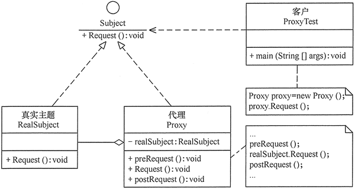
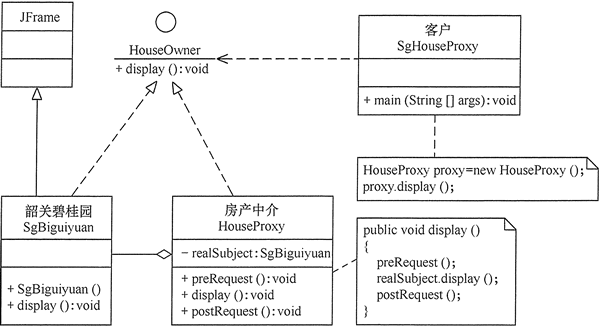
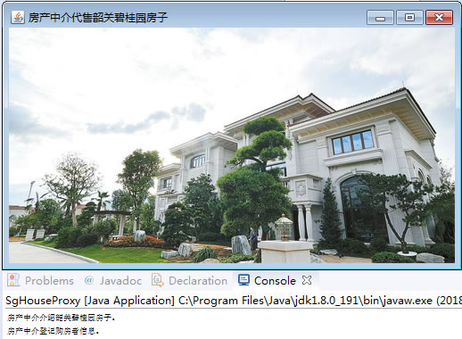

# 结构型模式应用实验

结构型模式（Structural Pattern）描述如何将类或者对象结合在一起形成更大的结构，就像搭积木， 可以通过简单积木的组合形成复杂的、功能更为强大的结构。结构型模式可以分为类结构型模式和对象结构型模式，也可分为代理模式（Proxy）、适配器模式（Adapter）、桥接模式（Bridge）、装饰模式 （Decorator ）、外观模式（Facade）、享元模式（Flyweight）和组合模式（Composite）等 7 类。

## 实验目的

本实验的主要目的如下。

1.  了解 7 种“结构型模式”的定义、特点和工作原理。
2.  理解 7 种“结构型模式”的结构、实现和应用场景。
3.  学会应用 7 种“结构型模式”进行软件开发。

## 实验原理

#### 1\. 结构型模式的工作原理

结构型模式重点考虑类或对象的布局方式，其目的是将现有类或对象组成更大的结构。按照其显示方式的不同，结构型模式可分为类结构型模式和对象结构型模式。前者采用继承机制来组织接口和类，后者采用组合或聚合来组合对象。

由于组合关系和或聚合关系比继承关系耦合度低，满足“合成复用原则”，所以对象结构型模式比类结构型模式具有更大的灵活性。如果按目的来分，结构 型模式共 7 种，每种模式的实验大概要花 2 个学时，大家可以根据实验计划来选做若干个实验。下面以代理（Proxy）模式为例，介绍其实验过程。

#### 2\. 代理模式的工作原理

代理模式是在访问对象和目标对象之间增加一个代理对象，该对象起到中介作用和保护目标对象的作用。另外，它还可以扩展目标对象的功能，并且将客户端与目标对象分离，这在一定程度上降低了系统的耦合度。

代理模式的结构比较简单，主要是通过定义一个继承抽象主题的代理来包含真实主题，从而实现对真实主题的访问，其结构图如图 1 所示。


图 1 代理模式的结构图
代理模式的主要角色如下。

1.  抽象主题（Subject）类：通过接口或抽象类声明真实主题和代理对象实现的业务方法。
2.  真实主题（Real Subject）类：实现了抽象主题中的具体业务，是代理对象所代表的真实对象，是最终要引用的对象。
3.  代理（Proxy）类：提供了与真实主题相同的接口，其内部含有对真实主题的引用，它可以访问或控制或扩展真实主题的功能。

## 实验内容

(1) 用代理模式设计一个房产中介的模拟程序。

要求：房产中介有介绍和代售韶关碧桂园房子的权利，以及登记购房者信息权利。这里的房产中介是代理者，韶关碧桂园是真实主题。

(2) 按照以上要求设计类图和编写 Java 源程序。

## 实验要求

所设计的实验程序要满足以下两点。

1.  体现“代理模式”的工作原理。
2.  符合面向对象中的“开闭原则”和“里氏替换原则”。

## 实验步骤

(1) 用 UML 设计“房产中介”模拟程序的结构图。

“房产中介”模拟程序的结构图如图 2 所示。


图 2 房产中介模拟程序的结构图
(2) 根据结构图写出“房产中介”模拟程序的源代码。

房产中介模拟程序的源代码如下。

```
package proxy;
import java.awt.*;
import javax.swing.*;
public class SgHouseProxy
{
    public static void main(String[] args)
    {
        HouseProxy proxy=new HouseProxy();
        proxy.display();
    }
}
//抽象主题：房主
interface HouseOwner
{
    void display();
}
//真实主题：韶关碧桂园
class SgBiguiyuan extends JFrame implements HouseOwner
{
    private static final long serialVersionUID=1L;
    public SgBiguiyuan()
    {
        super("房产中介代售韶关碧桂园房子");                    
    }
    public void display()
    {       
        this.setLayout(new GridLayout(1,1));
        JLabel l1=new JLabel(new ImageIcon("src/proxy/SgBiguiyuan.jpg"));
        this.add(l1);   
        this.pack();
        this.setVisible(true);
        this.setDefaultCloseOperation(JFrame.EXIT_ON_CLOSE);
    }
}
//代理：房产中介
class HouseProxy implements HouseOwner
{
    private SgBiguiyuan realSubject=new SgBiguiyuan();
    public void display()
    {
        preRequest();
        realSubject.display();
        postRequest();
    }
    public void preRequest()
    {
          System.out.println("房产中介介绍韶关碧桂园房子。");
    }
    public void postRequest()
    {
          System.out.println("房产中介登记购房者信息。");
    }
}
```

(3) 上机测试程序，写出运行结果。

“房产中介”模拟程序的运行结果如图 3 所示。


图 3 房产中介模拟程序的运行结果
(4) 按同样的步骤设计其他“结构型模式”的程序实例。

(5) 写出实验心得。