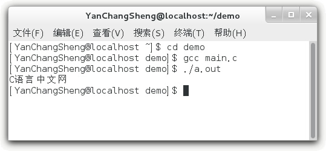
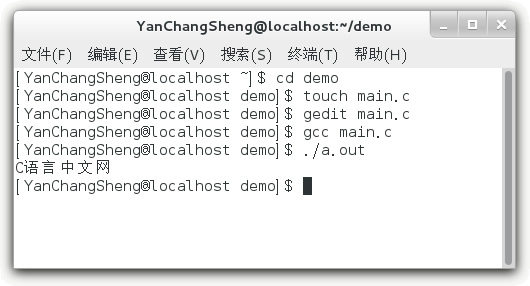

# GCC 编译 C 语言程序完整演示

GCC 仅仅是一个编译器，没有界面，必须在命令行模式下使用。通过`gcc`命令就可以将源文件编译成可执行文件。

GCC 既可以一次性完成 C 语言源文件的编译，也可以分步骤完成。本节将完整演示如何一次性完成源文件的编译（初学者也经常会这么做），下节将演示分步骤编译源文件。

本节以下面的 C 语言代码为例进行演示：

```
#include <stdio.h>
int main()
{
    puts("C 语言中文网");
    return 0;
}
```

#### 1) 生成可执行程序

最简单的生成可执行文件的写法为：

$ cd demo  #进入源文件所在的目录
$ gcc main.c  #在 gcc 命令后面紧跟源文件名

> `#`表示注释，读者可以不写，我写上是为了让读者明白每个命令的含义。`#`是 Shell 中的注释格式。

打开 demo 目录，会看到多了一个名为 a.out 的文件，这就是最终生成的可执行文件，如下图所示：这样就一次性完成了编译和链接的全部过程，非常方便。

> 注意：不像 Windows，Linux 不以文件后缀来区分可执行文件，Linux 下的可执行文件后缀理论上可以是任意的，这里的`.out`只是用来表明它是 GCC 的输出文件。不管源文件的名字是什么，GCC 生成的可执行文件的默认名字始终是`a.out`。

如果不想使用默认的文件名，那么可以通过`-o`选项来自定义文件名，例如：

$ gcc main.c -o main.out

这样生成的可执行程序的名字就是`main.out`。

因为 Linux 下可执行文件的后缀仅仅是一种形式上的，所以可执行文件也可以不带后缀，例如：

$ gcc main.c -o main

这样生成的可执行程序的名字就是`main`。

通过`-o`选项也可以将可执行文件输出到其他目录，并不一定非得在当前目录下，例如：

$ gcc main.c -o ./out/main.out

或者

$ gcc main.c -o out/main.out

表示将可执行文件输出到当前目录下的`out`目录，并命名为`main.out`。`./`表示当前目录，如果不写，默认也是当前目录。

> 注意：out 目录必须存在，如果不存在，gcc 命令不会自动创建，而是抛出一个错误。

#### 2) 运行可执行程序

上面我们生成了可执行程序，那么该如何运行它呢？很简单，在控制台中输入程序的名字就可以，如下所示：

$ ./a.out

`./`表示当前目录，整条命令的意思是运行当前目录下的 a.out 程序。如果不写`./`，Linux 会到系统路径下查找 a.out，而系统路径下显然不存在这个程序，所以会运行失败。

> 所谓系统路径，就是环境变量指定的路径，我们可以通过修改环境变量添加自己的路径，或者删除某个路径。很多时候，一条 Linux 命令对应一个可执行程序，如果执行命令时没有指明路径，那么就会到系统路径下查找对应的程序。

输入完上面的命令，按下回车键，程序就开始执行了，它会将输出结果直接显示在控制台上，如下所示：

$ cd demo
$ gcc main.c
$ ./a.out
C 语言中文网
$

下图演示了在控制台上的实际效果：如果程序在其它目录下，运行程序时还要带上目录的名字，例如：

$ ./out/main.out

或者

$ out/main.out

这个时候加不加`./`都一样，Linux 能够识别出`out`是一个目录，而不是一个命令，它默认会在当前路径下查找该目录，而不是去系统路径下查找，所以不加`./`也不会出错。

注意，如果程序没有执行权限，可以使用`sudo`命令来增加权限，例如：

$ sudo chmod 777 a.out

## 完整的演示

为了让读者有一个更加全面的认识，我们不妨将上面两部分的内容连接起来，完整的演示一下从编辑源文件到运行可执行程序的全过程：

$ cd demo  #进入源文件所在目录
$ touch main.c  #新建空白的源文件
$ gedit main.c  #编辑源文件
$ gcc main.c  #生成可执行程序
$ ./a.out  #运行可执行程序
C 语言中文网
$   #继续等待输入其它命令

下图是在控制台上的实际效果：