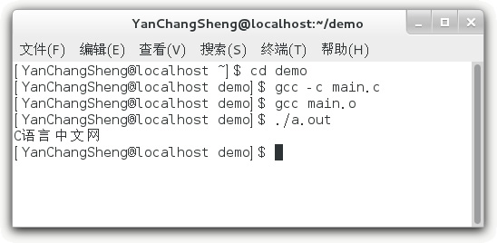

# GCC 分步骤编译 C 语言程序

上节《GCC 编译 C 语言程序完整演示》讲解的是通过`gcc`命令一次性完成编译和链接的整个过程，这样最方便，大家在学习 C 语言的过程中一般都这么做。实际上，`gcc`命令也可以将编译和链接分开，每次只完成一项任务。

本节将涉及到 C 语言程序的生成原理，如果你不了解，请转到《C 语言入门教程》学习。

本节以下面的 C 语言代码为例进行演示：

```
#include <stdio.h>
int main()
{
    puts("C 语言中文网");
    return 0;
}
```

## 1) 编译（Compile）

将源文件编译成目标文件需要使用`-c`选项，例如：

gcc -c main.c

就将 main.c 编译为 main.o。打开 demo 目录，就会看到 main.o：对于微软编译器（内嵌在 Visual C++ 或者 Visual Studio 中），目标文件的后缀为`.obj`；对于 GCC 编译器，目标文件的后缀为`.o`。

一个源文件会生成一个目标文件，多个源文件会生成多个目标文件，源文件数目和目标文件数目是一样的。通常情况下，默认的目标文件名字和源文件名字是一样的。

如果希望自定义目标文件的名字，那么可以使用`-o`选项，例如：

gcc -c main.c -o a.o

这样生成的目标文件的名字就是 a.o。

#### 2) 链接（Link）

在`gcc`命令后面紧跟目标文件的名字，就可以将目标文件链接成为可执行文件，例如：

gcc main.o

就将 main.o 链接为 a.out。打开 demo 目录，就会看到 a.out。

在`gcc`命令后面紧跟源文件名字或者目标文件名字都是可以的，`gcc`命令能够自动识别到底是源文件还是目标文件：如果是源文件，那么要经过编译和链接两个步骤才能生成可执行文件；如果是目标文件，只需要链接就可以了。

使用`-o`选项仍然能够自定义可执行文件的名字，例如：

gcc main.o -o main.out

这样生成的可执行文件的名字就是 main.out。

下面是一个完整的演示：

$ cd demo
$ gcc -c main.c
$ gcc main.o
$ ./a.out
C 语言中文网
$ 

在控制台上的真实效果为：