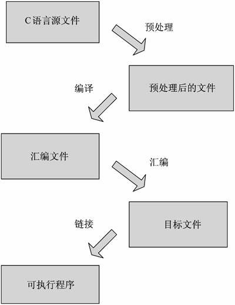

# GCC 编译流程

GCC 编译器在编译一个 C 语言程序时需要经过以下 4 步：

1.  将 C 语言源程序预处理，生成`.i`文件。
2.  预处理后的.i 文件编译成为汇编语言，生成`.s`文件。
3.  将汇编语言文件经过汇编，生成目标文件`.o`文件。
4.  将各个模块的`.o`文件链接起来生成一个可执行程序文件。

GCC 编译流程如下图所示：

`.i`文件、`.s`文件、`.o`文件可以认为是中间文件或临时文件，如果使用 GCC 一次性完成 C 语言程序的编译，那么只能看到最终的可执行文件，这些中间文件都是看不到的，因为 GCC 已经经它们删除了。

当然，可以使用 GCC 选项看到这些中间文件，下节我们会讲解 GCC 选项。