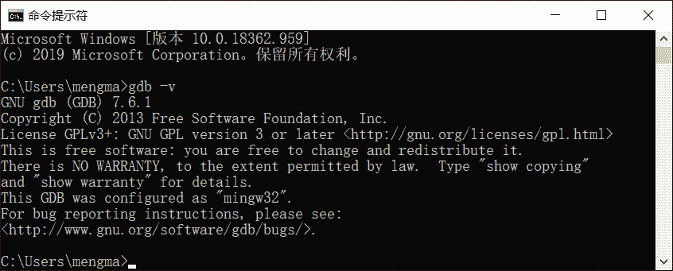

# Windows 平台安装 GDB 调试器

> 原文：[`c.biancheng.net/view/8296.html`](http://c.biancheng.net/view/8296.html)

前面介绍了如何将 GDB 调试器安装到 Linux 发行版系统中，其实它还能在 Windows 平台上使用。和前者不同，GDB 调试器无法直接安装到 Windows 平台上，如果想在 Windows 系统中使用 GDB 调试器，需要一个中间媒介，常用的就是 MinGW。

MinGw 全称 Minimalist GNU for Windows，应用于 Windows 平台，可以为我们提供一个功能有限的 Linux 系统环境以使用一些 GNU 工具，比如 GCC、GDB、gawk 等。也就是说，如果我们想将 GDB 安装到 Windows 平台，必须提前在该平台上打造出一个虚拟的 Linux 环境，MinGW 就可以帮我们完成这项工作。

由此，在 Windows 平台上安装 GDB 调试器的过程，分为如下 2 个步骤：

1.  下载并安装 MinGW；
2.  借助 MinGW 安装 GDB 调试器。

有关 MinGW 的下载和安装，我已经在《MinGW 下载和安装教程》一节中做了详细的讲解，这里不再重复赘述（安装好的 MinGW 如图 1 所示）。本节要重点介绍的，就是当安装完成 MinGW 之后，如何安装 GDB 调试器。
 
图 1 MinGW 安装完成 MinGW 安装 GDB 调试器

## MinGW 安装 GDB 调试器

使用 MinGW 安装 GDB 调试器的方法有 2 种，一种是利用 MinGW 的在线安装功能，由 MinGW 帮我们下载 GDB 并安装；另一种是由我们手动到 MinGW 官网上下载 GDB 安装包（本质是一个压缩包），然后将其解压到 MinGW 安装目录中的适当位置，由此完成 GDB 调试器的安装。

#### 1、在线安装 GDB 调试器

首先介绍较简单的第一种安装方法：

1) 打开图 1 所示的 MinGW，在右侧框中找到 mingw32-gdb-bin，并勾选它，如图 2 所示：

图 2 在线安装 GDB 调试器
2) 菜单栏中依次选择`Installation -> Apply Changes`，会弹出如下对话框：

图 3 开始安装 GDB 调试器
选择 "Apply"，MinGW 就会自动下载安装 GDB 调试器所需的包。此过程可能需要一段时间，读者耐心等待即可。看在如下对话框，证明 GDB 安装成功：

图 4 GDB 调试器成功安装

> 注意，在线安装过程中，GDB 安装包可能会下载失败。这种情况下，可以采用第 2 种安装方法。

#### 2、手动安装 GDB 调试器

当 MinGW 提示 GDB 调试器安装包下载失败时，我们可以自行打开 [MinGW 官网](https://sourceforge.net/projects/mingw/files/MinGW/Extension/gdb/)（如图 5 所示），下载所需版本的 GDB 调试器。

图 5 MinGW 官网下载 GDB 调试器安装包
本节，我们选择安装 7.6.1 版本的 GDB 调试器，点击`gdb-7.6.1-1`，然后找到`gdb-7.6.1-1-mingw32-bin.tar.lzma`，这是一个安装 GDB 的压缩包，直接点击即可开始下载：

图 6 下载 GDB 安装包
下载完成后，读者会得到`gdb-7.6.1-1-mingw32-bin.tar.lzma`压缩包，其内部包含一个`gdb-7.6.1-1-mingw32-bin.tar`的压缩包。所以，我们需要对下载的压缩包进行 2 次压缩，最终得到 bin 和 share 这 2 个文件夹。

将 bin 文件夹内的 2 个可执行文件 gdb.exe 和 gdbserver.exe 拷贝到 MinGW 安装目录中的 bin 文件夹内（本机 MinGW 安装目录为 E:\MinGW），即可完成 GDB 的安装。

#### 3、修改 PATH 环境变量

注意，无论采用以上哪种安装方式，最终都需要将 MinGW 的 bin 文件夹所在路径添加到 PATH 环境变量中。以本机为例，我将 MinGW 安装到 E:\MinGW 路径下，因此需要将 E:\MinGW\bin 添加至 PATH 环境变量中，如图 7 所示：

图 7 设置 PATH 环境变量

> PATH 环境变量打开方法是：右击计算机（我的电脑） -> 属性 -> 高级系统设置 -> 环境变量，建议读者修改当前用户的 PATH 环境变量。

由此，GDB 调试器就算安装成功了。打开命令行窗口，输入`gdb -v`命令，如果输入如下信息：

图 8 GDB 调试器安装成功的示意图
就证明 GDB 调试器安装成功，我们可以像在 Linux 系统中使用 GDB 那样，在 Windows 平台上使用 GDB 调试器。