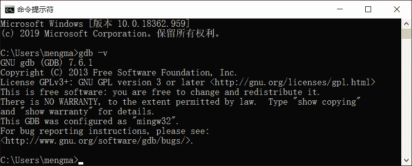
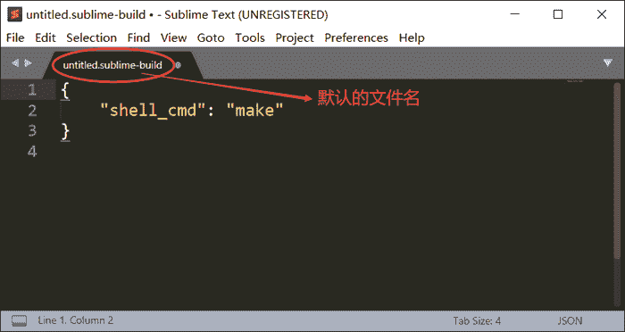
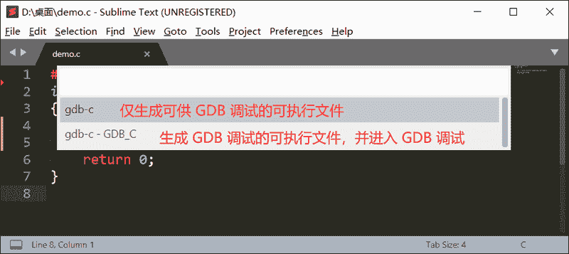
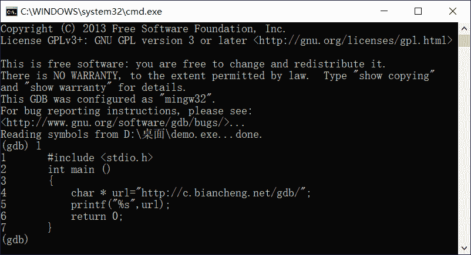

# Sublime Text 配置 GDB 调试环境

> 原文：[`c.biancheng.net/view/8300.html`](http://c.biancheng.net/view/8300.html)

作为当下一款非常流行的文本编辑器，Sublime Text 界面简洁、功能强大（提供有众多的插件）、还支持跨平台使用（包括 Mac OS X、Linux 和 Windows）。更值得一提的是在程序员眼中，Sublime Text 不仅仅是一个文本编辑器，更是一款好用的代码编辑器。

《Sublime Text 运行 C 和 C++程序》一节中，给大家详细介绍了怎样使 Sublime Text 具备编译、运行 C、C++ 程序的能力。在此基础上，本节给大家讲解：如何为 Sublime Text 配备 GDB 调试环境，从而可以直接调试在 Sublime Text 中编写的程序？

> 为 Sublime Text 配备 GDB 调试环境，其本质是令 Sublime Text 具备调用 GDB 调试器的能力。也就是说，当我们需要调试在 Sublime Text 中编写的代码时，无需手动打开 GDB 调试器，Sublime Text 可以自行调用 GDB 调试器，并以当前文件作为调试对象打开 GDB，等待我们输入 GDB 调试指令。

注意，要想为 Sublime Text 配备 GDB 调试环境，则必须确认当前系统环境中已经安装好了 GDB 调试器。以 Windows 平台为例，打开命令行窗口并执行 gdb -v 命令，如果打印出 GDB 调试器的相关信息（如图 1 所示），则表明当前系统中已经安装好了 GDB。


图 1 Windows 平台成功安装了 GDB 调试器

> 如果当前系统环境未安装 GDB，Windows 平台的读者可阅读《Windows 平台安装 GDB 调试器》一节；Linux 平台的读者可阅读《GDB 下载和安装教程》一节。

## Windows 平台配置 Sublime Text

在已安装好 Sublime Text 编辑器的基础上，为其配置 GDB 调试环境的过程如下（以调试 C 语言程序为例）：
1) 在 Sublime Text 的菜单栏中依次选择`Tools -> Build System -> New Build System`，此时会生成如图 2 所示的临时文件：


图 2 Sublime Text 配置文件
2) 将图 2 所示文件中的内容全部删除，然后将以下内容拷贝到文件中：

{
    "cmd": ["gcc","-g","${file}","-o", "${file_path}/${file_base_name}"],
    "file_regex":"^(..[^:]*):([0-9]+):?([0-9]+)?:? (.*)$",
    "working_dir":"${file_path}",
    "selector": "source.c",
    "variants":
    [
        {
            "name": "GDB_C",
            "cmd": ["cmd", "/c", "gcc","-g", "${file}", "-o", "${file_path}/${file_base_name}", "&&", "start", "cmd", "/c", "gdb", "${file_path}/${file_base_name}"]
        }
    ]
}

> 如果读者想调试 C++ 程序，可直接将其中的 gcc 全部改成 g++ 即可。当然，这样配置的 Sublime Text 仅能调试普通的 C、C++ 程序，那些引入非标准库或者第三方库的程序，需要在 2 个 "cmd" 行中的 gcc 或者 g++ 命令中注明要使用的系统库。

拷贝完成后，按 Ctrl+S 组合键保存此文件，对于调试 C 语言程序的配置文件，我将其重命名为 gdb_c.sublime-build。

由此，Sublime Text 就具备了调用 GDB 调试 C、C++ 程序的能力。以调试简单的 C 语言程序为例：

```

#include <stdio.h>
int main ()
{
    char * url="http://c.biancheng.net/gdb/";
    printf("%s",url);
    return 0;
}
```

读者可以将此示例程序拷贝到 Sublime Text 中，并为其命名以 .c 为后缀名的文件。在此基础上，在菜单栏中选择 Tools -> Build System -> gdb_c（即以我们自定义的方式编译指定文件），然后选择 Tools -> Build System，此时 Sublime Text 会弹出如下图所示的选项框：


图 3 选择具体的调试选项
可以看到，正如 gdb_c.sublime-build 文件配置的那样，这里显示了 2 个调试选项，第一个用于仅生成可供 GDB 调试的可执行文件，第二个选项不仅会生成可调式的执行文件，还会自动调用 GDB 并启动调试。例如，我们选择第二个选项，此时会进入 GDB 调试环境：


图 4 Sublime Text 自行启动 GDB 调试环境

> 感兴趣的读者，可尝试使用第一个选项，其会在该程序文件同目录的位置，生成可供 GDB 调试的可执行文件。

## Linux 平台配置 Sublime Text

Linux 平台配置 Sublime Text 的过程，和 Windows 平台配置 Sublime Text 的过程完全一致。唯一不同的一点在于，gdb-c.sublime-build 配置文件中的内容有所差异。

以 Ubuntu 为例，其配置文件中的内容如下所示：

{
    "shell_cmd":  "gcc -g \"$file_name\" -o \"$file_base_name\"",
    "file_regex": "^(..[^:]*):([0-9]+):?([0-9]+)?:? (.*)$",
    "selector": "source.c",
    "working_dir": "$file_path",
    "variants":
    [
        {  
        "name": "gdb_c",
        "shell_cmd": "gcc -g \"$file_name\" -o \"$file_base_name\";gnome-terminal -x gdb \"$file_base_name\""
        }
    ]
}

> 注意，不同的 Linux 发行版，调用命令行窗口的方式不同。以 Ubuntu 为例，使用 gnome-terminal -x 命令启动命令行窗口。

其它操作和在 Windows 平台上配置 Sublime_text 完全相同，这里不再重复赘述。

## Mac OS X 配置 Sublime Text

Mac OS X 平台配置 Sublime Text 的过程，也和 Windows 平台配置 Sublime Text 的过程完全一致，但需要修改 gdb-c.sublime-build 配置文件中的内容：

{
    "shell_cmd":"gcc -g \"$file_name\" -o \"$file_base_name\"",
    "selector":"source.c",
    "working_dir":"$file_path",
    "variants":
         [{
             "name":"gdb_c",
             "shell_cmd":"gcc -g \"$file_name\" -o \"$file_base_name\";open -a terminal.app /usr/local/bin/gdb"
        }]
}

读者需根据实际情况，调整 gdb 的存储位置（本机存储为 /usr/local/bin/gdb）。

注意，根据此配置文件，当我们选用 gdb_c 选项调试程序时，其只能自行打开 Terminal 命令行窗口并启动 GDB 调试器，但无法立即调试目标程序，还需手动在 GDB 中借助 file 命令指定要调试的目标程序，例如：

(gdb) file /tmp/demo/main.exe
Reading symbols from /tmp/demo/main.exe...
(gdb)

> 再次强调，启动 GDB 并不意味着可以立即调试程序，至于为什么，读者可阅读《gdb run（r）命令》一节做详细了解。