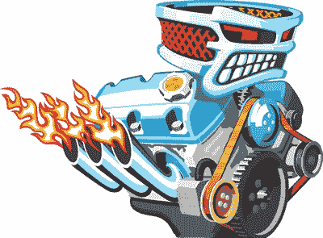

# 游戏引擎是什么？

> 原文：[`c.biancheng.net/view/7217.html`](http://c.biancheng.net/view/7217.html)

什么是游戏引擎？其实这很难给出明确的定义。

在很多游戏的宣传中，我们会听到对游戏引擎的推崇。绚丽的特效，流畅的体验，似乎都是游戏引擎的功劳。在游戏玩家看来，游戏画面的表现力越好，游戏场面的震撼程度越大，游戏体验的真实感越强，底层的游戏引擎就可能越强大。

我们不妨来看看业界给出的一些定义：

> 游戏引擎是指一些已编写好的可编辑计算机游戏系统或者一些交互式实时图像应用程序的核心组件。这些系统为游戏设计者提供编写游戏所需的各种工具，其目的在于让游戏设计者能容易和快速地写出游戏程序而不用从零开始。
> 
> 大部分游戏引擎支持多种操作平台，如 Linux、Mac OS X、Windows。游戏引擎包含渲染引擎（即“渲染器”，含二维图像引擎和三维图像引擎）、物理引擎、碰撞检测系统、音效引擎、脚本引擎、电脑动画引擎、人工智能引擎、网络引擎以及场景管理引擎。

根据上述定义，在很多人看来，游戏引擎负责把很多已有的零部件组装起来，如同组装手机，CPU、屏幕、摄像头、主板等都是别人生产的，手机厂商按照自己喜欢样式组装一下就好了。

下面再看看 Game Engine Architecture（中文书名《游戏引擎架构》）是怎么说的：

> 通常，游戏和其引擎之间的分界线是很模糊的。一些引擎有相当清晰的划分，一些则没有尝试把二者分开。
> 
> 在一款游戏中，渲染代码可能特别“知悉”如何画一只妖兽（Orc）；在另一款游戏中，渲染引擎可能只提供多用途的材质及着色功能，“妖兽”可能完全是用数据去定义的。没有工作室可以完美地划分游戏和引擎。
> 
> 这不难理解，因为随着游戏设计的逐渐成形，这两个组件的定义会经常转移。

似乎游戏界引擎专家也无法真正给引擎下一个明确定义，虽然大家都知道什么是游戏引擎，却很难用三言两语把它表述出来。

## 游戏引擎 VS 汽车发动机

在这里我们打个形象的比喻介绍 3D 游戏引擎——以汽车的发动机为例。

图 1：汽车引擎
驱动汽车在公路上行驶的是发动机引擎，汽车发动机引擎是驱动汽车行驶的动力源。不论是油箱还是驱动轴等，都要受发动机的控制，换句话说，发动机就相当于一个控制模块，控制所有其他设备运行。

发动机的性能也决定了汽车的性能，围绕发动机引擎可以制造出多款不同型号的汽车。

3D 游戏引擎的原理与汽车发动机引擎的原理是类似的，游戏的逻辑模块也是在游戏引擎的基础上实现的，游戏开发者只要调用引擎提供的接口编写逻辑。

引擎的渲染效率直接影响游戏运行效率，引擎的渲染品质直接决定了游戏的渲染品质。

当然，用同一款引擎可以做出许许多多款游戏，最直观的就是商业引擎，比如 Unity 和虚幻引擎，使用它们研发的产品种类非常多。

## 游戏引擎是如何诞生的？

十多年前，笔者刚踏入游戏公司做研发时，公司当时并没有 3D 游戏引擎，公司研发游戏都是在上款己研发好的产品基础上进行修改的，换句话说就是“换皮”。

做的时间久了会遇到相同的代码逻辑在不同的游戏项目里面重复出现的现象，行业里面俗称“重复的造轮子”，开发者在开发产品时通常的做法就是复制粘贴，导致项目出现 Bug 的概率非常高，大大降低了研发效率。

为了改变这种现状，公司安排专人尝试着把游戏里面常用的代码抽离出来，重新做一个新工程编译成静态库 LIB 或动态库 DLL，这样 3D 引擎的雏形开始形成了。随着工程的代码量不断增加完善，久而久之，3D 游戏引擎就形成了。

开发 3D 游戏引擎目的是简化游戏制作的复杂度，缩短游戏开发周期，降低产品制作成本，因为封装好的引擎可开发多种类型的产品。

## 游戏引擎的艺术

数千年以来，艺术家们通过文学、绘画、雕塑、建筑、音乐、舞蹈、戏剧等传统艺术形式充实人类的精神层面。自 20 世纪中叶，计算机的普及派生出另一种艺术形式——电子游戏。

图 2：颇具艺术性的游戏画面
游戏结合了上述传统艺术以及近代科技派生的其他艺术（如摄影、电影、动画），并且完全脱离了艺术欣赏这种单向传递的方式——游戏必然是互动的，“玩家”并不是“读者”、 “观众”或“听众”，而是进入游戏世界、感知并对世界做出反应的参与者。

基于游戏的互动本质，游戏的制作通常比其他大众艺术复杂。商业游戏的制作通常需要各种人才的参与，而他们则需要依赖各种工具及科技。游戏引擎便是专门为游戏而设计的工具及科技集成。

之所以称为引擎，如同交通工具中的发动机，提供了最核心的技术部分。因为复杂，研发成本高，人们不希望制作每款游戏（或车款）时都重新设计引擎，重用性是游戏引擎的一个重要设计目标。

然而，各游戏本身的性质以及平台的差异，使研发完全通用的游戏引擎变得极困难，甚至不可能。

市面上出售的游戏引擎，有一些虽然已经达到很高的技术水平，但在商业应用中，很多时候还是需要因应个别游戏项目对引擎改造、整合、扩展及优化。因此，即使能使用市面上最好的商用引擎或自研引擎，我们仍需要理解当中的架构、各种机制和技术，并且分析及解决在制作中遇到的问题。