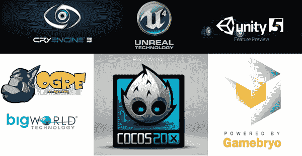

# 有哪些著名的游戏引擎？

> 原文：[`c.biancheng.net/view/7218.html`](http://c.biancheng.net/view/7218.html)

从卡马克的时代开始，国外就有了关于游戏引擎的概念。根据游戏需求的不同，游戏厂商要么自己开发引擎，要么购买商业引擎。

但真正的商业引擎不但必须有规范的开发流程，以便于定制化，而且要有后续的技术支持来帮助购买引擎的人解决遇到的各种问题，以保障购买者能够实现想要的功能。但能真正实现商业化的引擎也仅有少数几款。

商业引擎数量少，加之每款引擎的授权费用高昂，所以很多团队更愿意自己开发引擎。而几乎每一款知名游戏都有自己的引擎，比如育碧的《刺客信条》、EA 的《战地》、科乐美的《实况足球》。但自家的引擎同样需要不断迭代，以保证跟上时代的发展，否则落后的游戏引擎终究会被淘汰。

在国内曾经技术匮乏的那个年代，Gamebryo 和 Ogre 算是最早的两款引擎，Gamebryo 是用得最多的商业引擎，Ogre 是用得最多的非商业引擎。

现如今，除了传统大厂商在自己迭代引擎之外，大部分厂商选择了商业引擎。国内厂商更是如此，在 3D 游戏引擎的选择上都很明确，手机端用 Unity，PC 端用 Unreal Engine。这些引擎不同于以往特定类型的游戏引擎，它们耦合性很低，通用性更好。

那些年风光的引擎如下图所示。

图 1：那些年风光的游戏引擎
游戏引擎曾经百花齐放，如今则大局已定。那么自研引擎是否已是明日黄花了呢？

其实这个问题没有明确的答案。如果你的团队有实力，时间相对充足，已经成功开发出游戏，那么迭代自研发当然可以；但如果项目时间紧，要开发的游戏类型与团队已有的引擎类型大相径庭，改动成本高于学习其他商业引擎的成本，那么不妨使用相对成熟的商业引擎。