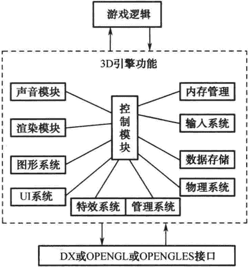

# 3D 游戏引擎的原理和架构

> 原文：[`c.biancheng.net/view/7224.html`](http://c.biancheng.net/view/7224.html)

随着 IT 产业的蓬勃发展，越来越多的幵源 3D 引擎、商业 3D 引擎都涌现出来了，其中最具代表性的有用于移动端开发的 Unity3D、用于 PC 端开发的虚幻 4（Unreal Engine 4，UE4）以及幵源图形学引擎 OGRE。

Unity 引擎在市面上比较流行，相信大多数 IT 开发者都使用过，先以 Unity3D 引擎为例介绍引擎的原理，Unity3D 引擎提供了一个功能非常强大的编辑器供用户开发使用。

支撑编辑器运行的是许多己经封装好的 DLL 文件，读者可通过其安装目录查看许多 DLL 动态库文件，这些封装的 DLL 动态库就是 Unity3D 引擎底层封装提供的。

游戏开发者在使用其开发游戏写具体逻辑时，也需要利用 C# 脚本调用动态库 DLL 封装的函数接口，从而能够执行引擎底层的代码，实现想要的效果。接口的使用可通过查看 Unity 帮助文档获取，它的底层代码的实现对用户来说是不可见的，但这不妨碍使用者开发项目，因为使用者只要知道函数的功能就可以了。

3D 引擎本身也是一种 3D 软件，主要负责处理游戏虚拟世界的渲染，3D 引擎架构设计其实非常复杂，用到的知识点非常多，比如设计模式、多线程编程、算法、GPU 编程等，但是不管多么复杂，其最基本架构思想还是模块化开发，就比如打篮球一样，不论采用哪种战术跑位，最基本的还是挡拆战术。

继续模块思想的讨论，以模块化思想设计的 3D 引擎便于扩展，可以有效地减少模块之间的耦合性。

开发 3D 游戏引擎时，切记面面倶到；换句话说，3D 游戏引擎的主要功能是渲染。在这方面做得比较好的是开源的 Ogre 图形学引擎及商业引擎 UE4，它们核心功能只是负责 3D 渲染，做 3D 引擎该做的事情。

对于 Unity3D 引擎，它在 3D 引擎渲染的基础上还增加了网络库等功能，对于引擎来说显得过于臃肿；当然这里不是说 Unity3D 引擎不好，只是其功能太多，对开发者来说并不一定是好事情。

这种做法对引擎自身来说也不一定是好事情，因为这样引擎的功能失去了重点，所以一提到 Unity3D 引擎，大家的第一印象是其跨平台功能，与引擎核心功能渲染不搭边，而对于 UE4 引擎，大家的第一印象是渲染，UE4 在渲染这方面做得非常专一，结果就是 UE4 引擎渲染功能比 Unity3D 引擎更强大。

当然 Unity3D 引擎的优点也是非常多的，比如引擎的架构设计使用了组件的理念，使用脚本写逻辑，可以跨多个平台等，而且对于初学者上手非常快，这也是它能快速普及的一个主要原因。

如果要开发一款引擎具体如何做？引擎由哪些主要模块组成？

游戏引擎涵盖的模块非常多，它是一个处理游戏所有逻辑的系统。引擎渲染功能是否强大，决定了游戏渲染品质的高低，以及游戏渲染运行的流畅度。

下面简单介绍一下通用的 3D 游戏引擎架构，如图 1 所示。

图 1：通用的游戏引擎架构
游戏逻辑是最顶端的，也就是所说的游戏产品，一般的游戏开发者都是开发这层的逻辑。

3D 引擎包括了很多功能模块，图 1-1 所列举的只是比较核心的引擎模块，引擎最终会编译成动态库 DLL 或者静态库 LIB，方便游戏逻辑幵发者调用其函数接口。

当然引擎模块内容对用户是不可见的，就像一个黑匣子一样，它里面封装了游戏开发用到的所有模块， 比如图 1-1 所示的声音模块、渲染模块、内存管理、输入系统、物理系统等。

游戏引擎的渲染模块会选择使用微软的 DirectX 库或者开源跨平台的 OPENGL、OPENGLES 图形库， 图 1-1 所示的是传统的引擎架构图。

市面上很多公司研发的跨平台 3D 引擎，都是基于 OPENGLES 图形库开发的，比如网龙、网易、腾讯、蜗牛、完美等知名 IT 公司都有自己研发的引擎，引擎的研发也代表着一个公司的研发实力。

对于程序员来说，掌握了 3D 引 擎开发技术，就等于掌握了游戏的核心技能，在国内研发 3D 引擎的人毕竟是少数，所以 3D 游戏引擎研发市场缺口很大。所以作为程序员来说，应该努力去掌握 3D 引擎研发技能，这样在 IT 激烈的竞争中才能立于不败之地。

当然对于个人开发者来说，开发一款功能很强大的引擎是不现实的，其涉及的模块太多，一个人无法在短期之内完成。