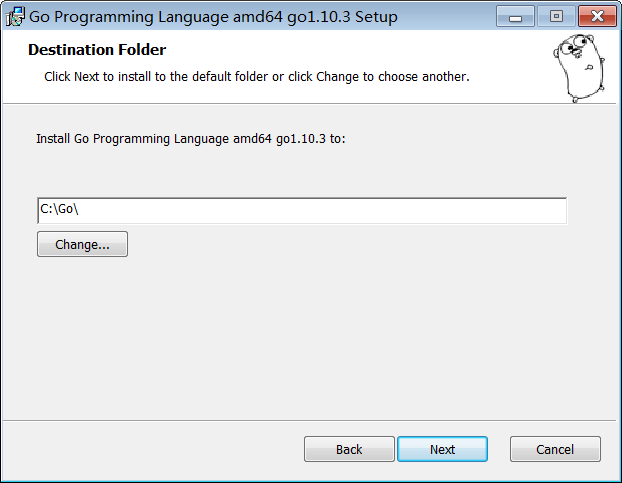
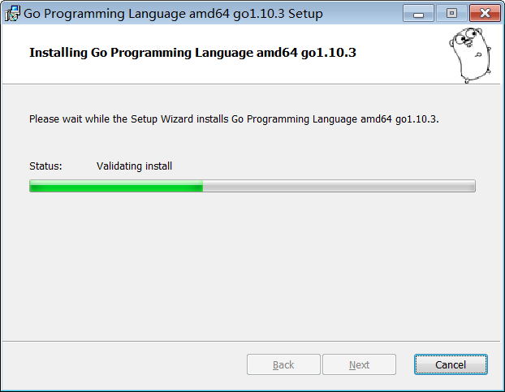

# 安装 Go 语言开发包

要学 Go 语言，首先要学会 Go 语言开发包的安装和使用。Go 语言的开发包可以在以下站点下载：

*   Golang 中国，网址为：https://www.golangtc.com/download
*   Go 语言官方网站，网址为：https://golang.org/dl/

下面是 golang.org 官方网站 1.10.3 版本的下载列表。

Go 语言开发包下载列表

| File name | Kind | OS | Arch | Size | SHA256 Checksum |
| **go1.10.3.src.tar.gz** | **Source** |   |   | **17MB** | **567b1cc66c9704d1c019c50bef946272e911ec6baf244310f87f4e678be155f2** |
| go1.10.3.darwin-amd64.tar.gz | Archive | macOS | x86-64 | 124MB | 131fd430350a3134d352ee75c5ca456cdf4443e492d0527a9651c7c04e2b458d |
| **go1.10.3.darwin-amd64.pkg** | **Installer** | **macOS** | **x86-64** | **124MB** | **6ea2b88dd10fa7efe4c68fcf990162475020fdb1789e0fa03b470fbddc1600c4** |
| go1.10.3.linux-386.tar.gz | Archive | Linux | x86 | 115MB | 3d5fe1932c904a01acb13dae07a5835bffafef38bef9e5a05450c52948ebdeb4 |
| **go1.10.3.linux-amd64.tar.gz** | **Archive** | **Linux** | **x86-64** | **126MB** | **fa1b0e45d3b647c252f51f5e1204aba049cde4af177ef9f2181f43004f901035** |
| go1.10.3.linux-armv6l.tar.gz | Archive | Linux | ARMv6 | 110MB | d3df3fa3d153e81041af24f31a82f86a21cb7b92c1b5552fb621bad0320f06b6 |
| go1.10.3.windows-386.zip | Archive | Windows | x86 | 121MB | 89696a29bdf808fa9861216a21824ae8eb2e750a54b1424ce7f2a177e5cd1466 |
| go1.10.3.windows-386.msi | Installer | Windows | x86 | 104MB | 2a395c4a26a9d682c0db8842d9fc64226ab398f087401b574d688f4dfdc3f270 |
| go1.10.3.windows-amd64.zip | Archive | Windows | x86-64 | 133MB | a3f19d4fc0f4b45836b349503e347e64e31ab830dedac2fc9c390836d4418edb |
| **go1.10.3.windows-amd64.msi** | **Installer** | **Windows** | **x86-64** | **114MB** | **cb8975b55340cd9c9cd120c49bb18f353e76558a1d2785e0fdbfb5e8df16608e** |
| Other Ports |
| go1.10.3.freebsd-386.tar.gz | Archive | FreeBSD | x86 | 111MB | 92a28ccd8caa173295490dfd3f1d10f3bc7eaf0953bf099631bc6c57a5842704 |
| go1.10.3.freebsd-amd64.tar.gz | Archive | FreeBSD | x86-64 | 122MB | 231d9e6f3b5acee1193cd18b98c89f1a51570fbc8ba7c6c6b67a7f7ff2985e2b |
| go1.10.3.linux-arm64.tar.gz | Archive | Linux | ARMv8 | 110MB | 355128a05b456c9e68792143801ad18e0431510a53857f640f7b30ba92624ed2 |
| go1.10.3.linux-ppc64le.tar.gz | Archive | Linux | ppc64le | 109MB | f3640b2f0990a9617c937775f669ee18f10a82e424e5f87a8ce794a6407b8347 |
| go1.10.3.linux-s390x.tar.gz | Archive | Linux | s390x | 108MB | 34385f64651f82fbc11dc43bdc410c2abda237bdef87f3a430d35a508ec3ce0d |

其中加粗部分是官方推荐下载的版本，下表是对这些版本的描述。

Go 安装包命名及对应的平台

| 文件名 | 说明 |
| go1.10.3.src.tar.gz | 源码包，供源码研究，对于日常开发不建议下载此包 |
| go1.10.3.darwin-amd64.pkg | Mac OS 平台安装包 |
| go1.10.3.linux-amd64.tar.gz | Linux 平台安装包 |
| go1.10.3.windows-amd64.msi | Windows 平台安装包 |

## Windows 版安装

Go 语言的 Windows 版安装包一般格式为 MSI 格式，可以直接安装到系统，Go 语言的 Windows 安装包一般命名如下：

go1.10.3.windows-amd64.msi

*   1.10.3 表示 Go 安装包的版本；
*   Windows 表示这是一个 Windows 安装包；
*   amd64 表示匹配的 CPU 版本，这里匹配的是 64 位 CPU。

Windows 下 Go 开发包的默认安装路径是 C 盘的 Go 目录下，推荐在这个目录下安装 Go 开发包，使用起来较为方便。Go 开发包安装完毕后占用磁盘空间大概是 300MB 左右。当然，在安装过程中你也可以选择安装路径，如下图所示：

Go 开发包的安装没有其他选项，接下来是安装程序的文件复制操作，如下图所示：

安装完成后，安装目录下将生成一些目录和文件，如下图所示：

这个目录的结构遵守 GOPATH 规则，后面的章节会提到这个概念。GOPATH 及相关的目录命名是 Go 语言编译的核心规则。

Go 开发包的安装目录的功能及说明

| 目录名 | 说明 |
| api | 每个版本的 api 变更差异 |
| bin | go 源码包编译出的编译器（go）、文档工具（godoc）、格式化工具（gofmt） |
| blog | Go 博客的模板，使用 Go 的网页模板，有一定的学习意义 |
| doc | 英文版的 Go 文档 |
| lib | 引用的一些库文件 |
| misc | 杂项用途的文件，例如 Android 平台的编译、git 的提交钩子等 |
| pkg | Windows 平台编译好的中间文件 |
| src | 标准库的源码 |
| test | 测试用例 |

开发时，无须关注这些目录。当读者希望深度了解底层原理时，可以通过上面的介绍继续探索。

## Linux 版安装

Linux 版的 Go 语言压缩包格式如下：

go1.10.3.linux-amd64.tar.gz

需要将这个包解压到`/usr/local/go`下，可以用下列命令来完成：

tar -C /usr/local -xzf go1.10.3.linux-amd64.tar.gz

请根据下载的 Go 语言压缩包的版本进行安装。
接下来，需要将/usr/local/go/bin 目录添加到 PATH 环境变量中，可以使用以下命令来完成：

export PATH=$PATH:/usr/local/go/bin

使用 go env 指令，可以查看 Go 压缩包是否安装成功：

$ go env
GOARCH="amd64"
GOBIN=""
GOEXE=""
GOHOSTARCH="amd64"
GOHOSTOS="linux"
GOOS="linux"
GOPATH="/root/go"
GORACE=""
GOROOT="/usr/local/go"
GOTOOLDIR="/usr/local/go/pkg/tool/linux_amd64"
GCCGO="gccgo"
CC="gcc"
GOGCCFLAGS="-fPIC -m64 -pthread -fmessage-length=0 -fdebug-prefix-map=/
tmp/go-build305492722=/tmp/go-build -gno-record-gcc-switches"
CXX="g++"
CGO_ENABLED="1"
CGO_CFLAGS="-g -O2"
CGO_CPPFLAGS=""
CGO_CXXFLAGS="-g -O2"
CGO_FFLAGS="-g -O2"
CGO_LDFLAGS="-g -O2"
PKG_CONFIG="pkg-config"

## Mac OS 版安装

Mac OS 下是傻瓜式安装，一路 Next 即可，不再赘述。
