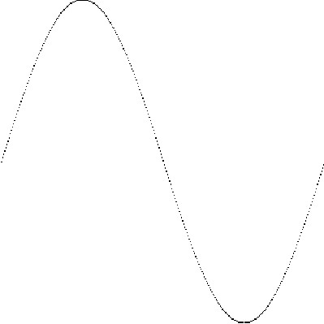

# Go 语言输出正弦函数（Sin）图像

在 Go 语言中，正弦函数由 math 包提供，函数入口为 math.Sin。正弦函数的参数为 float64，返回值也是 float64。在使用正弦函数时，根据实际精度可以进行转换。

Go 语言的标准库支持对图片像素进行访问，并且支持输出各种图片格式，如 JPEG、PNG、GIF 等。

首先给出本节完整的代码：

```
package main

import (
    "image"
    "image/color"
    "image/png"
    "log"
    "math"
    "os"
)

func main() {

    // 图片大小
    const size = 300
    // 根据给定大小创建灰度图
    pic := image.NewGray(image.Rect(0, 0, size, size))

    // 遍历每个像素
    for x := 0; x < size; x++ {
        for y := 0; y < size; y++ {
            // 填充为白色
            pic.SetGray(x, y, color.Gray{255})
        }
    }

    // 从 0 到最大像素生成 x 坐标
    for x := 0; x < size; x++ {

        // 让 sin 的值的范围在 0~2Pi 之间
        s := float64(x) * 2 * math.Pi / size

        // sin 的幅度为一半的像素。向下偏移一半像素并翻转
        y := size/2 - math.Sin(s)*size/2

        // 用黑色绘制 sin 轨迹
        pic.SetGray(x, int(y), color.Gray{0})
    }

    // 创建文件
    file, err := os.Create("sin.png")

    if err != nil {
        log.Fatal(err)
    }
    // 使用 png 格式将数据写入文件
    png.Encode(file, pic) //将 image 信息写入文件中

    // 关闭文件
    file.Close()
}
```

## 设置图片背景色

以下是设置图片背景的代码：

```
// 图片大小
const size = 300

// 根据给定大小创建灰度图
pic := image.NewGray(image.Rect(0, 0, size, size))

// 遍历每个像素
for x := 0; x < size; x++ {
    for y := 0; y < size; y++ {
        // 填充为白色
        pic.SetGray(x, y, color.Gray{255})
    }
}
```

代码说明如下：

*   第 2 行，声明一个 size 常量，值为 300。
*   第 5 行，使用 image 包的 NewGray() 函数创建一个图片对象，使用区域由 image.Rect 结构提供。image.Rect 描述一个方形的两个定位点 (x1,y1) 和 (x2,y2)。image.Rect(0,0,size,size) 表示使用完整灰度图像素，尺寸为宽 300，长 300。
*   第 8 行和第 9 行，遍历灰度图的所有像素。
*   第 11 行，将每一个像素的灰度设为 255，也就是白色。

灰度图是一种常见的图片格式，一般情况下颜色由 8 位组成，灰度范围为 0～255，0 表示黑色，255 表示白色。

初始化好的灰度图对象内存区域默认值都是 0，对应全是黑色，考虑到显示效果和习惯，将所有像素设置为 255，也就是白色。

## 绘制正弦函数轨迹

正弦函数是一个周期函数。定义域是实数集，值域范围是 [-1, 1]。用编程的通俗易懂的话来说就是：math.Sin 函数的参数支持任意浮点数范围，函数返回值的范围总是在 -1～1 之间（两端包含）。

要将正弦函数放在图片上需要考虑以下一些因素：

*   math.Sin 的返回值在 -1～1 之间。需要考虑将正弦的输出幅度变大，可以将 math.Sin 的返回值乘以一个常量进行放大。
*   图片的坐标系原点在左上角，而 math.Sin 基于笛卡尔坐标系原点在左下角。需要对图像进行上下翻转和平移。

将这些处理逻辑汇总为代码如下：

```
// 从 0 到最大像素生成 x 坐标
for x := 0; x < size; x++ {

    // 让 sin 的值的范围在 0~2Pi 之间
    s := float64(x) * 2 * math.Pi / size

    // sin 的幅度为一半的像素。向下偏移一半像素并翻转
    y := size/2 - math.Sin(s)*size/2

    // 用黑色绘制 sin 轨迹
    pic.SetGray(x, int(y), color.Gray{0})
}
```

代码说明如下：
1) 第 2 行，生成 0 到 size（300）的 x 坐标轴。

2) 第 5 行，计算 math.Sin 的定义域，这段代码等效为：

```
rate := x / size
s := rate * 2 * math.Pi
```

x 的范围是 0 到 size，因此除以 size 后，rate 的范围是 0～1 之间，再乘以 2π 后，s 的范围刚好是 0～2π 之间。

float64(x) 表示将整型的 x 变量转换为 float64 类型，之后运算的所有表达式将以 float64 类型进行。

3) 第 8 行中，math.Sin(s)*size/2 表示将正弦函数的返回值幅度从 1 扩大到二分之一的 size。负号表示将正弦函数图形以图形中心上下翻转。叠加 size/2 表示将图形在 y 轴上向下偏移二分之一的 size（图片坐标系的 y 向下）。

4) 第 11 行将计算好的 x 轴和 y 轴数据，以灰度为 0（黑色）使用 SetGray() 方法填充到像素中。

写入图片的正弦函数图像如下图所示：



## 写入图片文件

内存中的正弦函数图形是不可见的，我们选用 PNG 格式将图形输出为文件。Go 语言提供了文件创建函数和 PNG 格式写入函数，代码如下：

```
// 创建文件
file, err := os.Create("sin.png")

if err != nil {
    log.Fatal(err)
}
// 使用 PNG 格式将数据写入文件
png.Encode(file, pic)  //将 image 信息写入文件中

// 关闭文件
file.Close()
```

代码说明如下：

*   第 2 行，创建 sin.png 的文件。
*   第 4 行，如果创建文件失败，返回错误，打印错误并终止。
*   第 8 行，使用 PNG 包，将图形对象写入文件中。
*   第 11 行，关闭文件。