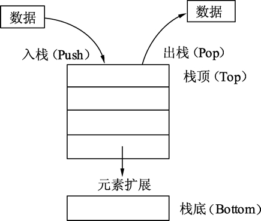
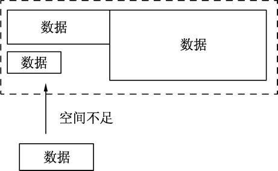

# Go 语言变量生命期，Go 语言变量逃逸分析

讨论变量生命期之前，先来了解下计算机组成里两个非常重要的概念：堆和栈。

## 什么是栈

栈（Stack）是一种拥有特殊规则的线性表数据结构。

#### 1) 概念

栈只允许往线性表的一端放入数据，之后在这一端取出数据，按照后进先出（LIFO，Last InFirst Out）的顺序，如下图所示。


图：栈的操作及扩展
往栈中放入元素的过程叫做入栈。入栈会增加栈的元素数量，最后放入的元素总是位于栈的顶部，最先放入的元素总是位于栈的底部。

从栈中取出元素时，只能从栈顶部取出。取出元素后，栈的数量会变少。最先放入的元素总是最后被取出，最后放入的元素总是最先被取出。不允许从栈底获取数据，也不允许对栈成员（除栈顶外的成员）进行任何查看和修改操作。

栈的原理类似于将书籍一本一本地堆起来。书按顺序一本一本从顶部放入，要取书时只能从顶部一本一本取出。

#### 2) 变量和栈有什么关系

栈可用于内存分配，栈的分配和回收速度非常快。下面代码展示栈在内存分配上的作用，代码如下：

```
func calc(a, b int) int {
    var c int
    c = a * b

    var x int
    x = c * 10

    return x
}
```

代码说明如下：

*   第 1 行，传入 a、b 两个整型参数。
*   第 2 行，声明 c 整型变量，运行时，c 会分配一段内存用以存储 c 的数值。
*   第 3 行，将 a 和 b 相乘后赋予 c。
*   第 5 行，声明 x 整型变量，x 也会被分配一段内存。
*   第 6 行，让 c 乘以 10 后存储到 x 变量中。
*   第 8 行，返回 x 的值。

上面的代码在没有任何优化情况下，会进行 c 和 x 变量的分配过程。Go 语言默认情况下会将 c 和 x 分配在栈上，这两个变量在 calc() 函数退出时就不再使用，函数结束时，保存 c 和 x 的栈内存再出栈释放内存，整个分配内存的过程通过栈的分配和回收都会非常迅速。

## 什么是堆

堆在内存分配中类似于往一个房间里摆放各种家具，家具的尺寸有大有小。分配内存时，需要找一块足够装下家具的空间再摆放家具。经过反复摆放和腾空家具后，房间里的空间会变得乱七八糟，此时再往空间里摆放家具会存在虽然有足够的空间，但各空间分布在不同的区域，无法有一段连续的空间来摆放家具的问题。此时，内存分配器就需要对这些空间进行调整优化，如下图所示。


图：堆的分配及空间
堆分配内存和栈分配内存相比，堆适合不可预知大小的内存分配。但是为此付出的代价是分配速度较慢，而且会形成内存碎片。

## 变量逃逸（Escape Analysis）——自动决定变量分配方式，提高运行效率

堆和栈各有优缺点，该怎么在编程中处理这个问题呢？在 C/C++ 语言中，需要开发者自己学习如何进行内存分配，选用怎样的内存分配方式来适应不同的算法需求。比如，函数局部变量尽量使用栈；全局变量、结构体成员使用堆分配等。程序员不得不花费很多年的时间在不同的项目中学习、记忆这些概念并加以实践和使用。

Go 语言将这个过程整合到编译器中，命名为“变量逃逸分析”。这个技术由编译器分析代码的特征和代码生命期，决定应该如何堆还是栈进行内存分配，即使程序员使用 Go 语言完成了整个工程后也不会感受到这个过程。

#### 1) 逃逸分析

使用下面的代码来展现 Go 语言如何通过命令行分析变量逃逸，代码如下：

```
package main

import "fmt"

// 本函数测试入口参数和返回值情况
func dummy(b int) int {

    // 声明一个 c 赋值进入参数并返回
    var c int
    c = b

    return c
}

// 空函数, 什么也不做
func void() {

}

func main() {

    // 声明 a 变量并打印
    var a int

    // 调用 void()函数
    void()

    // 打印 a 变量的值和 dummy()函数返回
    fmt.Println(a, dummy(0))
}
```

代码说明如下：

*   第 6 行，dummy() 函数拥有一个参数，返回一个整型值，测试函数参数和返回值分析情况。
*   第 9 行，声明 c 变量，这里演示函数临时变量通过函数返回值返回后的情况。
*   第 16 行，这是一个空函数，测试没有任何参数函数的分析情况。
*   第 23 行，在 main() 中声明 a 变量，测试 main() 中变量的分析情况。
*   第 26 行，调用 void() 函数，没有返回值，测试 void() 调用后的分析情况。
*   第 29 行，打印 a 和 dummy(0) 的返回值，测试函数返回值没有变量接收时的分析情况。

接着使用如下命令行运行上面的代码：

$ go run -gcflags "-m -l" main.go

使用 go run 运行程序时，-gcflags 参数是编译参数。其中 -m 表示进行内存分配分析，-l 表示避免程序内联，也就是避免进行程序优化。

运行结果如下：
# command-line-arguments
./main.go:29:13: a escapes to heap
./main.go:29:22: dummy(0) escapes to heap
./main.go:29:13: main ... argument does not escape
0 0

程序运行结果分析如下：

*   输出第 2 行告知“main 的第 29 行的变量 a 逃逸到堆”。
*   第 3 行告知“dummy(0)调用逃逸到堆”。由于 dummy() 函数会返回一个整型值，这个值被 fmt.Println 使用后还是会在其声明后继续在 main() 函数中存在。
*   第 4 行，这句提示是默认的，可以忽略。

上面例子中变量 c 是整型，其值通过 dummy() 的返回值“逃出”了 dummy() 函数。c 变量值被复制并作为 dummy() 函数返回值返回，即使 c 变量在 dummy() 函数中分配的内存被释放，也不会影响 main() 中使用 dummy() 返回的值。c 变量使用栈分配不会影响结果。

#### 2) 取地址发生逃逸

下面的例子使用结构体做数据，了解在堆上分配的情况，代码如下：

```
package main

import "fmt"

// 声明空结构体测试结构体逃逸情况
type Data struct {
}

func dummy() *Data {

    // 实例化 c 为 Data 类型
    var c Data

    //返回函数局部变量地址
    return &c
}

func main() {

    fmt.Println(dummy())
}
```

代码说明如下：

*   第 6 行，声明一个空的结构体做结构体逃逸分析。
*   第 9 行，将 dummy() 函数的返回值修改为 *Data 指针类型。
*   第 12 行，将 c 变量声明为 Data 类型，此时 c 的结构体为值类型。
*   第 15 行，取函数局部变量 c 的地址并返回。Go 语言的特性允许这样做。
*   第 20 行，打印 dummy() 函数的返回值。

执行逃逸分析：
$ go run -gcflags "-m -l" main.go
# command-line-arguments
./main.go:15:9: &c escapes to heap
./main.go:12:6: moved to heap: c
./main.go:20:19: dummy() escapes to heap
./main.go:20:13: main ... argument does not escape
&{}

注意第 4 行出现了新的提示：将 c 移到堆中。这句话表示，Go 编译器已经确认如果将 c 变量分配在栈上是无法保证程序最终结果的。如果坚持这样做，dummy() 的返回值将是 Data 结构的一个不可预知的内存地址。这种情况一般是 C/C++ 语言中容易犯错的地方：引用了一个函数局部变量的地址。

Go 语言最终选择将 c 的 Data 结构分配在堆上。然后由垃圾回收器去回收 c 的内存。

#### 3) 原则

在使用 Go 语言进行编程时，Go 语言的设计者不希望开发者将精力放在内存应该分配在栈还是堆上的问题。编译器会自动帮助开发者完成这个纠结的选择。但变量逃逸分析也是需要了解的一个编译器技术，这个技术不仅用于 Go 语言，在 Java 等语言的编译器优化上也使用了类似的技术。

编译器觉得变量应该分配在堆和栈上的原则是：

*   变量是否被取地址。
*   变量是否发生逃逸。