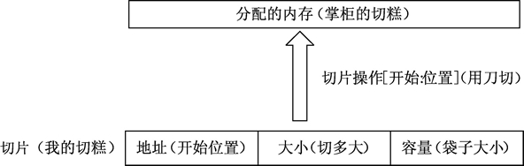

# Go 语言切片详解

切片（Slice）是一个拥有相同类型元素的可变长度的序列。Go 语言切片的内部结构包含地址、大小和容量。切片一般用于快速地操作一块数据集合。如果将数据集合比作切糕的话，切片就是你要的“那一块”。切的过程包含从哪里开始（这个就是切片的地址）及切多大（这个就是切片的大小）。容量可以理解为装切片的口袋大小，如下图所示。


图：切片结构和内存分配

## 从数组或切片生成新的切片

切片默认指向一段连续内存区域，可以是数组，也可以是切片本身。

从连续内存区域生成切片是常见的操作，格式如下：

slice [开始位置:结束位置]

*   slice 表示目标切片对象。
*   开始位置对应目标切片对象的索引。
*   结束位置对应目标切片的结束索引。

从数组生成切片，代码如下：

```
var a  = [3]int{1, 2, 3}
fmt.Println(a, a[1:2])
```

a 是一个拥有 3 个整型元素的数组，被初始化数值 1 到 3。使用 a[1:2] 可以生成一个新的切片。代码运行结果如下：

[1 2 3]  [2]

[2] 就是 a[1:2] 切片操作的结果。

从数组或切片生成新的切片拥有如下特性：

*   取出的元素数量为：结束位置-开始位置。
*   取出元素不包含结束位置对应的索引，切片最后一个元素使用 slice[len(slice)] 获取。
*   当缺省开始位置时，表示从连续区域开头到结束位置。
*   当缺省结束位置时，表示从开始位置到整个连续区域末尾。
*   两者同时缺省时，与切片本身等效。
*   两者同时为 0 时，等效于空切片，一般用于切片复位。

根据索引位置取切片 slice 元素值时，取值范围是（0～len(slice)-1），超界会报运行时错误。生成切片时，结束位置可以填写 len(slice) 但不会报错。

下面在具体的例子中熟悉切片的特性。

#### 1) 从指定范围中生成切片

切片和数组密不可分。如果将数组理解为一栋办公楼，那么切片就是把不同的连续楼层出租给使用者。出租的过程需要选择开始楼层和结束楼层，这个过程就会生成切片。示例代码如下：

```
var highRiseBuilding [30]int

for i := 0; i < 30; i++ {
        highRiseBuilding[i] = i + 1
}

// 区间
fmt.Println(highRiseBuilding[10:15])

// 中间到尾部的所有元素
fmt.Println(highRiseBuilding[20:])

// 开头到中间的所有元素
fmt.Println(highRiseBuilding[:2])
```

代码输出如下：

[11 12 13 14 15]
[21 22 23 24 25 26 27 28 29 30]
[1 2]

代码中构建了一个 30 层的高层建筑。数组的元素值从 1 到 30，分别代表不同的独立楼层。输出的结果是不同租售方案。

代码说明如下：

*   第 8 行，尝试出租一个区间楼层。
*   第 11 行，出租 20 层以上。
*   第 14 行，出租 2 层以下，一般是商用铺面。

切片有点像 C 语言里的指针。指针可以做运算，但代价是内存操作越界。切片在指针的基础上增加了大小，约束了切片对应的内存区域，切片使用中无法对切片内部的地址和大小进行手动调整，因此切片比指针更安全、强大。

#### 2) 表示原有的切片

生成切片的格式中，当开始和结束都范围都被忽略，则生成的切片将表示和原切片一致的切片，并且生成的切片与原切片在数据内容上是一致的，代码如下：

```
a := []int{1, 2, 3}
fmt.Println(a[:])
```

a 是一个拥有 3 个元素的切片。将 a 切片使用 a[:] 进行操作后，得到的切片与 a 切片一致，代码输出如下：

[1 2 3]

#### 3) 重置切片，清空拥有的元素

把切片的开始和结束位置都设为 0 时，生成的切片将变空，代码如下：

```
a := []int{1, 2, 3}
fmt.Println(a[0:0])
```

代码输出如下：

[]

## 直接声明新的切片

除了可以从原有的数组或者切片中生成切片，你也可以声明一个新的切片。每一种类型都可以拥有其切片类型，表示多个类型元素的连续集合。因此切片类型也可以被声明。切片类型声明格式如下：

var name []T

*   name 表示切片类型的变量名。
*   T 表示切片类型对应的元素类型。

下面代码展示了切片声明的使用过程：

```
// 声明字符串切片
var strList []string

// 声明整型切片
var numList []int

// 声明一个空切片
var numListEmpty = []int{}

// 输出 3 个切片
fmt.Println(strList, numList, numListEmpty)

// 输出 3 个切片大小
fmt.Println(len(strList), len(numList), len(numListEmpty))

// 切片判定空的结果
fmt.Println(strList == nil)
fmt.Println(numList == nil)
fmt.Println(numListEmpty == nil)
```

代码输出结果：

[] [] []
0 0 0
true
true
false

代码说明如下：

*   第 2 行，声明一个字符串切片，切片中拥有多个字符串。
*   第 5 行，声明一个整型切片，切片中拥有多个整型数值。
*   第 8 行，将 numListEmpty 声明为一个整型切片。本来会在`{}`中填充切片的初始化元素，这里没有填充，所以切片是空的。但此时 numListEmpty 已经被分配了内存，但没有元素。
*   第 11 行，切片均没有任何元素，3 个切片输出元素内容均为空。
*   第 14 行，没有对切片进行任何操作，strList 和 numList 没有指向任何数组或者其他切片。
*   第 17 行和第 18 行，声明但未使用的切片的默认值是 nil。strList 和 numList 也是 nil，所以和 nil 比较的结果是 true。
*   第 19 行，numListEmpty 已经被分配到了内存，但没有元素，因此和 nil 比较时是 false。

切片是动态结构，只能与 nil 判定相等，不能互相判等时。

声明新的切片后，可以使用 append() 函数来添加元素。

## 使用 make() 函数构造切片

如果需要动态地创建一个切片，可以使用 make() 内建函数，格式如下：

make( []T, size, cap )

*   T：切片的元素类型。
*   size：就是为这个类型分配多少个元素。
*   cap：预分配的元素数量，这个值设定后不影响 size，只是能提前分配空间，降低多次分配空间造成的性能问题。

示例如下：

```
a := make([]int, 2)
b := make([]int, 2, 10)

fmt.Println(a, b)
fmt.Println(len(a), len(b))
```

代码输出如下：

[0 0] [0 0]
2 2

a 和 b 均是预分配 2 个元素的切片，只是 b 的内部存储空间已经分配了 10 个，但实际使用了 2 个元素。

容量不会影响当前的元素个数，因此 a 和 b 取 len 都是 2。

#### 温馨提示

使用 make() 函数生成的切片一定发生了内存分配操作。但给定开始与结束位置（包括切片复位）的切片只是将新的切片结构指向已经分配好的内存区域，设定开始与结束位置，不会发生内存分配操作。

切片不一定必须经过 make() 函数才能使用。生成切片、声明后使用 append() 函数均可以正常使用切片。