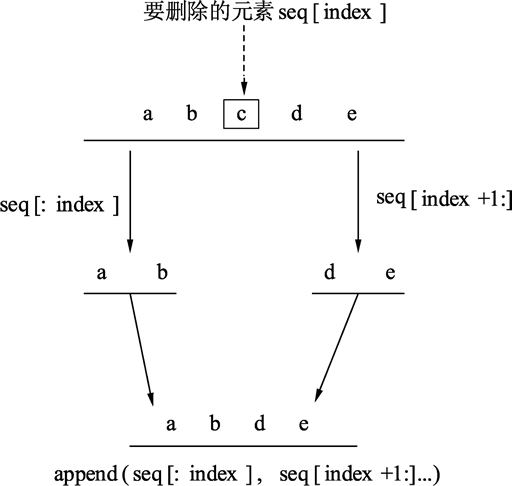

# Go 语言从切片中删除元素

Go 语言并没有对删除切片元素提供专用的语法或者接口，需要使用切片本身的特性来删除元素。示例代码如下：

```
seq := []string{"a", "b", "c", "d", "e"}

// 指定删除位置       
index := 2

// 查看删除位置之前的元素和之后的元素
fmt.Println(seq[:index], seq[index+1:])

// 将删除点前后的元素连接起来
seq = append(seq[:index], seq[index+1:]...)

fmt.Println(seq)
```

代码输出结果：
[a b] [d e]
[a b d e]

*   第 1 行，声明一个整型切片，保存含有从 a 到 e 的字符串。
*   第 4 行，为了演示和讲解方便，使用 index 变量保存需要删除的元素位置。
*   第 7 行中：seq[:index] 表示的就是被删除元素的前半部分，值为：
    [1 2]
    seq[index+1:] 表示的是被删除元素的后半部分，值为：
    [4 5]
*   第 10 行使用 append() 函数将两个切片连接起来。
*   第 12 行，输出连接好的新切片。此时，索引为 2 的元素已经被删除。

代码的删除过程可以使用下图来描述。
图：切片删除元素的操作过程
Go 语言中切片删除元素的本质是：以被删除元素为分界点，将前后两个部分的内存重新连接起来。

#### 提示

Go 语言中切片元素的删除过程并没有提供任何的语法糖或者方法封装，无论是初学者学习，还是实际使用都是极为麻烦的。

连续容器的元素删除无论是在任何语言中，都要将删除点前后的元素移动到新的位置。随着元素的增加，这个过程将会变得极为耗时。因此，当业务需要大量、频繁地从一个切片中删除元素时，如果对性能要求较高，就需要反思是否需要更换其他的容器（如双链表等能快速从删除点删除元素）。