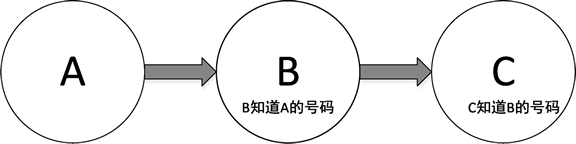
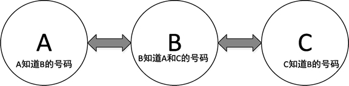
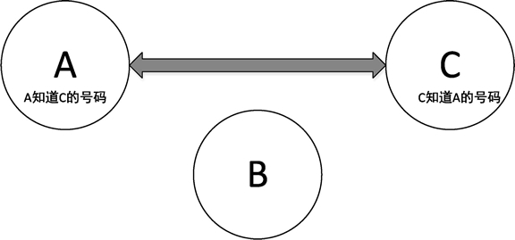

# Go 语言 list（列表）

列表是一种非连续存储的容器，由多个节点组成，节点通过一些变量记录彼此之间的关系。列表有多种实现方法，如单链表、双链表等。

列表的原理可以这样理解：假设 A、B、C 三个人都有电话号码，如果 A 把号码告诉给 B，B 把号码告诉给 C，这个过程就建立了一个单链表结构，如下图所示。


图：三人单向通知电话号码形成单链表结构
如果在这个基础上，再从 C 开始将自己的号码给自己知道号码的人，这样就形成了双链表结构，如下图所示。


图：三人相互通知电话号码形成双链表结构
那么如果需要获得所有人的号码，只需要从 A 或者 C 开始，要求他们将自己的号码发出来，然后再通知下一个人如此循环。这个过程就是列表遍历。

如果 B 换号码了，他需要通知 A 和 C，将自己的号码移除。这个过程就是列表元素的删除操作，如下图所示。


图：从双链表中删除一人的电话号码
在 Go 语言中，将列表使用 container/list 包来实现，内部的实现原理是双链表。列表能够高效地进行任意位置的元素插入和删除操作。

## 初始化列表

list 的初始化有两种方法：New 和声明。两种方法的初始化效果都是一致的。

1) 通过 container/list 包的 New 方法初始化 list

变量名 := list.New()

2) 通过声明初始化 list

var 变量名 list.List

列表与切片和 map 不同的是，列表并没有具体元素类型的限制。因此，列表的元素可以是任意类型。这既带来遍历，也会引来一些问题。给一个列表放入了非期望类型的值，在取出值后，将 interface{} 转换为期望类型时将会发生宕机。

## 在列表中插入元素

双链表支持从队列前方或后方插入元素，分别对应的方法是 PushFront 和 PushBack。

#### 提示

这两个方法都会返回一个 *list.Element 结构。如果在以后的使用中需要删除插入的元素，则只能通过 *list.Element 配合 Remove() 方法进行删除，这种方法可以让删除更加效率化，也是双链表特性之一。

下面代码展示如何给 list 添加元素：

```
l := list.New()

l.PushBack("fist")
l.PushFront(67)
```

代码说明如下：

*   第 1 行，创建一个列表实例。
*   第 3 行，将 fist 字符串插入到列表的尾部，此时列表是空的，插入后只有一个元素。
*   第 4 行，将数值 67 放入列表。此时，列表中已经存在 fist 元素，67 这个元素将被放在 fist 的前面。

列表插入元素的方法如下表所示。

| 方  法 | 功  能 |
| InsertAfter(v interface {}, mark * Element) * Element | 在 mark 点之后插入元素，mark 点由其他插入函数提供 |
| InsertBefore(v interface {}, mark * Element) *Element | 在 mark 点之前插入元素，mark 点由其他插入函数提供 |
| PushBackList(other *List) | 添加 other 列表元素到尾部 |
| PushFrontList(other *List) | 添加 other 列表元素到头部 |

## 从列表中删除元素

列表的插入函数的返回值会提供一个 *list.Element 结构，这个结构记录着列表元素的值及和其他节点之间的关系等信息。从列表中删除元素时，需要用到这个结构进行快速删除。

列表操作元素：

```
package main

import "container/list"

func main() {
    l := list.New()

    // 尾部添加
    l.PushBack("canon")

    // 头部添加
    l.PushFront(67)

    // 尾部添加后保存元素句柄
    element := l.PushBack("fist")

    // 在 fist 之后添加 high
    l.InsertAfter("high", element)

    // 在 fist 之前添加 noon
    l.InsertBefore("noon", element)

    // 使用
    l.Remove(element)
}
```

代码说明如下：
第 6 行，创建列表实例。
第 9 行，将 canon 字符串插入到列表的尾部。
第 12 行，将 67 数值添加到列表的头部。
第 15 行，将 fist 字符串插入到列表的尾部，并将这个元素的内部结构保存到 element 变量中。
第 18 行，使用 element 变量，在 element 的位置后面插入 high 字符串。
第 21 行，使用 element 变量，在 element 的位置前面插入 noon 字符串。
第 24 行，移除 element 变量对应的元素。

下表中展示了每次操作后列表的实际元素情况。

列表元素操作的过程

| 操作内容 | 列表元素 |
| l.PushBack("canon") | canon |
| l.PushFront(67) | 67, canon |
| element := l.PushBack("fist") | 67, canon, fist |
| l.InsertAfter("high", element) | 67, canon, fist, high |
| l.InsertBefore("noon", element) | 67, canon, noon, fist, high |
| l.Remove(element) | 67, canon, noon, high |

## 遍历列表——访问列表的每一个元素

遍历双链表需要配合 Front() 函数获取头元素，遍历时只要元素不为空就可以继续进行。每一次遍历调用元素的 Next，如代码中第 9 行所示。

```
l := list.New()

// 尾部添加
l.PushBack("canon")

// 头部添加
l.PushFront(67)

for i := l.Front(); i != nil; i = i.Next() {
    fmt.Println(i.Value)
}
```

代码输出如下：
67
canon

代码说明如下：

*   第 1 行，创建一个列表实例。
*   第 4 行，将 canon 放入列表尾部。
*   第 7 行，在队列头部放入 67。
*   第 9 行，使用 for 语句进行遍历，其中 i:=l.Front() 表示初始赋值，只会在一开始执行一次；每次循环会进行一次 i!=nil 语句判断，如果返回 false，表示退出循环，反之则会执行 i=i.Next()。
*   第 10 行，使用遍历返回的 *list.Element 的 Value 成员取得放入列表时的原值。