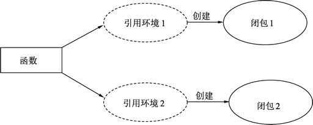

# Go 语言闭包（Closure）——引用了外部变量的匿名函数

闭包是引用了自由变量的函数，被引用的自由变量和函数一同存在，即使已经离开了自由变量的环境也不会被释放或者删除，在闭包中可以继续使用这个自由变量。因此，简单的说：

函数 + 引用环境 = 闭包

同一个函数与不同引用环境组合，可以形成不同的实例，如下图所示。
图：闭包与函数引用
一个函数类型就像结构体一样，可以被实例化。函数本身不存储任何信息，只有与引用环境结合后形成的闭包才具有“记忆性”。函数是编译期静态的概念，而闭包是运行期动态的概念。

#### 其它编程语言中的闭包

闭包（Closure）在某些编程语言中也被称为 Lambda 表达式。

闭包对环境中变量的引用过程，也可以被称为“捕获”，在 C++11 标准中，捕获有两种类型：引用和复制，可以改变引用的原值叫做“引用捕获”，捕获的过程值被复制到闭包中使用叫做“复制捕获”。

在 Lua 语言中，将被捕获的变量起了一个名字叫做 Upvalue，因为捕获过程总是对闭包上方定义过的自由变量进行引用。

闭包在各种语言中的实现也是不尽相同的。在 Lua 语言中，无论闭包还是函数都属于 Prototype 概念，被捕获的变量以 Upvalue 的形式引用到闭包中。

C++ 与 C# 中为闭包创建了一个类，而被捕获的变量在编译时放到类中的成员中，闭包在访问被捕获的变量时，实际上访问的是闭包隐藏类的成员。

## 在闭包内部修改引用的变量

闭包对它作用域上部变量的引用可以进行修改，修改引用的变量就会对变量进行实际修改，通过下面的例子来理解：

```
// 准备一个字符串
str := "hello world"

// 创建一个匿名函数
foo := func() {

    // 匿名函数中访问 str
    str = "hello dude"
}

// 调用匿名函数
foo()
```

代码说明如下：

*   第 2 行，准备一个字符串用于修改。
*   第 5 行，创建一个匿名函数。
*   第 8 行，在匿名函数中并没有定义 str，str 的定义在匿名函数之前，此时，str 就被引用到了匿名函数中形成了闭包。
*   第 12 行，执行闭包，此时 str 发生修改，变为 hello dude。

代码输出：
hello dude。

## 示例：闭包的记忆效应

被捕获到闭包中的变量让闭包本身拥有了记忆效应，闭包中的逻辑可以修改闭包捕获的变量，变量会跟随闭包生命期一直存在，闭包本身就如同变量一样拥有了记忆效应。

累加器的实现：

```
package main

import (
    "fmt"
)

// 提供一个值, 每次调用函数会指定对值进行累加
func Accumulate(value int) func() int {

    // 返回一个闭包
    return func() int {

        // 累加
        value++

        // 返回一个累加值
        return value
    }
}

func main() {

    // 创建一个累加器, 初始值为 1
    accumulator := Accumulate(1)

    // 累加 1 并打印
    fmt.Println(accumulator())

    fmt.Println(accumulator())

    // 打印累加器的函数地址
    fmt.Printf("%p\n", accumulator)

    // 创建一个累加器, 初始值为 1
    accumulator2 := Accumulate(10)

    // 累加 1 并打印
    fmt.Println(accumulator2())

    // 打印累加器的函数地址
    fmt.Printf("%p\n", accumulator2)
}
```

代码说明如下：

*   第 8 行，累加器生成函数，这个函数输出一个初始值，调用时返回一个为初始值创建的闭包函数。
*   第 11 行，返回一个闭包函数，每次返回会创建一个新的函数实例。
*   第 14 行，对引用的 Accumulate 参数变量进行累加，注意 value 不是第 11 行匿名函数定义的，但是被这个匿名函数引用，所以形成闭包。
*   第 17 行，将修改后的值通过闭包的返回值返回。
*   第 24 行，创建一个累加器，初始值为 1，返回的 accumulator 是类型为 func()int 的函数变量。
*   第 27 行，调用 accumulator() 时，代码从 11 行开始执行匿名函数逻辑，直到第 17 行返回。
*   第 32 行，打印累加器的函数地址。

对比输出的日志发现 accumulator 与 accumulator2 输出的函数地址不同，因此它们是两个不同的闭包实例。

每调用一次 accumulator 都会自动对引用的变量进行累加。

## 示例：闭包实现生成器

闭包的记忆效应进程被用于实现类似于设计模式中工厂模式的生成器。下面的例子展示了创建一个玩家生成器的过程。

玩家生成器的实现：

```
package main

import (
    "fmt"
)

// 创建一个玩家生成器, 输入名称, 输出生成器
func playerGen(name string) func() (string, int) {

    // 血量一直为 150
    hp := 150

    // 返回创建的闭包
    return func() (string, int) {

        // 将变量引用到闭包中
        return name, hp
    }
}

func main() {

    // 创建一个玩家生成器
    generator := playerGen("high noon")

    // 返回玩家的名字和血量
    name, hp := generator()

    // 打印值
    fmt.Println(name, hp)
}
```

代码输出如下：
high noon 150

代码说明如下：

*   第 8 行，playerGen() 需要提供一个名字来创建一个玩家的生成函数。
*   第 11 行，声明并设定 hp 变量为 150。
*   第 14～18 行，将 hp 和 name 变量引用到匿名函数中形成闭包。
*   第 24 行中，通过 playerGen 传入参数调用后获得玩家生成器。
*   第 27 行，调用这个玩家生成器函数，可以获得玩家的名称和血量。

闭包还具有一定的封装性，第 11 行的变量是 playerGen 的局部变量，playerGen 的外部无法直接访问及修改这个变量，这种特性也与面向对象中强调的封装性类似。