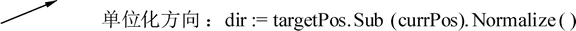

# Go 语言方法和接收器

Go 语言中的方法（Method）是一种作用于特定类型变量的函数。这种特定类型变量叫做接收器（Receiver）。

如果将特定类型理解为结构体或“类”时，接收器的概念就类似于其他语言中的 this 或者 self。

在 Go 语言中，接收器的类型可以是任何类型，不仅仅是结构体，任何类型都可以拥有方法。

#### 提示

在面向对象的语言中，类拥有的方法一般被理解为类可以做的事情。在 Go 语言中“方法”的概念与其他语言一致，只是 Go 语言建立的“接收器”强调方法的作用对象是接收器，也就是类实例，而函数没有作用对象。

## 为结构体添加方法

本节中，将会使用背包作为“对象”，将物品放入背包的过程作为“方法”，通过面向过程的方式和 Go 语言中结构体的方式来理解“方法”的概念。

#### 1) 面向过程实现方法

面向过程中没有“方法”概念，只能通过结构体和函数，由使用者使用函数参数和调用关系来形成接近“方法”的概念，代码如下：

```
type Bag struct {
    items []int
}

// 将一个物品放入背包的过程
func Insert(b *Bag, itemid int) {
    b.items = append(b.items, itemid)
}

func main() {

    bag := new(Bag)

    Insert(bag, 1001)
}
```

代码说明如下：

*   第 1 行，声明 Bag 结构，这个结构体包含一个整型切片类型的 items 的成员。
*   第 6 行，定义了 Insert() 函数，这个函数拥有两个参数，第一个是背包指针（*Bag），第二个是物品 ID（itemid）。
*   第 7 行，用 append() 将 itemid 添加到 Bag 的 items 成员中，模拟往背包添加物品的过程。
*   第 12 行，创建背包实例 bag。
*   第 14 行，调用 Insert() 函数，第一个参数放入背包，第二个参数放入物品 ID。

Insert() 函数将 *Bag 参数放在第一位，强调 Insert 会操作 *Bag 结构体。但实际使用中，并不是每个人都会习惯将操作对象放在首位。一定程度上让代码失去一些范式和描述性。同时，Insert() 函数也与 Bag 没有任何归属概念。随着类似 Insert() 的函数越来越多，面向过程的代码描述对象方法概念会越来越麻烦和难以理解。

#### 2) Go 语言的结构体方法

将背包及放入背包的物品中使用 Go 语言的结构体和方法方式编写：为 *Bag 创建一个方法，代码如下：

```
type Bag struct {
    items []int
}

func (b *Bag) Insert(itemid int) {
    b.items = append(b.items, itemid)
}

func main() {

    b := new(Bag)

    b.Insert(1001)
}
```

第 5 行中，Insert(itemid int) 的写法与函数一致。(b*Bag) 表示接收器，即 Insert 作用的对象实例。

每个方法只能有一个接收器，如下图所示。


图：接收器
第 13 行中，在 Insert() 转换为方法后，我们就可以愉快地像其他语言一样，用面向对象的方法来调用 b 的 Insert。

## 接收器——方法作用的目标

接收器的格式如下：

func (接收器变量 接收器类型) 方法名(参数列表) (返回参数) {
    函数体
}

对各部分的说明：

*   接收器变量：接收器中的参数变量名在命名时，官方建议使用接收器类型名的第一个小写字母，而不是 self、this 之类的命名。例如，Socket 类型的接收器变量应该命名为 s，Connector 类型的接收器变量应该命名为 c 等。
*   接收器类型：接收器类型和参数类似，可以是指针类型和非指针类型。
*   方法名、参数列表、返回参数：格式与函数定义一致。

接收器根据接收器的类型可以分为指针接收器、非指针接收器。两种接收器在使用时会产生不同的效果。根据效果的不同，两种接收器会被用于不同性能和功能要求的代码中。

#### 1) 理解指针类型的接收器

指针类型的接收器由一个结构体的指针组成，更接近于面向对象中的 this 或者 self。

由于指针的特性，调用方法时，修改接收器指针的任意成员变量，在方法结束后，修改都是有效的。

在下面的例子，使用结构体定义一个属性（Property），为属性添加 SetValue() 方法以封装设置属性的过程，通过属性的 Value() 方法可以重新获得属性的数值。使用属性时，通过 SetValue() 方法的调用，可以达成修改属性值的效果。

```
package main

import "fmt"

// 定义属性结构
type Property struct {
    value int  // 属性值
}

// 设置属性值
func (p *Property) SetValue(v int) {

    // 修改 p 的成员变量
    p.value = v
}

// 取属性值
func (p *Property) Value() int {
    return p.value
}

func main() {

    // 实例化属性
    p := new(Property)

    // 设置值
    p.SetValue(100)

    // 打印值
    fmt.Println(p.Value())

}
```

运行程序，输出如下：
100

代码说明如下：

*   第 6 行，定义一个属性结构，拥有一个整型的成员变量。
*   第 11 行，定义属性值的方法。
*   第 14 行，设置属性值方法的接收器类型为指针。因此可以修改成员值，即便退出方法，也有效。
*   第 18 行，定义获取值的方法。
*   第 25 行，实例化属性结构。
*   第 28 行，设置值。此时成员变量变为 100。
*   第 31 行，获取成员变量。

#### 2) 理解非指针类型的接收器

当方法作用于非指针接收器时，Go 语言会在代码运行时将接收器的值复制一份。在非指针接收器的方法中可以获取接收器的成员值，但修改后无效。

点（Point）使用结构体描述时，为点添加 Add() 方法，这个方法不能修改 Point 的成员 X、Y 变量，而是在计算后返回新的 Point 对象。Point 属于小内存对象，在函数返回值的复制过程中可以极大地提高代码运行效率，详细过程请参考下面的代码。

```
package main

import (
    "fmt"
)

// 定义点结构
type Point struct {
    X int
    Y int
}

// 非指针接收器的加方法
func (p Point) Add(other Point) Point {

    // 成员值与参数相加后返回新的结构
    return Point{p.X + other.X, p.Y + other.Y}
}

func main() {

    // 初始化点
    p1 := Point{1, 1}
    p2 := Point{2, 2}

    // 与另外一个点相加
    result := p1.Add(p2)

    // 输出结果
    fmt.Println(result)

}
```

代码输出如下：
{3 3}

代码说明如下：

*   第 8 行，定义一个点结构，拥有 X 和 Y 两个整型分量。
*   第 14 行，为 Point 结构定义一个 Add() 方法。传入和返回都是点的结构，可以方便地实现多个点连续相加的效果，例如：

    ```
    P4 := P1.Add( P2 ).Add( P3 )
    ```

*   第 23 和 24 行，初始化两个点 p1 和 p2。
*   第 27 行，将 p1 和 p2 相加后返回结果。
*   第 30 行，打印结果。

由于例子中使用了非指针接收器，Add() 方法变得类似于只读的方法，Add() 方法内部不会对成员进行任何修改。

#### 3) 指针和非指针接收器的使用

在计算机中，小对象由于值复制时的速度较快，所以适合使用非指针接收器。大对象因为复制性能较低，适合使用指针接收器，在接收器和参数间传递时不进行复制，只是传递指针。

## 示例：二维矢量模拟玩家移动

在游戏中，一般使用二维矢量保存玩家的位置。使用矢量运算可以计算出玩家移动的位置。本例子中，首先实现二维矢量对象，接着构造玩家对象，最后使用矢量对象和玩家对象共同模拟玩家移动的过程。

#### 1) 实现二维矢量结构

矢量是数学中的概念，二维矢量拥有两个方向的信息，同时可以进行加、减、乘（缩放）、距离、单位化等计算。在计算机中，使用拥有 X 和 Y 两个分量的 Vec2 结构体实现数学中二维向量的概念。详细实现请参考下面的代码。

```
package main

import "math"

type Vec2 struct {
    X, Y float32
}

// 加
func (v Vec2) Add(other Vec2) Vec2 {

    return Vec2{
        v.X + other.X,
        v.Y + other.Y,
    }

}

// 减
func (v Vec2) Sub(other Vec2) Vec2 {

    return Vec2{
        v.X - other.X,
        v.Y - other.Y,
    }
}

// 乘
func (v Vec2) Scale(s float32) Vec2 {

    return Vec2{v.X * s, v.Y * s}
}

// 距离
func (v Vec2) DistanceTo(other Vec2) float32 {
    dx := v.X - other.X
    dy := v.Y - other.Y

    return float32(math.Sqrt(float64(dx*dx + dy*dy)))
}

// 插值
func (v Vec2) Normalize() Vec2 {
    mag := v.X*v.X + v.Y*v.Y
    if mag > 0 {
        oneOverMag := 1 / float32(math.Sqrt(float64(mag)))
        return Vec2{v.X * oneOverMag, v.Y * oneOverMag}
    }

    return Vec2{0, 0}
}
```

代码说明如下：

*   第 5 行声明了一个 Vec2 结构体，包含两个方向的单精度浮点数作为成员。
*   第 10～16 行定义了 Vec2 的 Add() 方法。使用自身 Vec2 和通过 Add() 方法传入的 Vec2 进行相加。相加后，结果以返回值形式返回，不会修改 Vec2 的成员。
*   第 20 行定义了 Vec2 的减法操作。
*   第 29 行，缩放或者叫矢量乘法，是对矢量的每个分量乘上缩放比，Scale() 方法传入一个参数同时乘两个分量，表示这个缩放是一个等比缩放。
*   第 35 行定义了计算两个矢量的距离。math.Sqrt() 是开方函数，参数是 float64，在使用时需要转换。返回值也是 float64，需要转换回 float32。
*   第 43 行定义矢量单位化。

#### 2) 实现玩家对象

玩家对象负责存储玩家的当前位置、目标位置和速度。使用 MoveTo() 方法为玩家设定移动的目标，使用 Update() 方法更新玩家位置。在 Update() 方法中，通过一系列的矢量计算获得玩家移动后的新位置，步骤如下。

① 使用矢量减法，将目标位置（targetPos）减去当前位置（currPos）即可计算出位于两个位置之间的新矢量，如下图所示。


图：计算玩家方向矢量
② 使用 Normalize() 方法将方向矢量变为模为 1 的单位化矢量。这里需要将矢量单位化后才能进行后续计算，如下图所示。


图：单位化方向矢量
③ 获得方向后，将单位化方向矢量根据速度进行等比缩放，速度越快，速度数值越大，乘上方向后生成的矢量就越长（模很大），如下图所示。


图：根据速度缩放方向
④ 将缩放后的方向添加到当前位置后形成新的位置，如下图所示。


图：缩放后的方向叠加位置形成新位置
下面是玩家对象的具体代码：

```
package main

type Player struct {
    currPos   Vec2    // 当前位置
    targetPos Vec2    // 目标位置
    speed     float32 // 移动速度
}

// 移动到某个点就是设置目标位置
func (p *Player) MoveTo(v Vec2) {

    p.targetPos = v
}

// 获取当前的位置
func (p *Player) Pos() Vec2 {
    return p.currPos
}

// 是否到达
func (p *Player) IsArrived() bool {

    // 通过计算当前玩家位置与目标位置的距离不超过移动的步长，判断已经到达目标点
    return p.currPos.DistanceTo(p.targetPos) < p.speed
}

// 逻辑更新
func (p *Player) Update() {

    if !p.IsArrived() {

        // 计算出当前位置指向目标的朝向
        dir := p.targetPos.Sub(p.currPos).Normalize()

        // 添加速度矢量生成新的位置
        newPos := p.currPos.Add(dir.Scale(p.speed))

        // 移动完成后，更新当前位置
        p.currPos = newPos
    }

}

// 创建新玩家
func NewPlayer(speed float32) *Player {

    return &Player{
        speed: speed,
    }
}
```

代码说明如下：

*   第 3 行，结构体 Player 定义了一个玩家的基本属性和方法。结构体的 currPos 表示当前位置，speed 表示速度。
*   第 10 行，定义玩家的移动方法。逻辑层通过这个函数告知玩家要去的目标位置，随后的移动过程由 Update() 方法负责。
*   第 15 行，使用 Pos 方法实现玩家 currPos 的属性访问封装。
*   第 20 行，判断玩家是否到达目标点。玩家每次移动的半径就是速度（speed），因此，如果与目标点的距离小于速度，表示已经非常靠近目标，可以视为到达目标。
*   第 27 行，玩家移动时位置更新的主要实现。
*   第 29 行，如果已经到达，则不必再更新。
*   第 32 行，数学中，两矢量相减将获得指向被减矢量的新矢量。Sub() 方法返回的新矢量使用 Normalize() 方法单位化。最终返回的 dir 矢量就是移动方向。
*   第 35 行，在当前的位置上叠加根据速度缩放的方向计算出新的位置 newPos。
*   第 38 行，将新位置更新到 currPos，为下一次移动做准备。
*   第 44 行，玩家的构造函数，创建一个玩家实例需要传入一个速度值。

#### 3) 处理移动逻辑

将 Player 实例化后，设定玩家移动的最终目标点。之后开始进行移动的过程，这是一个不断更新位置的循环过程，每次检测玩家是否靠近目标点附近，如果还没有到达，则不断地更新位置，让玩家朝着目标点不停的修改当前位置，如下代码所示：

```
package main

import "fmt"

func main() {

    // 实例化玩家对象，并设速度为 0.5
    p := NewPlayer(0.5)

    // 让玩家移动到 3,1 点
    p.MoveTo(Vec2{3, 1})

    // 如果没有到达就一直循环
    for !p.IsArrived() {

        // 更新玩家位置
        p.Update()

        // 打印每次移动后的玩家位置
        fmt.Println(p.Pos())
    }

}
```

代码说明如下：

*   第 8 行，使用 NewPlayer() 函数构造一个 *Player 玩家对象，并设移动速度为 0.5，速度本身是一种相对的和抽象的概念，在这里没有单位，可以根据实际效果进行调整，达到合适的范围即可。
*   第 11 行，设定玩家移动的最终目标为 X 为 3，Y 为 1。
*   第 14 行，构造一个循环，条件是没有到达时一直循环。
*   第 17 行，不停地更新玩家位置，如果玩家到达目标，p.IsArrived 将会变为 true。
*   第 20 行，打印每次更新后玩家的位置。

本例中使用到了结构体的方法、构造函数、指针和非指针类型方法接收器等，读者通过这个例子可以了解在哪些地方能够使用结构体。