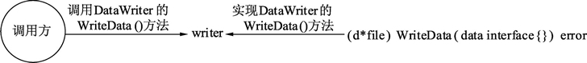

# Go 语言实现接口的条件

接口定义后，需要实现接口，调用方才能正确编译通过并使用接口。接口的实现需要遵循两条规则才能让接口可用。

## 接口被实现的条件一：接口的方法与实现接口的类型方法格式一致

在类型中添加与接口签名一致的方法就可以实现该方法。签名包括方法中的名称、参数列表、返回参数列表。也就是说，只要实现接口类型中的方法的名称、参数列表、返回参数列表中的任意一项与接口要实现的方法不一致，那么接口的这个方法就不会被实现。

为了抽象数据写入的过程，定义 DataWriter 接口来描述数据写入需要实现的方法，接口中的 WriteData() 方法表示将数据写入，写入方无须关心写入到哪里。实现接口的类型实现 WriteData 方法时，会具体编写将数据写入到什么结构中。这里使用 file 结构体实现 DataWriter 接口的 WriteData 方法，方法内部只是打印一个日志，表示有数据写入，详细实现过程请参考下面的代码。

数据写入器的抽象：

```
package main

import (
    "fmt"
)

// 定义一个数据写入器
type DataWriter interface {
    WriteData(data interface{}) error
}

// 定义文件结构，用于实现 DataWriter
type file struct {
}

// 实现 DataWriter 接口的 WriteData 方法
func (d *file) WriteData(data interface{}) error {

    // 模拟写入数据
    fmt.Println("WriteData:", data)
    return nil
}

func main() {

    // 实例化 file
    f := new(file)

    // 声明一个 DataWriter 的接口
    var writer DataWriter

    // 将接口赋值 f，也就是*file 类型
    writer = f

    // 使用 DataWriter 接口进行数据写入
    writer.WriteData("data")
}
```

代码说明如下：

*   第 8 行，定义 DataWriter 接口。这个接口只有一个方法，即 WriteData()，输入一个 interface{} 类型的 data，返回一个 error 结构表示可能发生的错误。
*   第 17 行，file 的 WriteData() 方法使用指针接收器。输入一个 interface{} 类型的 data，返回 error。
*   第 27 行，实例化 file 赋值给 f，f 的类型为 *file。
*   第 30 行，声明 DataWriter 类型的 writer 接口变量。
*   第 33 行，将 *file 类型的 f 赋值给 DataWriter 接口的 writer，虽然两个变量类型不一致。但是 writer 是一个接口，且 f 已经完全实现了 DataWriter() 的所有方法，因此赋值是成功的。
*   第 36 行，DataWriter 接口类型的 writer 使用 WriteData() 方法写入一个字符串。

运行代码，输出如下：
WriteData: data

本例中调用及实现关系如下图所示。
图：WriteWriter 的实现过程
当类型无法实现接口时，编译器会报错，下面列出常见的几种接口无法实现的错误。

#### 1) 函数名不一致导致的报错

在以上代码的基础上尝试修改部分代码，造成编译错误，通过编译器的报错理解如何实现接口的方法。首先，修改 file 结构的 WriteData() 方法名，将这个方法签名（第 17 行）修改为：

```
func (d *file) WriteDataX(data interface{}) error {
```

编译代码，报错：

cannot use f (type *file) as type DataWriter in assignment:
        *file does not implement DataWriter (missing WriteData method)

报错的位置在第 33 行。报错含义是：不能将 f 变量（类型*file）视为 DataWriter 进行赋值。原因：*file 类型未实现 DataWriter 接口（丢失 WriteData 方法）。

WriteDataX 方法的签名本身是合法的。但编译器扫描到第 33 行代码时，发现尝试将 *file 类型赋值给 DataWriter 时，需要检查 *file 类型是否完全实现了 DataWriter 接口。显然，编译器因为没有找到 DataWriter 需要的 WriteData() 方法而报错。

#### 2) 实现接口的方法签名不一致导致的报错

将修改的代码恢复后，再尝试修改 WriteData() 方法，把 data 参数的类型从 interface{} 修改为 int 类型，代码如下：

```
func (d *file) WriteData(data int) error {
```

编译代码，报错：

cannot use f (type *file) as type DataWriter in assignment:
        *file does not implement DataWriter (wrong type for WriteData method)
                have WriteData(int) error
                want WriteData(interface {}) error

这次未实现 DataWriter 的理由变为（错误的 WriteData() 方法类型）发现 WriteData(int)error，期望 WriteData(interface{})error。

这种方式的报错就是由实现者的方法签名与接口的方法签名不一致导致的。

## 接口被实现的条件二：接口中所有方法均被实现

当一个接口中有多个方法时，只有这些方法都被实现了，接口才能被正确编译并使用。

在本节开头的代码中，为 DataWriter 中 添加一个方法，代码如下：

```
// 定义一个数据写入器
type DataWriter interface {
    WriteData(data interface{}) error

    // 能否写入
    CanWrite() bool
}
```

新增 CanWrite() 方法，返回 bool。此时再次编译代码，报错：

cannot use f (type *file) as type DataWriter in assignment:
        *file does not implement DataWriter (missing CanWrite method)

需要在 file 中实现 CanWrite() 方法才能正常使用 DataWriter()。

Go 语言的接口实现是隐式的，无须让实现接口的类型写出实现了哪些接口。这个设计被称为非侵入式设计。

实现者在编写方法时，无法预测未来哪些方法会变为接口。一旦某个接口创建出来，要求旧的代码来实现这个接口时，就需要修改旧的代码的派生部分，这一般会造成雪崩式的重新编译。

#### 提示

传统的派生式接口及类关系构建的模式，让类型间拥有强耦合的父子关系。这种关系一般会以“类派生图”的方式进行。经常可以看到大型软件极为复杂的派生树。随着系统的功能不断增加，这棵“派生树”会变得越来越复杂。

对于 Go 语言来说，非侵入式设计让实现者的所有类型均是平行的、组合的。如何组合则留到使用者编译时再确认。因此，使用 GO 语言时，不需要同时也不可能有“类派生图”，开发者唯一需要关注的就是“我需要什么？”，以及“我能实现什么？”。