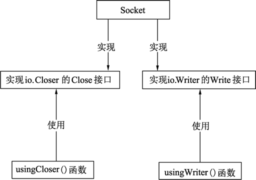

# Go 语言类型与接口的关系

类型和接口之间有一对多和多对一的关系，下面将列举出这些常见的概念，以方便读者理解接口与类型在复杂环境下的实现关系。

## 一个类型可以实现多个接口

一个类型可以同时实现多个接口，而接口间彼此独立，不知道对方的实现。

网络上的两个程序通过一个双向的通信连接实现数据的交换，连接的一端称为一个 Socket。Socket 能够同时读取和写入数据，这个特性与文件类似。因此，开发中把文件和 Socket 都具备的读写特性抽象为独立的读写器概念。

Socket 和文件一样，在使用完毕后，也需要对资源进行释放。

把 Socket 能够写入数据和需要关闭的特性使用接口来描述，请参考下面的代码：

```
type Socket struct {
}

func (s *Socket) Write(p []byte) (n int, err error) {

    return 0, nil
}

func (s *Socket) Close() error {

    return nil
}
```

Socket 结构的 Write() 方法实现了 io.Writer 接口：

```
type Writer interface {
    Write(p []byte) (n int, err error)
}
```

同时，Socket 结构也实现了 io.Closer 接口：

```
type Closer interface {
    Close() error
}
```

使用 Socket 实现的 Writer 接口的代码，无须了解 Writer 接口的实现者是否具备 Closer 接口的特性。同样，使用 Closer 接口的代码也并不知道 Socket 已经实现了 Writer 接口，如下图所示。


图：接口的使用和实现过程
在代码中使用 Socket 结构实现的 Writer 接口和 Closer 接口代码如下：

```
// 使用 io.Writer 的代码, 并不知道 Socket 和 io.Closer 的存在
func usingWriter( writer io.Writer){
    writer.Write( nil )
}

// 使用 io.Closer, 并不知道 Socket 和 io.Writer 的存在
func usingCloser( closer io.Closer) {
    closer.Close()
}

func main() {

    // 实例化 Socket
    s := new(Socket)

    usingWriter(s)

    usingCloser(s)
}
```

usingWriter() 和 usingCloser() 完全独立，互相不知道对方的存在，也不知道自己使用的接口是 Socket 实现的。

## 多个类型可以实现相同的接口

一个接口的方法，不一定需要由一个类型完全实现，接口的方法可以通过在类型中嵌入其他类型或者结构体来实现。也就是说，使用者并不关心某个接口的方法是通过一个类型完全实现的，还是通过多个结构嵌入到一个结构体中拼凑起来共同实现的。

Service 接口定义了两个方法：一个是开启服务的方法（Start()），一个是输出日志的方法（Log()）。使用 GameService 结构体来实现 Service，GameService 自己的结构只能实现 Start() 方法，而 Service 接口中的 Log() 方法已经被一个能输出日志的日志器（Logger）实现了，无须再进行 GameService 封装，或者重新实现一遍。所以，选择将 Logger 嵌入到 GameService 能最大程度地避免代码冗余，简化代码结构。详细实现过程如下：

```
// 一个服务需要满足能够开启和写日志的功能
type Service interface {
    Start()  // 开启服务
    Log(string)  // 日志输出
}

// 日志器
type Logger struct {
}

// 实现 Service 的 Log()方法
func (g *Logger) Log(l string) {

}

// 游戏服务
type GameService struct {
    Logger  // 嵌入日志器
}

// 实现 Service 的 Start()方法
func (g *GameService) Start() {
}
```

代码说明如下：

*   第 2 行，定义服务接口，一个服务需要实现 Start() 方法和日志方法。
*   第 8 行，定义能输出日志的日志器结构。
*   第 12 行，为 Logger 添加 Log() 方法，同时实现 Service 的 Log() 方法。
*   第 17 行，定义 GameService 结构。
*   第 18 行，在 GameService 中嵌入 Logger 日志器，以实现日志功能。
*   第 22 行，GameService 的 Start() 方法实现了 Service 的 Start() 方法。

此时，实例化 GameService，并将实例赋给 Service，代码如下：

```
var s Service = new(GameService)
s.Start()
s.Log(“hello”)
```

s 就可以使用 Start() 方法和 Log() 方法，其中，Start() 由 GameService 实现，Log() 方法由 Logger 实现。