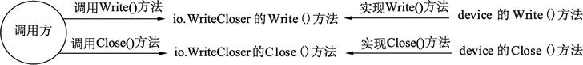

# Go 语言接口的嵌套组合

在 Go 语言中，不仅结构体与结构体之间可以嵌套，接口与接口间也可以通过嵌套创造出新的接口。

接口与接口嵌套组合而成了新接口，只要接口的所有方法被实现，则这个接口中的所有嵌套接口的方法均可以被调用。

## 系统包中的接口嵌套组合

Go 语言的 io 包中定义了写入器（Writer）、关闭器（Closer）和写入关闭器（WriteCloser）3 个接口，代码如下：

```
type Writer interface {
    Write(p []byte) (n int, err error)
}

type Closer interface {
    Close() error
}

type WriteCloser interface {
    Writer
    Closer
}
```

代码说明如下：

*   第 1 行定义了写入器（Writer），如这个接口较为常用，常用于 I/O 设备的数据写入。
*   第 5 行定义了关闭器（Closer），如有非托管内存资源的对象，需要用关闭的方法来实现资源释放。
*   第 9 行定义了写入关闭器（WriteCloser），这个接口由 Writer 和 Closer 两个接口嵌入。也就是说，WriteCloser 同时拥有了 Writer 和 Closer 的特性。

## 在代码中使用接口嵌套组合

在代码中使用 io.Writer、io.Closer 和 io.WriteCloser 这 3 个接口时，只需要按照接口实现的规则实现 io.Writer 接口和 io.Closer 接口即可。而 io.WriteCloser 接口在使用时，编译器会根据接口的实现者确认它们是否同时实现了 io.Writer 和 io.Closer 接口，详细实现代码如下：

```
package main

import (
    "io"
)

// 声明一个设备结构
type device struct {
}

// 实现 io.Writer 的 Write()方法
func (d *device) Write(p []byte) (n int, err error) {
    return 0, nil
}

// 实现 io.Closer 的 Close()方法
func (d *device) Close() error {
    return nil
}

func main() {

    // 声明写入关闭器, 并赋予 device 的实例
    var wc io.WriteCloser = new(device)

    // 写入数据
    wc.Write(nil)

    // 关闭设备
    wc.Close()

    // 声明写入器, 并赋予 device 的新实例
    var writeOnly io.Writer = new(device)

    // 写入数据
    writeOnly.Write(nil)

}
```

代码说明如下：

*   第 8 行定义了 device 结构体，用来模拟一个虚拟设备，这个结构会实现前面提到的 3 种接口。
*   第 12 行，实现了 io.Writer 的 Write() 方法。
*   第 17 行，实现了 io.Closer 的 Close() 方法。
*   第 24 行，对 device 实例化，由于 device 实现了 io.WriteCloser 的所有嵌入接口，因此 device 指针就会被隐式转换为 io.WriteCloser 接口。
*   第 27 行，调用了 wc（io.WriteCloser 接口）的 Write() 方法，由于 wc 被赋值 *device，因此最终会调用 device 的 Write() 方法。
*   第 30 行，与 27 行类似，最终调用 device 的 Close() 方法。
*   第 33 行，再次创建一个 device 的实例，writeOnly 是一个 io.Writer 接口，这个接口只有 Write() 方法。
*   第 36 行，writeOnly 只能调用 Write() 方法，没有 Close() 方法。

为了整理思路，将上面的实现、调用关系使用图方式来展现，参见图 1 和图 2。

1) io.WriteCloser 的实现及调用过程如图 1 所示。


图 1：io.WriteCloser 的实现及调用过程
2) io.Writer 的实现调用过程如图 2 所示。


图 2：io.Write 的实现及调用过程
给 io.WriteCloser 或 io.Writer 更换不同的实现者，可以动态地切换实现代码。