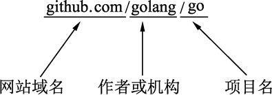

# go get 命令——一键获取代码、编译并安装

go get 可以借助代码管理工具通过远程拉取或更新代码包及其依赖包，并自动完成编译和安装。整个过程就像安装一个 App 一样简单。

使用 go get 前，需要安装与远程包匹配的代码管理工具，如 Git、SVN、HG 等，参数中需要提供一个包名。

## 远程包的路径格式

Go 语言的代码被托管于 Github.com 网站，该网站是基于 Git 代码管理工具的，很多有名的项目都在该网站托管代码。其他类似的托管网站还有 code.google.com、bitbucket.org 等。

这些网站的项目包路径都有一个共同的标准，参见下图所示。

图：远程包路径格式
图中的远程包路径是 Go 语言的源码，这个路径共由 3 个部分组成：

*   网站域名：表示代码托管的网站，类似于电子邮件 @ 后面的服务器地址。
*   作者或机构：表明这个项目的归属，一般为网站的用户名，如果需要找到这个作者下的所有项目，可以直接在网站上通过搜索“域名/作者”进行查看。这部分类似于电子邮件 @ 前面的部分。
*   项目名：每个网站下的作者或机构可能会同时拥有很多的项目，图中标示的部分表示项目名称。

## go get+远程包

默认情况下，go get 可以直接使用。例如，想获取 go 的源码并编译，使用下面的命令行即可：

$ go get github.com/davyxu/cellnet

获取前，请确保 GOPATH 已经设置。Go 1.8 版本之后，GOPATH 默认在用户目录的 go 文件夹下。

cellnet 只是一个网络库，并没有可执行文件，因此在 go get 操作成功后 GOPATH 下的 bin 目录下不会有任何编译好的二进制文件。

需要测试获取并编译二进制的，可以尝试下面的这个命令。当获取完成后，就会自动在 GOPATH 的 bin 目录下生成编译好的二进制文件。

$ go get github.com/davyxu/tabtoy

## go get 使用时的附加参数

使用 go get 时可以配合附加参数显示更多的信息及实现特殊的下载和安装操作，详见下表所示。

go get 使用时的附加参数

| 附加参数 | 备  注 |
| -v | 显示操作流程的日志及信息，方便检查错误 |
| -u | 下载丢失的包，但不会更新已经存在的包 |
| -d | 只下载，不安装 |
| -insecure | 允许使用不安全的 HTTP 方式进行下载操作 |