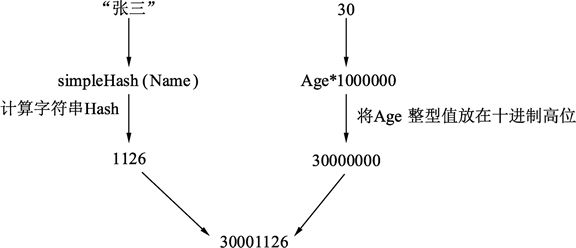
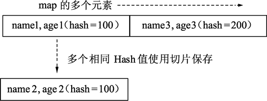

# Go 语言 map 的多键索引——多个数值条件可以同时查询

在大多数的编程语言中，映射容器的键必须以单一值存在。这种映射方法经常被用在诸如信息检索上，如根据通讯簿的名字进行检索。但随着查询条件越来越复杂，检索也会变得越发困难。下面例子中涉及通讯簿的结构，结构如下：

```
// 人员档案
type Profile struct {
    Name    string   // 名字
    Age     int      // 年龄
    Married bool     // 已婚
}
```

并且准备好了一堆原始数据，需要算法实现构建索引和查询的过程，代码如下：

```
func main() {

    list := []*Profile{
        {Name: "张三", Age: 30, Married: true},
        {Name: "李四", Age: 21},
        {Name: "王麻子", Age: 21},
    }

    buildIndex(list)

    queryData("张三", 30)
}
```

需要用算法实现 buildIndex() 构建索引函数及 queryData() 查询数据函数，查询到结果后将数据打印出来。

下面，分别基于传统的基于哈希值的多键索引和利用 map 特性的多键索引进行查询。

## 基于哈希值的多键索引及查询

传统的数据索引过程是将输入的数据做特征值。这种特征值有几种常见做法：

*   将特征使用某种算法转为整数，即哈希值，使用整型值做索引。
*   将特征转为字符串，使用字符串做索引。

数据都基于特征值构建好索引后，就可以进行查询。查询时，重复这个过程，将查询条件转为特征值，使用特征值进行查询得到结果。

基于哈希的传统多键索引和查询的完整代码位于`./src/chapter12/classic/classic.go`，下面是对各个部分的分析。

> 本套教程所有源码下载地址：[`pan.baidu.com/s/1ORFVTOLEYYqDhRzeq0zIiQ`](https://pan.baidu.com/s/1ORFVTOLEYYqDhRzeq0zIiQ)    提取密码：hfyf

#### 1) 字符串转哈希值

本例中，查询键（classicQueryKey）的特征值需要将查询键中每一个字段转换为整型，字符串也需要转换为整型值，这里使用一种简单算法将字符串转换为需要的哈希值，代码如下：

```
func simpleHash(str string) (ret int) {

    // 遍历字符串中的每一个 ASCII 字符
    for i := 0; i < len(str); i++ {
        // 取出字符
        c := str[i]

        // 将字符的 ASCII 码相加
        ret += int(c)
    }

    return
}
```

代码说明如下：

*   第 1 行传入需要计算哈希值的字符串。
*   第 4 行，根据字符串的长度，遍历这个字符串的每一个字符，以 ASCII 码为单位。
*   第 9 行，c 变量的类型为 uint8，将其转为 int 类型并累加。

哈希算法有很多，这里只是选用一种大家便于理解的算法。哈希算法的选用的标准是尽量减少重复键的发生，俗称“哈希冲撞”，即同样两个字符串的哈希值重复率降到最低。

#### 2) 查询键

有了哈希算法函数后，将哈希函数用在查询键结构中。查询键结构如下：

```
// 查询键
type classicQueryKey struct {
    Name string  // 要查询的名字
    Age  int     // 要查询的年龄
}

// 计算查询键的哈希值
func (c *classicQueryKey) hash() int {
    // 将名字的 Hash 和年龄哈希合并
    return simpleHash(c.Name) + c.Age*1000000
}
```

代码说明如下：

*   第 2 行，声明查询键的结构，查询键包含需要索引和查询的字段。
*   第 8 行，查询键的成员方法哈希，通过调用这个方法获得整个查询键的哈希值。
*   第 10 行，查询键哈希的计算方法：使用 simpleHash() 函数根据给定的名字字符串获得其哈希值。同时将年龄乘以 1000000 与名字哈希值相加。

哈希值构建过程如下图所示

#### 3) 构建索引

本例需要快速查询，因此需要提前对已有的数据构建索引。前面已经准备好了数据查询键，使用查询键获得哈希即可对数据进行快速索引，参考下面的代码：

```
// 创建哈希值到数据的索引关系
var mapper = make(map[int][]*Profile)

// 构建数据索引
func buildIndex(list []*Profile) {

    // 遍历所有的数据
    for _, profile := range list {

        // 构建数据的查询索引
        key := classicQueryKey{profile.Name, profile.Age}

        // 计算数据的哈希值, 取出已经存在的记录
        existValue := mapper[key.hash()]

        // 将当前数据添加到已经存在的记录切片中
        existValue = append(existValue, profile)

        // 将切片重新设置到映射中
        mapper[key.hash()] = existValue
    }
}
```

代码说明如下：

*   第 2 行，实例化一个 map，键类型为整型，保存哈希值；值类型为 *Profile，为通讯簿的数据格式。
*   第 5 行，构建索引函数入口，传入数据切片。
*   第 8 行，遍历数据切片的所有数据元素。
*   第 11 行，使用查询键（classicQueryKey）来辅助计算哈希值，查询键需要填充两个字段，将数据中的名字和年龄赋值到查询键中进行保存。
*   第 14 行，使用查询键的哈希方法计算查询键的哈希值。通过这个值在 mapper 索引中查找相同哈希值的数据切片集合。因为哈希函数不能保证不同数据的哈希值一定完全不同，因此要考虑在发生哈希值重复时的处理办法。
*   第 17 行，将当前数据添加到可能存在的切片中。
*   第 20 行，将新添加好的数据切片重新赋值到相同哈希的 mapper 中。

具体哈希结构如下图所示。
图：哈希结构
这种多键的算法就是哈希算法。map 的多个元素对应哈希的“桶”。哈希函数的选择决定桶的映射好坏，如果哈希冲撞很厉害，那么就需要将发生冲撞的相同哈希值的元素使用切片保存起来。

#### 4) 查询逻辑

从已经构建好索引的数据中查询需要的数据流程如下：

1.  给定查询条件（名字、年龄）。
2.  根据查询条件构建查询键。
3.  查询键生成哈希值。
4.  根据哈希值在索引中查找数据集合。
5.  遍历数据集合逐个与条件比对。
6.  获得结果。

```
func queryData(name string, age int) {

    // 根据给定查询条件构建查询键
    keyToQuery := classicQueryKey{name, age}

    // 计算查询键的哈希值并查询, 获得相同哈希值的所有结果集合
    resultList := mapper[keyToQuery.hash()]

    // 遍历结果集合
    for _, result := range resultList {

        // 与查询结果比对, 确认找到打印结果
        if result.Name == name && result.Age == age {
            fmt.Println(result)
            return
        }
    }

    // 没有查询到时, 打印结果
    fmt.Println("no found")

}
```

代码说明如下：

*   第 1 行，查询条件（名字、年龄）。
*   第 4 行，根据查询条件构建查询键。
*   第 7 行，使用查询键计算哈希值，使用哈希值查询相同哈希值的所有数据集合。
*   第 10 行，遍历所有相同哈希值的数据集合。
*   第 13 行，将每个数据与查询条件进行比对，如果一致，表示已经找到结果，打印并返回。
*   第 20 行，没有找到记录时，打印 no found。

## 利用 map 特性的多键索引及查询

使用结构体进行多键索引和查询比传统的写法更为简单，最主要的区别是无须准备哈希函数及相应的字段无须做哈希合并。看下面的实现流程。

利用 map 特性的多键索引和查询的代码位于`./src/chapter12/multikey/multikey.go`，下面是对各个部分的分析。

> 本套教程所有源码下载地址：[`pan.baidu.com/s/1ORFVTOLEYYqDhRzeq0zIiQ`](https://pan.baidu.com/s/1ORFVTOLEYYqDhRzeq0zIiQ)    提取密码：hfyf

#### 1) 构建索引

代码如下：

```
// 查询键
type queryKey struct {
    Name string
    Age  int
}

// 创建查询键到数据的映射
var mapper = make(map[queryKey]*Profile)

// 构建查询索引
func buildIndex(list []*Profile) {

    // 遍历所有数据
    for _, profile := range list {

        // 构建查询键
        key := queryKey{
            Name: profile.Name,
            Age:  profile.Age,
        }

        // 保存查询键
        mapper[key] = profile
    }
}
```

代码说明如下：

*   第 2 行，与基于哈希值的查询键的结构相同。
*   第 8 行，在 map 的键类型上，直接使用了查询键结构体。注意，这里不使用查询键的指针。同时，结果只有 *Profile 类型，而不是 *Profile 切片，表示查到的结果唯一。
*   第 17 行，类似的，使用遍历到的数据的名字和年龄构建查询键。
*   第 23 行，更简单的，直接将查询键保存对应的数据。

#### 2) 查询逻辑

```
// 根据条件查询数据
func queryData(name string, age int) {

    // 根据查询条件构建查询键
    key := queryKey{name, age}

    // 根据键值查询数据
    result, ok := mapper[key]

    // 找到数据打印出来
    if ok {
        fmt.Println(result)
    } else {
        fmt.Println("no found")
    }
}
```

代码说明如下：

*   第 5 行，根据查询条件（名字、年龄）构建查询键。
*   第 8 行，直接使用查询键在 map 中查询结果。
*   第 12 行，找到结果直接打印。
*   第 14 行，没有找到结果打印 no found。

## 总结

基于哈希值的多键索引查询和利用 map 特性的多键索引查询的代码复杂程度显而易见。聪明的程序员都会利用 Go 语言的特性进行快速的多键索引查询。

其实，利用 map 特性的例子中的 map 类型即便修改为下面的格式，也一样可以获得同样的结果：

```
var mapper = make(map[interface{}]*Profile)
```

代码量大大减少的关键是：Go 语言的底层会为 map 的键自动构建哈希值。能够构建哈希值的类型必须是非动态类型、非指针、函数、闭包。

*   非动态类型：可用数组，不能用切片。
*   非指针：每个指针数值都不同，失去哈希意义。
*   函数、闭包不能作为 map 的键。