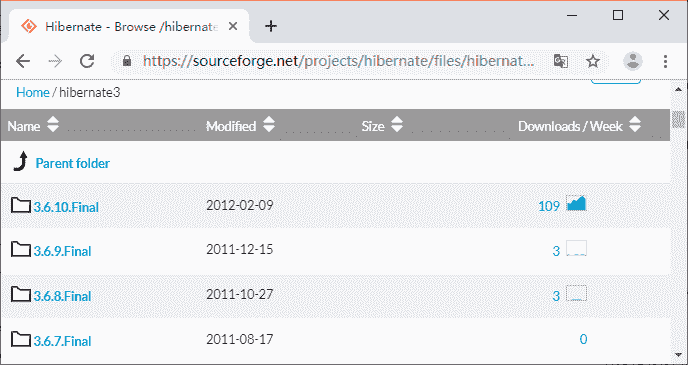
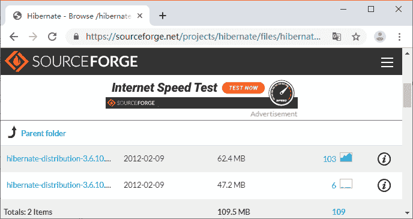
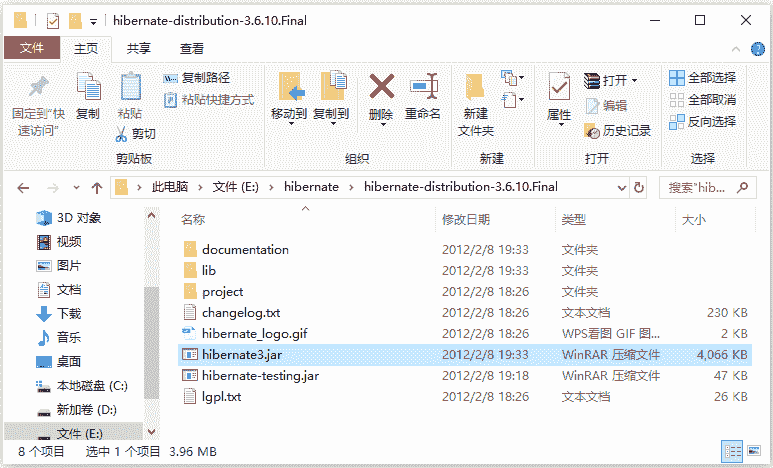

# Hibernate 目录结构和基础 JAR 包介绍

> 原文：[`c.biancheng.net/view/4170.html`](http://c.biancheng.net/view/4170.html)

目前企业主流使用的 Hibernate 版本以 Hibernate 3.x 版本为主，这里以 Hibernate 3.6.10 版本为例。初学者可以从官方网址 [`sourceforge.net/projects/hibernate/files/hibernate3/`](http://sourceforge.net/projects/hibernate/files/hibernate3/) 中下载对应的版本。Hibernate 3.6.10 版本的下载过程，如图 1 所示。

图 1  Hibernate 的下载
 
图 2  Hibernate 的下载
在图 1 中，单击 3.6.10.Final 链接，进入下载页面。

在图 2 中有两个压缩包链接，其中 hibernate-distribution-3.6.10.Final-dist.zip 是 Windows 下的版本，Final 表示版本号为正式版。hibernate-distribution-3.6.10.Final-dist.tar.gz 是 Linux 下的版本，读者可以根据自己的环境需求下载指定版本的 Hibernate，本教程下载的是 Windows 版本的 ZIP 压缩包。

下载完成后，对 Hibernate 3.6.10 进行解压，解压后的目录结构，如图 3 所示。

图 3  Hibernate 压缩包的文件结构
从图 3 中可以看出，Hibernate 3.6.10 安装目录中包含一系列的子目录，这些子目录分别用于存放不同功能的文件，下面针对这些子目录进行简单介绍，如表 1 所示。

表 1 Hibernate 子目录介绍

| 名    称 | 说    明 |
| --- | --- |
| documentation 文件夹 | 该路径下存放了 Hibernate 的相关文档，包括 Hibernate 的参考文档和 API 文档等。 |
| lib 文件夹 | 该路径下存放了 Hibernate 3 的核心类库，以及编译和运行所依赖的第三方类库。其中 lib 路径下的 required 子目录中包含了运行 Hibernate 3 所必须的 JAR 包。 |
| project 文件夹 | 该路径下存放了 Hibernate 各种相关项目的源代码。 |
| hibernate3.jar 文件 | 此 JAR 包是 Hibernate 3 的核心 JAR。 |

在实际开发中，需要将 Hibernate 3 的核心 JAR 以及 lib/required 子目录中的 JAR 包添加到项目中，除此之外，通常还需要添加 Hibernate 3 对 JPA 支持的 JAR，以及实现日志功能的 JAR。使用 Hibernate 3 开发项目时，所需的 JAR 包及其说明如表 2 所示。

表 2 Hibernate 3 所需的 JAR 包的说明

| JAR 包名称 | 描   述 |
| --- | --- |
| hibernate3.jar | Hibernate 的核心包 |
| antlr-2.7.6.jar | 语言转换工具，Hibernate 利用它实现 HQL 到 SQL 的转换 |
| commons-collections-3.1.jar | collections Apache 的工具集，用于增强 Java 对集合的处理能力 |
| dom4j-l.6.1.jar | dom4j XML 解析器 |
| javassist-3.12.0.GA.jar | 代码生成工具，Hibernate 利用它在运行时扩展 Java 类 |
| jta-1.1.jar | 标准的 JAVA 事务（跨数据库）处理接口 |
| slf4j-api-l.6.1.jar | 只是一个接口，用于整合 log4j |
| hibernate-jpa-2.0-api-1.0.1.Final.jar | JPA 接口开发包 |
| log4j-l.2.17.jar | Log4j 日志文件核心 JAR |
| slf4j-log4jl2-l.7.12.jar | Hibernate 使用的一个日志系统 |

从表 2 中可以看出，Hibernate 3 所依赖的 JAR 包共有 10 个。其中 hibernate-jpa-2.0-api-1.0.1.Final.jar 是 JPA 接口的开发包，它位于 Hibernate 的 lib 子目录的 jpa 文件夹中。由于 Hibernate 并没有提供对日志的实现，所以需要 slf4j 和 log4j 开发包整合 Hibernate 的日志系统到 log4j。

Hibernate 的环境搭建非常简单，将表 2 中的所有 JAR 包复制到项目的 WEB-INF/lib 目录下即可。需要注意的是，Hibernate 框架要想与数据库建立连接，使用时还需要导入相关数据库的驱动 JAR 包。