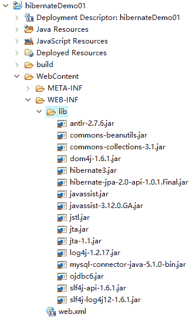
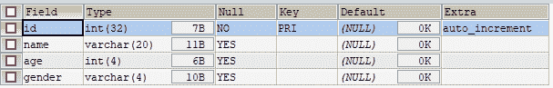

# 第一个 Hibernate 程序

> 原文：[`c.biancheng.net/view/4172.html`](http://c.biancheng.net/view/4172.html)

通过前面的学习，读者对 Hibernate 已经有了一个初步的了解。下面通过一个完整的增、删、改、查案例讲解 Hibernate 框架的使用。

#### 1）创建项目并导入 JAR 包

在 MyEclipse 中创建一个名称为 hibernateDemo01 的 Web 项目，将 Hibernate 所需 JAR 包和 MySQL 的驱动包（mysql-connector-java-5.0.8-bin.jar）复制到项目的 WEB-INF/lib 目录中，并将所有 JAR 添加到类路径下。添加 JAR 包后的项目结构如图 1 所示。


图 1  Hibernate 所需的 JAR 包

#### 2）创建数据库

在 MySQL 中创建一个名称为 hibernate 的数据库，然后在该数据库中创建一个 user 表，创建数据库和表的 SQL 语句如下所示：

```

CREATE DATABASE hibernate;
USE hibernate;
CREATE TABLE `user` (
  `id` int(32) PRIMARY KEY AUTO_INCREMENT,
  `name` varchar(20),
  `age` int(4),
  `gender` varchar(4),
)
```

在 SQLyog 工具中，使用 desc user 语句查询 user 表结构，其执行结果如图 2 所示。


图 2  user 表结构

#### 3）编写实体类（持久化类）

持久化类是应用程序中的业务实体类，符合基本的 JavaBean 编码规范。Hibernate 操作的持久化类基本上都是普通的 Java 对象（Plain Ordinary Java Object，POJO），这些普通 Java 对象中包含的是与数据库表相对应的各个属性，并且这些属性可以通过 getter 和 setter 方法访问。

下面编写一个持久化类 User。在项目的 src 目录下创建一个名称为 com.mengma.domain 的包，在包中创建一个实体类 User（对应数据库表 user），并定义其属性（包括 id、name、age 和 gender）以及相应的 getter 和 setter 方法。如下所示。

```

package com.mengma.domain;

public class User {
    private Integer id; // 唯一标识 id
    private String name; // 姓名
    private Integer age; // 年龄
    private String gender; // 性别

    public Integer getId() {
        return id;
    }

    public void setId(Integer id) {
        this.id = id;
    }

    public String getName() {
        return name;
    }

    public void setName(String name) {
        this.name = name;
    }

    public Integer getAge() {
        return age;
    }

    public void setAge(Integer age) {
        this.age = age;
    }

    public String getGender() {
        return gender;
    }

    public void setGender(String gender) {
        this.gender = gender;
    }

}
```

上述代码中定义的四个属性分别与 user 表中的字段相对应。由于 Hibernate 默认访问的是各个属性的 getter 和 setter 方法，所以为了实现类的封装性，建议为持久化类的各个属性添加 getter 和 setter 方法。

通常持久化类的编写应该遵循一些规则，具体如下。

*   提供一个无参数的 public 访问控制符的构造器。
*   持久化类中所有属性使用 private 修饰。
*   所有属性提供 public 修饰的 setter 和 getter 方法。
*   提供一个标识属性 OID，映射数据表主键字段，例如 User 表的 id 属性。
*   标识属性应尽量使用基本数据类型的包装类型，目的是为了与数据库表的字段默认值 null 一致。
*   不要用 final 修饰持久化类，否则无法生成代理对象。

#### 4）编写映射文件

实体类 User 目前还不具备持久化操作的能力，为了使该类具备这种能力，需要通知 Hibernate 框架将 User 实体类映射到数据库的某一张表中，以及类中的哪个属性对应数据表的哪个字段，这些都需要在映射文件中配置。

在 com.mengma.domain 包中，创建一个名称为 User.hbm.xml 的映射文件，编辑后如下所示。

```

<?xml version="1.0" encoding="UTF-8"?>
<!DOCTYPE hibernate-mapping PUBLIC "-//Hibernate/Hibernate Mapping DTD 3.0//EN"
"http://hibernate.sourceforge.net/hibernate-mapping-3.0.dtd">
<hibernate-mapping>
    <!-- name 代表的是类名，table 代表的是表名 -->
    <class name="com.mengma.domain.User" table="user">
        <!-- name 代表的是 User 类中的 id 属性，column 代表的是 user 表中的主键 id -->
        <id name="id" column="id">
            <!-- 主键生成策略 -->
            <generator class="native" />
        </id>
        <!-- 其他属性使用 property 标签映射 -->
        <property name="name" column="name" type="java.lang.String" />
        <property name="age" type="integer" column="age" />
        <property name="gender" type="java.lang.String" column="gender" />
    </class>
</hibernate-mapping>
```

上述代码展示了实体类 User 与数据表 user 的映射关系。在上述映射文件中：

*   <class> 节点用于配置实体类的映射信息，其中 name 属性表示实体类的完整类名，table 属性表示数据表的名称。
*   <id> 节点用于定义实体类的唯一标识（对应数据表的主键），是 <class> 节点下的必须节点，其 name 属性对应实体类的属性，<column> 用于对应数据库表中的列，这里即为表的主键，<generator> 子节点用于指定主键的生成策略。
*   <property> 节点用于映射普通属性，其 name 属性对应实体中的属性，column 属性对应数据库表中的字段，type 属性表示其属性的类型。

关于映射文件中的节点元素，后面教程中会进行更为详细的讲解，此处读者了解即可。

#### 5）编写核心配置文件 hibernate.cfg.xml

Hibernate 映射文件反映了持久化类和数据表的映射信息，而 Hibernate 核心配置文件则用于配置 Hibernate 连接数据库的相关信息，如数据库的驱动、URL、用户名、密码等。

在 src 目录下创建一个名称为 hibernate.cfg.xml 的文件，如下所示。

```

<?xml version="1.0" encoding="UTF-8"?>
<!DOCTYPE hibernate-configuration PUBLIC
          "-//Hibernate/Hibernate Configuration DTD 3.0//EN"
          "http://hibernate.sourceforge.net/hibernate-configuration-3.0.dtd">
<hibernate-configuration>
    <session-factory>
        <!-- 指定方言 -->
        <property name="dialect">
            org.hibernate.dialect.MySQL5Dialect
        </property>
        <!-- 链接数据库 url -->
        <property name="connection.url">
              <![CDATA[jdbc:mysql://localhost:3306/hibernate?useUnicode=true&characterEncoding=utf-8]]>
        </property>
        <!-- 连接数据库的用户名 -->
        <property name="connection.username">
            root
        </property>
        <!-- 数据库的密码 -->
        <property name="connection.password">
            1128
        </property>
        <!-- 数据库驱动 -->
        <property name="connection.driver_class">
            com.mysql.jdbc.Driver
        </property>
        <!-- 显示 sql 语句 -->
        <property name="show_sql">
            true
        </property>
        <!-- 格式化 sql 语句 -->
        <property name="format_sql">true</property>
        <!-- 映射文件配置 -->
        <mapping resource="com/mengma/domain/User.hbm.xml" />
    </session-factory>
</hibernate-configuration>
```

上述代码中，设置了数据库连接的相关配置和其他的一些常用属性，其中 <mapping> 元素用于将对象的映射信息加入到 Hibernate 的核心配置文件中。

由于篇幅有限，Hibernate 具体增删改查实现步骤可参考《Hibernate 实现增删改查》教程。