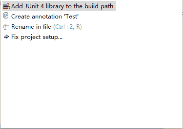
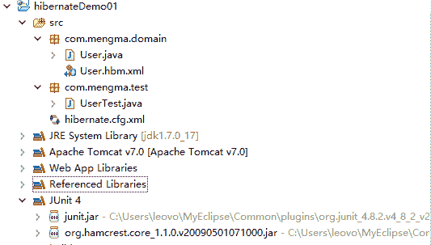
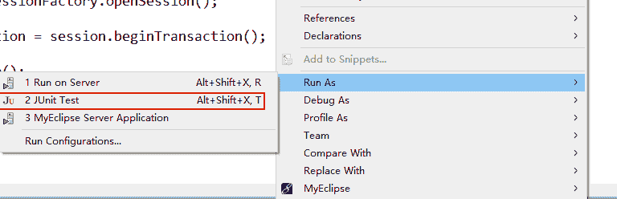
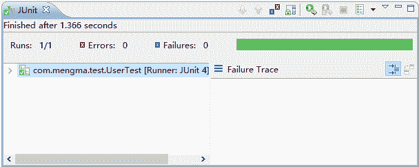
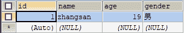
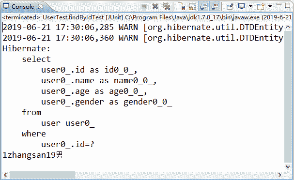

# Hibernate 实现增删改查功能

> 原文：[`c.biancheng.net/view/4174.html`](http://c.biancheng.net/view/4174.html)

在项目的 src 目录下创建一个名称为 com.mengma.test 的包，在该包下创建一个名称为 UserTest 的测试类。

## 添加数据

在 UserTest 类中创建一个名称为 testInsert 的方法，该方法用于向数据库中添加数据，其代码如下所示。

```

package com.mengma.test;

import org.hibernate.SessionFactory;
import org.hibernate.Transaction;
import org.hibernate.cfg.Configuration;
import org.hibernate.Session;
import org.junit.Test;

import com.mengma.domain.User;

public class UserTest {
    // 添加操作
    @Test
    public void testInsert() {
        // 1.创建 Configuration 对象并加载 hibernate.cfg.xml 配置文件
        Configuration config = new Configuration().configure();
        // 2.获取 SessionFactory
        SessionFactory sessionFactory = config.buildSessionFactory();
        // 3.得到一个 Session
        Session session = sessionFactory.openSession();
        // 4.开启事务
        Transaction transaction = session.beginTransaction();
        // 5.执行持久化操作
        User user = new User();
        user.setName("zhangsan");
        user.setAge(21);
        user.setGender("男");
        // 将对象保存到表中
        session.save(user);
        // 6.提交事务
        transaction.commit();
        // 7.关闭资源
        session.close();
        sessionFactory.close();
    }
}
```

上述代码中，首先创建 Configuration 类的实例，并加载解析 hibernate.cfg.xml 核心配置文件。然后获取 SessionFactory 读取解析映射文件信息，并将 Configuration 对象中的所有配置信息加载到 SessionFactory 内存中。接着得到一个 Session，开启一个事务，之后创建 User 对象，向对象中设置添加数据，通过 session.save() 方法完成向数据库中保存数据的操作。最后提交事务，并关闭资源。

#### 添加 JUnit 测试

在软件开发过程中，需要有相应的测试工作。依据测试目的的不同，可以将软件测试分为单元测试、集成测试、系统测试等。其中单元测试在软件开发阶段是最底层的测试，它易于及时发现并解决问题。JUnit 就是一个进行单元测试的开源框架。

本程序使用的就是单元测试框架 JUnit4，使用此框架测试时，不需要 main 方法，就可以直接对类中的方法进行运行测试。其中 @Test 用于测试的注解，要测试哪个方法，只需要在相应测试的方法上添加此注解即可。

当在需要测试方法上写入 @Test 后，MyEclipse 会在 @Test 处报出 Test cannot be resolved to a type 的错误，将鼠标移到 @Test 处，在显示的弹出窗口中，单击 Add JUnit4 library to the build path，程序会自动将 JUnit4 的支持包加入到项目中，如图 1 所示。


图 1  添加 JUnit4
添加后在项目中会多出两个关于 JUnit4 的 JAR 包，在 MyEclipse 中的显示如图 2 所示。


图 2  JUnit 框架支持包
在 UserTest 类中，右击 testInsert() 方法，在弹出的快捷菜单中选择 Run As→JUnit Test 选项运行测试，如图 3 所示。


图 3  运行 JUnit
单击 JUnit Test 选项后，运行的结果如图 4 所示。


图 4  运行结果
在图 4 中，当 JUnit 选项卡的进度条为绿色时，表明运行结果正确，如果进度条为红色，则表示有错误，并且会在窗口中显示所报的错误信息。运行成功后，查询数据库 user 表中的数据，其结果如图 5 所示。


图 5  使用 Hibernate 添加数据
从图 5 中可以看出，使用 Hibernate 框架成功地向 user 表中添加了一条数据。

## 修改数据

在 UserTest 类中，添加一个名为 testUpdate() 的方法，该方法用于修改 user 表中的数据，其代码如下所示：

```

// 修改操作
@Test
public void testUpdate() {
    // 1.创建 Configuration 对象并加载 hibernate.cfg.xml 配置文件
    Configuration config = new Configuration().configure();
    // 2.获取 SessionFactory
    SessionFactory sessionFactory = config.buildSessionFactory();
    // 3.得到一个 Session
    Session session = sessionFactory.openSession();
    // 4.开启事务
    Transaction transaction = session.beginTransaction();
    // 5.执行持久化操作
    User user = new User();
    user.setId(1);
    user.setName("zhangsan");
    user.setAge(19);
    user.setGender("男");
    // 更新数据
    session.update(user);
    // 6.提交事务
    transaction.commit();
    // 7.关闭资源
    session.close();
    sessionFactory.close();
}
```

从上述代码中可以看出，Hibernate 修改数据的方法与其保存数据的方法类似，只是在修改数据后通过 session.update() 方法执行的更新操作。

使用 JUnit 运行此方法，执行成功后，查询 user 表中的数据，其结果如图 6 所示。


图 6  更新数据后的数据表
从图 6 中可以看出，表中 age 字段已经被修改为 19，说明使用 Hibernate 成功更新了 user 表中的数据。

## 查询数据

在 UserTest 类中，添加一个名称为 testFindById() 的方法，查询 id 为 1 的表数据，其代码如下所示：

```

// 查询操作
@Test
public void findByIdTest() {
    // 1.创建 Configuration 对象并加载 hibernate.cfg.xml 配置文件
    Configuration config = new Configuration().configure();
    // 2.获取 SessionFactory
    SessionFactory sessionFactory = config.buildSessionFactory();
    // 3.得到一个 Session
    Session session = sessionFactory.openSession();
    // 4.开启事务
    Transaction transaction = session.beginTransaction();
    // 5.执行持久化操作
    User user = (User) session.get(User.class, 1);
    System.out.println(user.getId() + "" + user.getName() + ""
                + user.getAge() + "" + user.getGender());
    // 6.提交事务
    transaction.commit();
    // 7.关闭资源
    session.close();
    sessionFactory.close();
}
```

从上述代码中可以看出，与增加和修改数据相比，查询操作中通过使用 session.get() 方法获取 User 对象数据，然后将查询出的 User 对象数据输出到控制台。

使用 JUnit4 运行 findByIdTest() 方法后，控制台的显示如图 7 所示。

在图 7 中，控制台开始处出现的警告部分是由于没有配置 log4j 才显示的，此处可先不必理会。中间部分是 Hibernate 自动生成的 SQL 语句信息，这是由于在 hibernate.cfg.xml 中增加了显示 SQL 语句和格式化 SQL 的配置信息才显示出来的。最后就是所查询出的数据输出信息。

注意：在 Hibernate 中，除了使用 get() 方法加载数据以外，还可以使用 load() 方法加载数据，它们都能将数据从数据库中取出。两者的区别是使用 get() 方法加载数据时，如果指定的记录不存在，则返回 null；而使用 load() 方法加载数据时，如果指定的记录不存在，则会报出 ObjectNotfountException 异常，这一异常说明使用 load() 方法加载数据时，要求记录必须存在。


图 7  查询结果

## 删除数据

在 UserTest 类中，添加一个名称为 deleteByIdTest() 的方法，在该方法中使用 Hibernate 将 id 为 1 的这条记录从数据表中删除，其方法代码如下所示：

```

// 删除操作
@Test
public void deleteByIdTest() {
    // 1.创建 Configuration 对象并加载 hibernate.cfg.xml 配置文件
    Configuration config = new Configuration().configure();
    // 2.获取 SessionFactory
    SessionFactory sessionFactory = config.buildSessionFactory();
    // 3.得到一个 Session
    Session session = sessionFactory.openSession();
    // 4.开启事务
    Transaction transaction = session.beginTransaction();
    // 5.执行持久化操作
    User user = (User) session.get(User.class, 1);
    session.delete(user);
    // 6.提交事务
    transaction.commit();
    // 7.关闭资源
    session.close();
    sessionFactory.close();
}
```

从上述代码中可以看出，在执行删除操作时，先通过 get() 方法获取了 id 为 1 的 User 对象，然后通过 delete() 方法删除了该对象数据。

使用 JUnit 运行此方法，执行成功后，再次查询数据库 user 表，会发现 user 表中的数据已经为空，这表明使用 Hibernate 框架删除数据的操作执行成功。