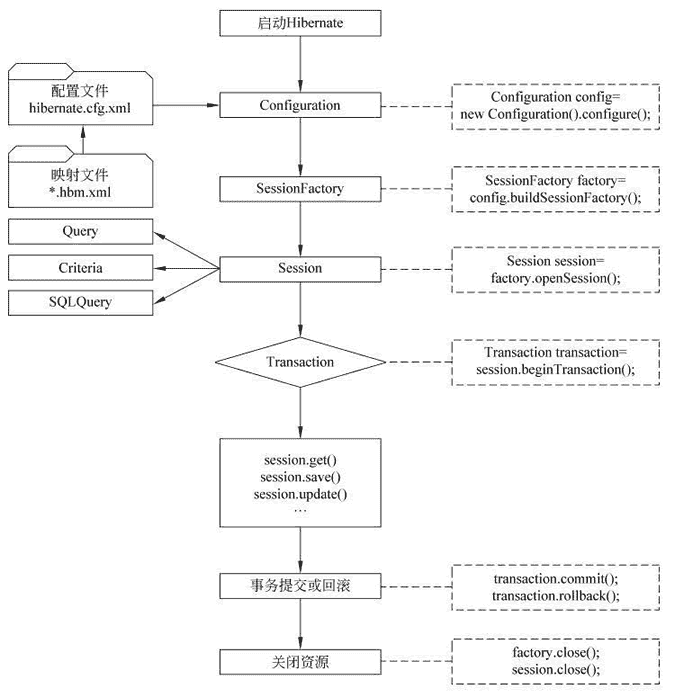

# Hibernate 的运行流程详解

> 原文：[`c.biancheng.net/view/4176.html`](http://c.biancheng.net/view/4176.html)

通过《Hibernate 实现增删改查功能》教程的学习，读者对 Hibernate 的使用已经有了一个初步的了解。

在教程《Hibernate 实现增删改查功能》的 Hibernate 程序中，主要涉及四个接口的使用，分别为 Configuration 接口、SessionFactory 接口、Session 接口和 Transaction 接口，除了这四个接口以外，其常用接口还有 Query 和 Criteria 等。关于这几个接口的详细内容将在后面教程中进行讲解。本节将讲解 Hibernate 的运行机制。

Hibernate 在运行时的执行流程如图 1 所示。
图 1  Hibernate 的执行流程
图 1 所示的 Hibernate 的执行流程过程具体如下。

1）创建 Configuration 实例，加载 Hibernate 核心配置文件和映射文件信息到 Configuration 对象中。

2）创建 SessionFactory 实例。通过 Configuration 对象读取到的配置文件信息创建 SessionFactory 对象，该对象中保存了当前数据库的配置信息和所有映射关系等信息。

3）创建 Session 实例，建立数据库连接。Session 主要负责执行持久化对象的增、删、改、查操作，创建一个 Session 就相当于创建一个新的数据库连接。

4）创建 Transaction 实例，开启一个事务。Transaction 用于事务管理，一个 Transaction 对象对应的事务可以包含多个操作。在使用 Hibernate 进行增、删、改操作时，必须先创建 Transaction 对象。需要注意的是，Hibernate 的事务默认是关闭的，需要手动开启事务和关闭事务。

5）利用 Session 接口通过的各种方法进行持久化操作。

6）提交事务，对实体对象持久化操作后，必须提交事务。

7）关闭 Session 与 SessionFactory，断开与数据库的连接。

注意：Hibernate 中的 Session 不同于 JSP 中的 HttpSession。在 Hibernate 中使用 Session 对象时，通常指 Hibernate 中的 Session，而 HttpSession 被称为用户会话 Session。