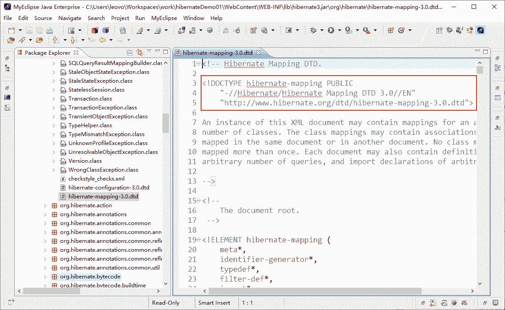

# Hibernate 映射文件*.hbm.xml 的元素及属性详解

> 原文：[`c.biancheng.net/view/4177.html`](http://c.biancheng.net/view/4177.html)

映射文件用于向 Hibernate 提供对象持久化到关系型数据库中的相关信息，每个映射文件的结构基本相同，其示例代码如下所示：

```

<?xml version="1.0" encoding="UTF-8"?>
<!--映射文件的 dtd 约束信息-->
<!DOCTYPE hibernate-mapping PUBLIC "-//Hibernate/Hibernate Mapping DTD 3.0//EN"
"http://hibernate.sourceforge.net/hibernate-mapping-3.0.dtd">
<hibernate-mapping>
    <!-- name 代表的是完整类名（包含的类名），table 代表的是表名 -->
    <class name="className" table="tableName">
        <!-- name 代表的是 className 类中的唯一标识属性，column 代表的是 tableName 表中的主键 id -->
        <id name="id" column="id">
            <!-- 主键生成策略 -->
            <generator class="native" />
        </id>
        <!-- name 表示 className 的普通属性 column 表示 tableName 表的普通字段 type 表示字段类型-->
        <property name="attrName" column="fieIdName" type="string" />
    </class>
</hibernate-mapping>
```

在上述代码中，首先进行了 xml 声明，然后定义了映射文件的 dtd 信息，此 dtd 信息读者不需要去手写，可以在项目的 Web App Libraries 目录（或 Referenced Libraries 目录）中，找到 hibernate 的核心 JAR 包 hibernate3.jar，打开此 JAR 包后，在 org.hibernate 包中即可找到 hibernate-mapping-3.0.dtd 文件。

打开此文件后，在文件的最上方即有此 dtd 信息，只需要将此 dtd 信息复制到映射文件中使用即可。hibernate-mapping-3.0.dtd 文件中的 dtd 信息如图 1 所示。


图 1  映射文件的 dtd 信息
在上述映射文件代码的 dtd 信息下面，就是 Hibernate 映射的具体配置。下面将对其配置中的每个元素的常用属性进行详细讲解。

#### 1\. <hibernate-mapping> 元素

<hibernate-mapping> 元素是映射文件的根元素，它所定义的属性在映射文件的所有节点都有效。<hibernate-mapping> 元素所包含的常用属性及其含义说明如表 1 所示。

表 1  <hibernate-mapping> 元素的常用属性及其说明

| 属性名 | 是否必须 | 说   明 |
| --- | --- | --- |
| package | 否 | 为映射文件中的类指定一个包前缀，用于非全限定类名 |
| schema | 否 | 指定数据库 schema 名 |
| catalog | 否 | 指定数据库 catalog 名 |
| default-access | 否  | 指定 Hibernate 用于访问属性时所使用的策略，默认为 property。 当 default-access="property" 时，使用 getter 和 setter 方法访问成员变量；当 default-access = "field"时，使用反射访问成员变量 |
| default-cascade | 否  | 指定默认的级联样式，默认为空 |
| default-lazy | 否 | 指定 Hibernate 默认所采用的延迟加载策略，默认为 true |

#### 2\. <class> 元素

<class> 元素主要用于指定持久化类和数据表的映射关系，它是 XML 配置文件中的主要配置内容。其常用属性及其含义说明如表 2 所示。

表 2 <class><class>元素的常用属性及其说明</class>

| 属性名 | 是否必须 | 说   明 |
| --- | --- | --- |
| name | 否 | 持久化类或接口的全限定名。如果未定义该属性，则 Hibernate 将 该映射视为非 POJO 实体的映射 |
| table | 否 | 持久化类对应的数据库表名，默认为持久化类的非限定类名 |
| catalog | 否 | 数据库 catalog 名称，如果指定该属性，则会覆盖 hibernate-mapping 元素中指定的 catalog 属性值 |
| lazy | 否 | 指定是否使用延迟加载 |

#### 3\. <id>元素

<class> 元素内包含了一个 <id> 元素，该属性用于设定持久化类的 OID（Object identifier，对象标识符）和表的主键的映射，其常用属性及其含义说明如表 3 所示。

表 3 <id><id>元素常用属性及其说明</id>

| 属性名 | 是否必须 | 说   明 |
| --- | --- | --- |
| name | 否 | 标识持久化类 OID 的属性名 |
| type | 否 | 持久化类中标识属性的数据类型。如果没有为某个属性显式设定映射类型，Hibernate 会运用反射机制先识别出持久化类的特定属性的 Java 类型，然后自动使用与之对应的默认 Hibernate 映射类型。 Java 的基本数据类型和包装类型对应相同的 Hibernate 映射类型，基本数据类型无法表达 null，所以对于持久化类的 OID，推荐使用包装类型（integer，long，string 等） |
| column | 否 | 设置标识属性所映射的数据列的列名（主键字段的名字） |
| access | 否 | 指定 Hibernate 对标识属性的访问策略，默认为 property。若此处指定了该属性，则会覆盖 <hibemate-mapping> 元素中指定的 default-access 属性 |

除了上面五个元素以外，<id> 元素还可以包含一个可选的子元素 <generator>。

<generator> 元素指定了主键的生成方式。对于不同的关系型数据库和业务应用来说，其主键的生成方式往往也不同，有的是依赖数据库自增字段生成主键，有的是按照具体的应用逻辑决定，通过 <generator> 元素就可以指定这些不同的实现方式。这些实现方式在 Hibernate 中，又称为主键生成策略。

在讲解 Hibernate 的主键生成策略之前，需要先了解两个概念：自然主键和代理主键。关于这两个概念的描述如下。

#### 1）自然主键

把具有业务含义的字段作为主键，称为自然主键。例如在 user 表中，如果把 name 字段作为主键，其前提条件必须是：每一个用户的姓名不允许为 null，不允许用户重名，并且不允许修改用户姓名。

尽管这些是可行的，但是不能满足不断变化的业务需求，一旦出现了允许用户重名的业务需求，就必须修改数据模型，重新定义表的主键，这给数据库的维护增加了难度。

#### 2）代理主键

把不具备业务含义的字段作为主键，称为代理主键。该字段一般取名为 ID，通常为整数类型，因为整数类型比字符串类型可以节省更多的数据库空间。在上述例子中，显然更合理的方式是使用代理主键。

在 Hibernate 中，提供了几个内置的主键生成策略，其常用主键生成策略的名称和描述如表 4 所示。

表 4 主键生成策略

| 名   称 | 描   述 |
| --- | --- |
| increment | 用于 long.short 或 int 类型，由 Hibernate 自动以递增的方式生成唯一标识符，每次增量为 1。只有当没有其他进程向同一张表中插入数据时才可以使用，不能在集群环境下使用，适用于代理主键 |
| identity | 采用底层数据库自身提供的主键生成标识符，条件是数据库支持自动增长数据类型。在 DB2、MySQL、SQL Server、Sybase 和 HypersonicSQL 数据库中可以使用该生成器，该生成器要求在数据库中把主键定义成为自增长类型，适用于代理主键 |
| sequence | Hibernate 根据底层数据库序列生成标识符。条件是数据库支持序列，适用于代理主键 |
| hilo | 使用一个高/低位算法高效地生成 long、short 或 int 类型的标识符。给定一个表和字段（默认的表和字段分别为 hibernate_unique_key 和 next_hi）作为高位值的来源。高/低位算法产生的标识符仅在特定数据库中是唯一的 |
| native  | 根据底层数据库对自动生成标识符的能力选择 identity、sequence、hilo 三种生成器中的一种，适合跨数据库平台开发，适用于代理主键 |
| uuid | Hibernate 采用 128 位的 UUID 算法生成标识符。该算法能够在网络环境中生成唯一的字符串标识符，其 UUID 被编码为一个长度为 32 位的十六进制字符串。这种策略并不流行，因为字符串类型的主键比整数类型的主键占用更多的数据库空间，适用于代理主键 |
| assigned | 由 java 程序负责生成标识符，如果不指定 id 元素的 generator 属性，则默认使用该主键生成策略，适用于自然主键 |

#### 4）<property>元素

<class> 元素内可以包含多个 <property> 子元素，它用于表示持久化类的其他属性和数据表中非主键字段的映射关系。<property> 元素所包含的常用属性及其含义说明如表 5 所示。

表 5 <property><property>元素常用属性</property>

| 属性名 | 说   明 |
| --- | --- |
| name | 持久化类属性的名称，以小写字母开头 |
| column | 数据表字段名 |
| type | 数据表的字段类型 |
| length | 数据表字段定义的长度 |
| lazy | 指定当持久化类的实例首次被访问时，是否对该属性使用延迟加载，其默认值是 false |
| unique | 是否对映射列产生一个唯一性约束。常在产生 DDL 语句或创建数据库对象时使用 |
| not-null | 是否允许映射列为空 |