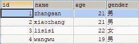
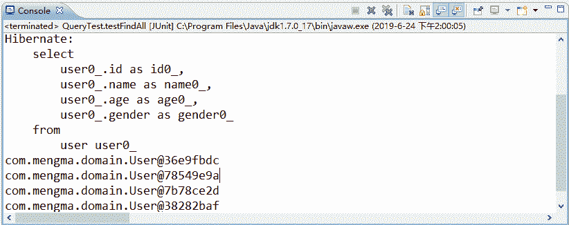
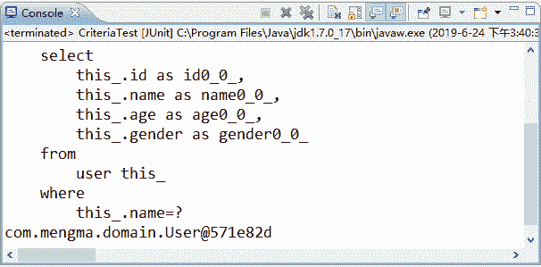

# Configuration、SessionFactory、Session、Transaction、Query 和 Criteria：Hibernate 核心接口

> 原文：[`c.biancheng.net/view/4181.html`](http://c.biancheng.net/view/4181.html)

在 Hibernate 中，有六个常用的核心接口，它们分别是 Configuration、SessionFactory、Session、Transaction、Query 和 Criteria。在接下来的几个小节中，将对这六个核心接口进行详细讲解。

## Configuration

Configuration 主要用于启动、加载和管理 Hibernate 的配置文件信息，在启动 Hibernate 的过程中，Configuration 实例首先确定 Hibernate 文件的位置，然后读取相关配置，最后创建一个唯一的 SessionFactory 实例。

Hibernate 通常使用 Configuration config=new Configuration().configure(); 的方式创建实例，此种方式默认会在 src 下读取 hibernate.cfg.xml 配置文件。如果不希望配置文件放置在 src 目录下，则可以在 configure() 方法中传入一个参数指定文件位置，其代码如下所示：

Configuration config = new Configuration().configure("文件的位置");

此种写法中 Hibernate 会到指定的位置查询配置文件。例如，读取 src 下 config 包中的 hibernate.cfg.xml 文件，可以将代码写成如下形式：

Configuration config = new Configuration().configure("/config/hibernate.cfg.xml");

需要注意的是，Configuration 对象只存在于系统的初始化阶段，它将 SessionFactory 创建完成后，就完成了自己的使命。

## SessionFactory

SessionFactory 接口负责读取并解析映射文件，以及建立 Session 对象，它在 Hibernate 中起到一个缓冲区的作用，会将 Configuration 对象中的所有配置信息、Hibernate 自动生成的 SQL 语句以及某些可重复利用的数据加载到缓冲区中。同时，它还维护了 Hibernate 的二级缓存。

通常所使用的 SessionFactory 实例是通过 Configuration 对象获取的，其获取方法如下所示：

SessionFactory sessionFactory = config.buildSessionFactory();

SessionFactory 具有以下特点。

*   它是线程安全的，它的同一个实例能够供多个线程共享。
*   它是重量级的，不能随意创建和销毁它的实例。

由于 SessionFactory 是一个重量级的对象，占用的内存空间较大，所以通常情况下，一个应用程序只需要一个 SessionFactory 实例，只有应用中存在多个数据源时，才为每个数据源建立一个 SessionFactory 实例。为此，在实际开发时，通常会抽取出一个工具类提供 Session 对象。下面就介绍一个简单的抽取方式，如下所示。

```

public class HibernateUtils {
    // 声明一个私有的静态 final 类型的 Configuration 对象
    private static final Configuration config;
    // 声明一个私有的静态的 final 类型的 SessionFactory 对象
    private static final SessionFactory factory;
    // 通过静态代码块构建 SessionFactory
    static {
        config = new Configuration().configure();
        factory = config.buildSessionFactory();
    }

    // 提供一个公有的静态方法供外部获取，并返回一个 session 对象
    public static Session getSession() {
        return factory.openSession();
    }
}
```

上述代码中，首先声明了一个私有的静态 final 类型的 Configuration 对象和 SessionFactory 对象，供类中的其他成员使用，下面通过静态方法构建了 SessionFactory 实例，最后提供了一个公有的静态方法供外部获取 session 对象。使用此工具类，就可以直接通过 HibernateUtils.getSession() 的方式获取 session 对象。

## Session

Session 是 Java 应用程序和 Hibernate 进行交互时所使用的主要接口，是持久化操作的核心 API。它主要用于读取、创建和删除映射对象的实例，这一系列的操作将被转换为数据表中的增加、修改、查询和删除操作。

Session 是轻量级的，实例的创建和销毁不需要消耗太多的资源，同时它还是 Hibernate 的一级缓存，这个缓存主要用于存放当前工作单元加载的对象。

获取 Session 实例有两种方式，一种是通过 openSession() 方法，另一种是通过 getCurrentSession() 方法。两种方法获取 Session 的代码如下所示：

```

//采用 openSession 方法创建 Session
Session session = sessionFactory.openSession();
//采用 getCurrentSession()方法创建 Session
Session session = sessionFactory.getCurrentSession();
```

以上两种获取 Session 实例的主要区别是：采用 openSession() 方法获取 Session 实例时，SessionFactory 直接创建一个新的 Session 实例，并且在使用完成后需要调用 close() 方法进行手动关闭；而 getCurrentSession() 方法创建的 Session 实例会被绑定到当前线程中，它在提交或回滚操作时会自动关闭。

在 Session 中，提供了多个持久化的操作方法，其常用方法如表 1 所示。

表 1 Session 中的常用方法

| 名称 | 描述 |
| --- | --- |
| save() | 用于执行添加对象操作 |
| update() | 用于执行修改对象操作 |
| saveOrUpdate() | 用于执行添加或修改对象操作 |
| delete() | 用于执行删除对象操作 |
| get() | 根据主键查询数据 |
| load() | 根据主键查询数据 |
| createQuery() | 用于数据库操作对象 |
| createSQLQuery() | 用于数据库操作对象 |
| createCriteria() | 面向对象的条件查询 |

需要注意的是，Session 是线程不安全的，当多个并发线程同时操作一个 Session 实例时，就可能导致 Session 数据存取的混乱（当方法内部定义和使用 Session 时，不会出现线程问题）。因此设计软件架构时，应避免多个线程共享一个 Session 实例。

## Transaction

Transaction 接口主要是用于管理事务，它是 Hibernate 的数据库事务接口，且对底层的事务接口进行了封装。Transaction 接口的实例对象是通过 Session 对象开启的，其开启方式如下所示：

Transaction transaction = session.beginTransaction();

在 Transaction 接口中，提供了事务管理的常用方法，具体如下。

*   commit() 方法：提交相关联的 session 实例。
*   rollback() 方法：撤销事务操作。
*   wasCommitted() 方法：检查事务是否提交。

当应用程序执行完持久化操作后，需要调用 commit() 方法提交事务，或者调用 rollback() 方法回滚事务（取消事务），可以通过以下代码加以理解：

```

try{
    transaction = session.beginTransaction();   //开启事务
    session.save(user); //执行操作
    transaction.commit();   //提交事务
}catch(Exception e) {
    transaction.rollback(); //回滚事务
}finally{
    session.close();    //关闭资源
}
```

从上述代码中可以看出，Session 执行完保存操作后，使用了 Transaction 接口的 commit() 方法进行事务提交。只有事务执行提交后，才能真正地将数据操作同步到数据库中。在发生异常时，需要使用 rollback() 方法进行事务回滚，以避免数据发生错误。

## Query

Query 接口是 Hibernate 的查询接口，主要用于执行 Hibernate 的查询操作。Query 中包装了一个 HQL（Hibernate Query Language）查询语句，该语句采用了面向对象的查询方式，具有丰富灵活的查询特征。因此，Hibernate 官方推荐使用 HQL 语言进行查询。

1.  在 Hibernate 中，使用 Query 对象的步骤如下。
2.  获得 Hibernate Session 对象。
3.  编写 HQL 语句。
4.  调用 session.createQuery 创建查询对象。
5.  如果 HQL 语句包含参数，则调用 Query 的 setXxx 设置参数。
6.  调用 Query 对象的 list() 或 uniqueResult() 方法执行查询。

了解了使用 Query 对象的步骤后，接下来通过具体示例演示 Query 对象的查询操作。

1）向 user 表中插入 4 条数据，插入数据的 SQL 语句如下所示：

```

INSERT INTO `hibernate`.`user` (`id`, `name`, `age`, `gender`)
VALUES
  (1, 'zhangsan', '21', '男') ;
INSERT INTO `hibernate`.`user` (`id`, `name`, `age`, `gender`)
VALUES
  (2, 'xiaozhang', '21', '男') ;
INSERT INTO `hibernate`.`user` (`id`, `name`, `age`, `gender`)
VALUES
  (3, 'lisisi', '22', '女') ;
INSERT INTO `hibernate`.`user` (`id`, `name`, `age`, `gender`)
VALUES
  (4, 'wangwu', '19', '男') ;
```

插入后，user 表中的数据如图 1 所示。
图 1  user 表中的数据
2）在 com.mengma.test 包中创建一个名称为 QueryTest 的类，在类中添加一个名称为 testFindAll() 的方法，编辑后如下所示。

```

package com.mengma.test;

import java.util.List;

import org.hibernate.Query;
import org.hibernate.Session;
import org.hibernate.SessionFactory;
import org.hibernate.Transaction;
import org.hibernate.cfg.Configuration;
import org.junit.Test;

import com.mengma.domain.User;

public class QueryTest {
    @Test
    public void testFindAll() {
        Configuration config = new Configuration().configure();
        SessionFactory sessionFactory = config.buildSessionFactory();
        // 1.得到一个 Session
        Session session = sessionFactory.openSession();
        Transaction transaction = session.beginTransaction();
        // 2.编写 HQL，其中的 User 代表的是类
        String hql = "from User";
        // 3.创建 Query 查询对象
        Query query = session.createQuery(hql);
        // 4.使用 query.list()方法查询数据，并放入 list 集合
        List<User> list = query.list();
        for (User u : list) {
            System.out.println(u);
        }
        transaction.commit();
        session.close();
        sessionFactory.close();
    }

}
```

上述代码中，按照 Query 对象的使用步骤，对 user 表的数据进行了查询。使用 Junit 运行测试方法成功后，执行结果如图 2 所示。


图 2  Query 查询输出结果
从图 2 中可以看出，user 表中的数据已经全部被查询并输出。

在 Query 接口中，除了上面代码中使用的 list() 方法以外，还包含其他一些常用方法，如表 2 所示。

表 2 Query 的常用方法

| 名   称 | 描   述 |
| --- | --- |
| setter | Query 接口中提供了一系列的 setter 方法用于设置查询语句中的参 数，针对不同的数据类型，需要用到不同的 setter 方法 |
| Iterator iterator() | 该方法用于查询语句，返回的结果是一个 Iterator 对象，在读取时只能按照顺序方式读取，它仅把使用到的数据转换成 Java 实体对象 |
| Object uniqueResult() | 该方法用于返回唯一的结果，在确保只有一条记录的查询时可以 使用该方法 |
| int executeUpdate() | 该方法是 Hibernate 3 的新特性，它支持 HQL 语句的更新和删除操作 |
| Query setFirstResult(int firstResult) | 该方法可以设置获取第一个记录的位置，也就是它表示从第几条 记录开始查询，默认从 0 开始计算 |
| Query setMaxResult(int maxResults) | 该方法用于设置结果集的最大记录数，通常与 setFirstResult() 方法结合使用，用于限制结果集的范围，以实现分页功能 |

## Criteria

Criteria 接口是 Hibernate 提供的一个面向对象的查询条件接口，通过它完全不需要考虑数据库底层如何实现，以及 SQL 语句如何编写。Criteria 查询又称为 QBC 查询（Query By Criteria），是 Hibernate 的另一种对象检索方式。

一个单独的查询就是 Criterion 接口的一个实例，用于限制 Criteria 对象的查询，在 Hibernate 中 Criterion 对象的创建通常是通过 Restrictions 工厂类完成的，它提供了一系列的条件查询方法，如表 3 所示。

表 3 Criteria 常用查询方法

| 名   称 | 描   述 |
| --- | --- |
| Criteria add(Criterion criterion) | 用于设置查询的条件，这个方法的参数为 Criterion 对象的实例 |
| Criteria addOrder(Order order) | 用于设置结果集的排序规则，其参数为一个 Order 对象实例 |
| Criteria createCriteria(String associationPath) | 用于创建一个新的 Criteria，这个方法用于执行符合查询时设置查询条件 |
| List list() | 用于执行数据库查询，返回查询的结果 |
| Criteria setFirstResult(int firstResult) | 设置获取第一个记录的位置，这个位置从 0 开始算 |
| Object uniqueResult() | 这个方法用于得到唯一的结果对象实例。在确保最多只有一个 满足条件的查询结果时，可以选择适用这个方法 |

通常情况下，使用 Criteria 对象查询数据的主要步骤如下。

1）获得 Hibernate 的 Session 对象。

2）通过 Session 获得 Criteria 对象。

3）使用 Restrictions 的静态方法创建 Criterion 条件对象。Restrictions 类中提供了一系列用于设定查询条件的静态方法，这些静态方法都返回 Criterion 实例，每个 Criterion 实例代表一个查询条件。

4）向 Criteria 对象中添加 Criterion 查询条件。Criteria 的 add() 方法用于加入查询条件。

5）执行 Criteria 的 list() 或 uniqueResult() 获得结果。

了解了 Criteria 对象的使用步骤后，下面通过案例演示如何使用 Criteria 对象实现查询操作。在 hibernateDemo01 项目的 com.mengma.test 包中新建一个名称为 CriteriaTest 的类，在类中添加一个名称为 testQBC() 的方法，如下所示。

```

package com.mengma.test;

import java.util.List;

import org.hibernate.Criteria;
import org.hibernate.Session;
import org.hibernate.SessionFactory;
import org.hibernate.Transaction;
import org.hibernate.cfg.Configuration;
import org.hibernate.criterion.Restrictions;
import org.junit.Test;

import com.mengma.domain.User;

public class CriteriaTest {
    @Test
    public void testQBC() {
        Configuration config = new Configuration().configure();
        SessionFactory sessionFactory = config.buildSessionFactory();
        // 1.得到一个 Session
        Session session = sessionFactory.openSession();
        Transaction transaction = session.beginTransaction();
        // 2.通过 session 获得 Criteria 对象
        Criteria criteria = session.createCriteria(User.class);
        // 3.使用 Restrictions 的 eq 方法设定查询条件为 name="zhangsan"
        // 4.向 Criteria 对象中添加查询条件
        criteria.add(Restrictions.eq("name", "zhangsan"));
        // 5.执行 Criterita 的 list()方法获得结果
        List<User> list = criteria.list();
        for (User u : list) {
            System.out.println(u);
        }
        transaction.commit();
        session.close();
        sessionFactory.close();
    }
}
```

上述代码中，按照 Criteria 对象查询数据的步骤查询了 user 表中 name 等于 zhangsan 的数据。使用 JUnit 测试运行 testQBC() 方法后，控制台的显示结果如图 3 所示。

从图 3 中可以看到，使用 Criteria 对象的查询方法，已将数据表中“name="zhangsan"”的数据查询输出。


图 3  使用 Criteria 条件查询