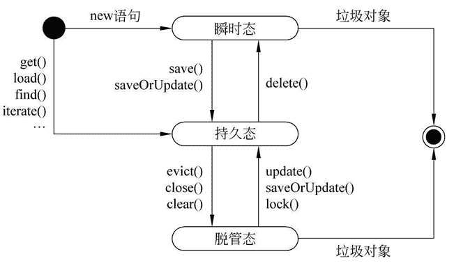

# Hibernate 持久化对象的状态及状态转换

> 原文：[`c.biancheng.net/view/4185.html`](http://c.biancheng.net/view/4185.html)

在 Hibernate 中，持久化对象是存储在一级缓存当中的，一级缓存指 Session 级别的缓存，它可以根据缓存中的持久化对象的状态改变同步更新数据库。

Hibernate 是持久层的 ORM 框架，专注于数据的持久化工作。在进行数据持久化操作时，持久化对象可能处于不同的状态当中。这些状态可分为三种，分别为瞬时态、持久态和脱管态。下面分别针对这三种状态进行简单介绍。

#### 1）瞬时态（transient）

瞬时态也称为临时态或者自由态，瞬时态的对象是由 new 关键字开辟内存空间的对象，不存在持久化标识 OID（相当于主键值），且未与任何的 Session 实例相关联，在数据库中也没有记录，失去引用后将被 JVM 回收。瞬时对象在内存孤立存在，它是携带信息的载体，不和数据库的数据有任何关联关系。

#### 2）持久态（persistent）

持久态的对象存在一个持久化标识 OID，当对象加入到 Session 缓存中时，就与 Session 实例相关联。它在数据库中存在与之对应的记录，每条记录只对应唯一的持久化对象。需要注意的是，持久态对象是在事务还未提交前变成持久态的。

#### 3）脱管态（detached）

脱管态也称离线态或者游离态，当持久化对象与 Session 断开时就变成了脱管态，但是脱管态依然存在持久化标识 OID，只是失去了与当前 Session 的关联。需要注意的是，脱管态对象发生改变时 Hibernate 是不能检测到的。

在 Hibernate 运行时，持久化对象的三种状态是可以通过一系列的方法进行转换的。这三种状态之间的转换关系具体如图 1 所示。
图 1  持久化对象的状态转换
从图 1 中可以看出，当一个对象通过 new 关键字创建后，该对象处于瞬时态；当对瞬时态对象执行 Session 的 save() 或 saveOrUpdate() 方法后，该对象将被放入 Session 的一级缓存中，此时该对象处于持久态。

当对持久态对象执行 evict()、close() 或 clear() 操作后，对象会进入脱管态。

当直接执行 Session 的 get()、load()、find() 或 iterate() 等方法从数据库中查询出对象时，查询到的对象也会处于持久态。

当对数据库中的纪录进行 update()、saveOrUpdate() 以及 lock() 等操作后，此时脱管态的对象就过渡到持久态；由于瞬时态和脱管态的对象不在 session 的管理范围内，所以会在一段时间后被 JVM 回收。