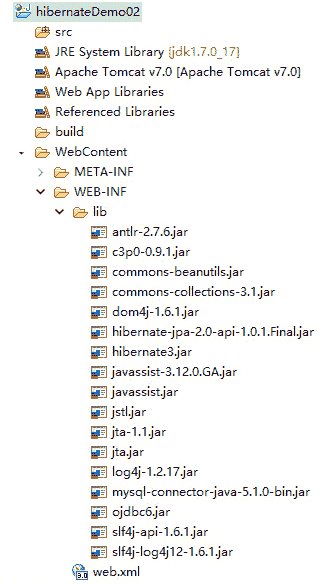
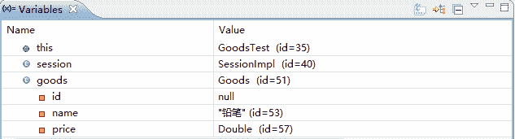

# Hibernate 持久化对象的状态转换实例

> 原文：[`c.biancheng.net/view/4190.html`](http://c.biancheng.net/view/4190.html)

通过《Hibernate 持久化对象的状态及状态转换》的学习，读者已经了解了持久化对象的三种状态，以及三种状态之间的转换方式。本节将通过案例演示这三种状态的转换。

#### 1\. 创建项目并导入 JAR 包

在 MyEclipse 中创建一个名为 hibernateDemo02 的 Web 项目，将 Hibernate 所必需的 JAR 包添加到 WEB-INF/lib 目录中，并发布到类路径下，如图 1 所示。


图 1  导入 Hibernate 框架所需的 JAR 文件

#### 2\. 创建实体类

在 src 目录下创建一个名为 com.mengma.domain 的包，并在该包下创建一个名为 Goods 的实体类，编辑后如下所示。

```

package com.mengma.domain;

public class Goods {
    private Integer id; // 标识 id
    private String name; // 商品名称
    private Double price; // 商品价格

    public Integer getId() {
        return id;
    }

    public void setId(Integer id) {
        this.id = id;
    }

    public String getName() {
        return name;
    }

    public void setName(String name) {
        this.name = name;
    }

    public Double getPrice() {
        return price;
    }

    public void setPrice(Double price) {
        this.price = price;
    }

    // 重写 toString()方法
    public String toString() {
        return "Goods[id=" + id + ",name=" + name + ",price=" + price + "]";
    }
}

```

上述代码中，定义了三个属性，分别为 id、name 和 price，并提供了各属性的 getter 和 setter 方法以及 toString() 方法。

#### 3\. 创建映射文件

在 com.mengma.domain 包下创建一个名为 Goods.hbm.xml 的映射文件，编辑后如下所示。

```

<?xml version="1.0" encoding="UTF-8"?>
<!DOCTYPE hibernate-mapping PUBLIC "-//Hibernate/Hibernate Mapping DTD 3.0//EN"
"http://hibernate.sourceforge.net/hibernate-mapping-3.0.dtd">
<hibernate-mapping>
    <class name="com.mengma.domain.Goods" table="goods">
        <id name="id" column="id" type="integer">
            <generator class="native" />
        </id>
        <property name="name" column="name" />
        <property name="price" column="price" />
    </class>
</hibernate-mapping>
```

上述代码中可以看出，实体类 Goods 与所对应的是数据库中的 goods 表，实体类的属性与数据表的字段名相对应。

#### 4\. 创建配置文件

在 src 目录下创建 Hibernate 的核心配置文件 hibernate.cfg.xml，编辑后如下所示。

```

<?xml version="1.0" encoding="UTF-8"?>
<!DOCTYPE hibernate-configuration PUBLIC
          "-//Hibernate/Hibernate Configuration DTD 3.0//EN"
          "http://hibernate.sourceforge.net/hibernate-configuration-3.0.dtd">
<hibernate-configuration>
    <session-factory>
        <!-- 指定方言 -->
        <property name="dialect">
            org.hibernate.dialect.MySQL5Dialect
        </property>
        <!-- 链接数据库 url -->
        <property name="connection.url">
              <![CDATA[jdbc:mysql://localhost:3306/hibernate?useUnicode=true&characterEncoding=utf-8]]>
        </property>
        <!-- 连接数据库的用户名 -->
        <property name="connection.username">
            root
        </property>
        <!-- 数据库的密码 -->
        <property name="connection.password">
            1128
        </property>
        <!-- 数据库驱动 -->
        <property name="connection.driver_class">
            com.mysql.jdbc.Driver
        </property>
        <!-- 显示 sql 语句 -->
        <property name="show_sql">
            true
        </property>
        <!-- 格式化 sql 语句 -->
        <property name="format_sql">true</property>
        <!-- 自动建表 -->
        <property name="hbm2ddl.auto">update</property>
        <!-- 映射文件配置 -->
        <mapping resource="com/mengma/domain/Goods.hbm.xml" />
    </session-factory>
</hibernate-configuration>
```

上述代码中，除了配置数据库的基本信息、显示 SQL 语句、格式化 SQL 语句以及导入关联映射文件信息以外，还增加了一个自动建表的配置信息，该配置会自动检测数据库中是否存在对应的表，如果不存在，则会自动在数据库中创建数据表，反之则不创建。

#### 5\. 创建工具类

在 src 目录下创建一个名为 com.mengma.utils 的包，在该包下创建一个名为 HibernateUtils 的类，该类用于获取 Session 实例对象，其实现代码请参见《Hibernate 核心接口》教程。

#### 6\. 创建测试类

在 src 目录下创建一个名为 com.mengma.test 的包，在该包下创建一个名为 GoodsTest 的类，编辑后如下所示。

```

package com.mengma.test;

import org.hibernate.classic.Session;
import org.junit.Test;

import com.mengma.domain.Goods;
import com.mengma.utils.HibernateUtils;

public class GoodsTest {
    // 演示持久化对象的三种状态
    @Test
    public void test1() {
        Session session = HibernateUtils.getSession(); // 得到 session 对象
        session.beginTransaction();
        Goods goods = new Goods();
        goods.setName("铅笔");
        goods.setPrice(0.5);
        session.save(goods);
        session.getTransaction().commit();
        session.close();
        System.out.println(goods);
    }

}
```

上述代码中，使用 new 关键字创建 Goods 对象时，该对象是没有标识（OID）的，也没有与 Session 进行关联，它处于瞬时状态。

执行 save() 方法后，Goods 对象已经处于 Session 的管理范围了，并且有了自己的 OID，此时的 Goods 对象已转换为持久态。当执行 commit() 方法并关闭 Session 后，Goods 对象就已不在 Session 的管理范围，此时 Goods 对象从持久态转换为托管态。

#### 7\. 运行程序并查看结果

为了验证上面所讲解的内容，接下来在代码的第 15 行设置断点，用 Debug 方式执行 test1() 方法，程序运行至断点位置，观察 Variables 窗口的变量值，如图 2 所示。

从图 2 中可以看出，此时 Goods 对象的 id 值为 null，按 F6 键进行单步跳过操作，save() 方法执行后，继续观察变量的变化情况，如图 3 所示。


图 2  Variables 窗口

图 3  Variables 窗口
从图 3 中可以看出，执行完 save() 方法后，Good 对象的 id 属性已被赋值，该值就是 Goods 对象的持久化标识 OID，这说明持久化对象在事务提交前就已经变成了持久态，也说明了瞬时态对象和持久态对象的区别就是，持久态对象与 Session 进行了关联并且 OID 有值。

当执行完 close() 方法后，Goods 对象与 Session 不再存在关联关系，此时的 Goods 对象会由持久态对象转换为脱管态，但通过控制台的输出内容可以发现 Goods 对象的 OID 属性依然是存在的，这说明脱管态对象与持久态对象的区别就是脱管状态对象没有了 Session 关联。