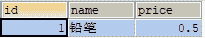
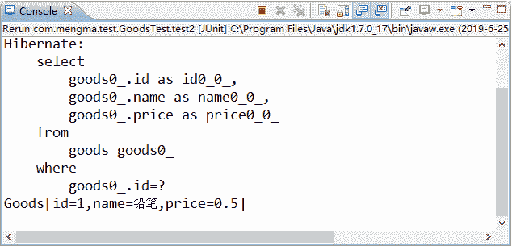
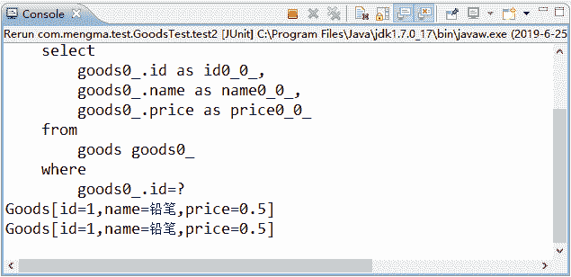

# Hibernate 一级缓存详解

> 原文：[`c.biancheng.net/view/4191.html`](http://c.biancheng.net/view/4191.html)

Hibernate 中的缓存分为一级缓存和二级缓存，这两个级别的缓存都位于持久化层，并且存储的都是数据库数据的备份。其中一级缓存是 Hibernate 的内置缓存，在前面的学习中已经使用过。本节将针对 Hibernate 的一级缓存进行详细讲解。

一级缓存其实就是 Session 缓存。Session 缓存是一块内存空间，用于存储与管理 Java 对象。

在使用 Hibernate 查询对象时，首先会使用对象的 OID 值在 Hibernate 的一级缓存中查找，如果找到匹配的对象，则直接将该对象从一级缓存中取出使用；如果没有找到匹配的对象，则会去数据库中查询对应的数据。当从数据库中查询到所需数据时，该数据信息会存储到一级缓存中。由此可知，Hibernate 一级缓存的作用就是减少对数据库的访问次数。

Hibernate 的一级缓存具有如下特点。

1）当应用程序调用 Session 接口的 save()、update()、saveOrUpdate() 时，如果 Session 缓存中没有相应的对象，则 Hibernate 就会自动把从数据库中查询到的相应对象信息加入到一级缓存中。

2）当调用 Session 接口的 load()、get() 方法，以及 Query 接口的 list()、iterator() 方法时，会判断缓存中是否存在该对象，有则返回，不会查询数据库，如果缓存中没有要查询的对象，则再去数据库中查询对应对象，并添加到一级缓存中。

3）当调用 Session 的 close() 方法时，Session 缓存会被清空。

4）Session 能够在某些情况下，按照缓存中对象的变化，执行相关的 SQL 语句同步更新数据库，这一过程被称为刷出缓存（flush）。

在默认情况下，Session 在如下几种情况中会刷出缓存。

1）当应用程序调用 Transaction 的 commit() 方法时，该方法先刷出缓存（调用 session.flush() 方法），然后再向数据库提交事务（调用 commit() 方法）。

2）当应用程序执行一些查询操作时，如果缓存中持久化对象的属性已经发生了变化，会先刷出缓存，以保证查询结果能够反映持久化对象的最新状态。

3）调用 Session 的 flush() 方法。

以上就是 Hibernate 一级缓存的刷出情况。对于刚接触 Hibernate 框架的读者来说并不是很容易理解，为了帮助读者更好地理解 Session 的一级缓存，下面通过具体案例演示一级缓存的使用。

以 goods 表为例，此时 goods 表中的数据如图 1 所示。
图 1  goods 表查询结果
在 GoodsTest 类中添加一个名为 test2() 的方法，使用该方法证明一级缓存的存在，其代码如下所示：

```

// 证明一级缓存的存在
@Test
public void test2() {
    Session session = HibernateUtils.getSession(); // 得到 session 对象
    session.beginTransaction();
    // 获取 goods1 对象时，由于一级缓存中没有数据，所以会发送 SQL 语句，查询数据库中的内容
    Goods goods1 = (Goods) session.get(Goods.class, 1);
    System.out.println(goods1);
    // 获取 goods2 对象时，不会发出 SQL 语句，会从 Session 缓存中获取数据
    Goods goods2 = (Goods) session.get(Goods.class, 1);
    System.out.println(goods2);
    session.getTransaction().commit();
    session.close();
}
```

在上述代码中，第一次执行 get() 方法时，由于一级缓存中不存在 id 为 1 的 Goods 对象，所以 Hibernate 会发出 SQL 语句查询数据库中 id 为 1 的数据。查到后，会将该数据信息保存到一级缓存中。当再次调用 get() 方法获取该对象时，此时将不会发出 SQL 语句，这是因为该对象是在一级缓存中获取的。

为了验证上面的描述，接下来在 7 行设置断点，用 Debug 方式执行 test2() 方法。程序进入断点后，按 F6 键执行 System.out.println(goods1); 语句后，控制台的显示结果如图 2 所示。


图 2  输出结果
从图 2 的显示结果中可以看出，执行第一次 get() 方法后，Hibernate 会向数据库中发出一条 SQL 语句，这说明 goods1 对象是从数据库中查询的。程序继续向下执行第二个输出语句时，控制台显示结果如图 3 所示。


图 3  输出结果
从图 3 的显示结果中可以看出，goods2 对象的查询结果被直接输出了，这说明第二次调用 get() 方法获取 goods2 对象时没有查询数据库，而是直接从一级缓存中获取了 goods2 对象。