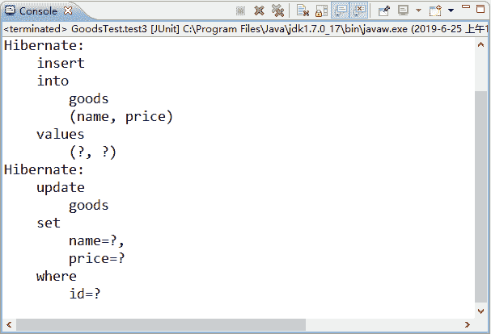
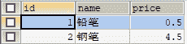

# Hibernate 快照技术详解

> 原文：[`c.biancheng.net/view/4195.html`](http://c.biancheng.net/view/4195.html)

通过《Hibernate 一级缓存详解》的学习，读者对 Hibernate 的一级缓存已经有了一定的了解。为了确保一级缓存中的数据和数据库中的数据保持一致，在 Hibernate 框架中提供了快照技术。

Hibernate 向一级缓存中存入数据的同时，还会复制一份数据存入 Hibernate 快照中。当调用 commit() 方法时，会清理一级缓存中的数据操作），同时会检测一级缓存中的数据和快照区的数据是否相同。如果不同，则会执行 update() 方法，将一级缓存的数据同步到数据库中，并更新快照区；反之，则不会执行 update() 方法。

下面通过具体示例演示 Hibernate 快照技术的应用。在 GoodsTest 中添加一个名为 test3() 的方法，其代码如下所示：

```

// hibernate 快照
@Test
public void test3() {
    Session session = HibernateUtils.getSession(); // 得到 session 对象
    session.beginTransaction();
    Goods goods = new Goods();
    goods.setName("钢笔");
    goods.setPrice(5.0);
    session.save(goods);    // 向一级缓存中存入 session 对象
    goods.setPrice(4.5);    // 提交价格
    session.getTransaction().commit();    //提交事务
    session.close();    //关闭资源
}
```

在上述代码中，创建了一个 Goods 对象，并为该对象的属性进行赋值。在执行 save() 方法时，会将数据保存到一级缓存中。接着修改对象的 price 属性值，提交事务并关闭 session 对象。

使用 JUnit 测试运行 test3() 方法后，控制台的显示结果如图 1 所示。


图 1  输出结果
从图 1 的显示结果中可以看出，在执行上述 test3() 方法时共发出了两条 SQL 语句。如果使用 Debug 模式调试执行程序，会发现在执行 save() 方法后发出了第一条 insert 语句，直到提交事务后才会发出第二条 update 语句。

此时读者一定会费解，为什么会发出 update 语句呢？

这是因为在执行 session 的 save() 方法时，Hibernate 一级缓存中保存了 Goods 对象的数据且会复制一份数据放入到 Hibernate 快照中，在执行 commit() 方法时，Hibernate 会检测快照中的数据与一级缓存中的数据是否一致，由于在此之前 Goods 对象的 price 属性值发生了变化，导致快照中的数据与一级缓存中的数据已经不一致，因此发送了 update 语句，更新了 Hibernate 一级缓存中的数据。

此时，goods 表中数据如图 2 所示。
图 2  数据查询结果
从图 2 的查询结果中可以看出，goods 表中插入的数据是一级缓存中更新后的数据。