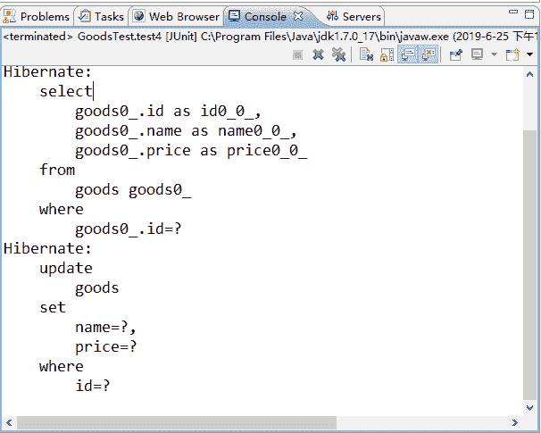
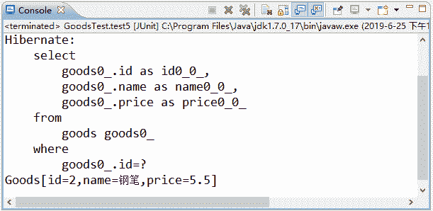
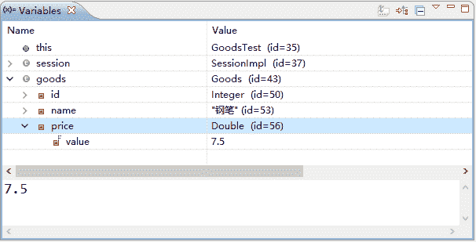
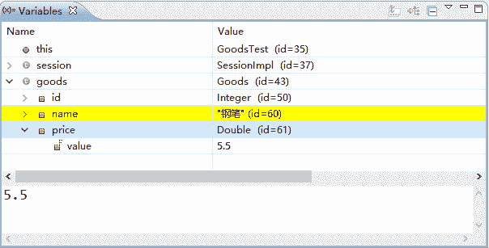

# Hibernate 一级缓存常用操作：刷出、清除和刷新

> 原文：[`c.biancheng.net/view/4197.html`](http://c.biancheng.net/view/4197.html)

在 Hibernate 中，一级缓存有三个常见的操作，分别为刷出、清除和刷新操作，下面结合本章前面的案例演示这三种常见的操作。

#### 1\. 刷出（flush）

一级缓存刷出功能是指调用 Session 的 flush() 方法时会执行刷出缓存的操作。下面通过具体示例演示一级缓存的刷出功能。在 GoodsTest 类中添加一个名为 test4() 的方法，具体代码如下所示：

```

// 刷出
@Test
public void test4() {
    Session session = HibernateUtils.getSession(); // 得到 session 对象
    session.beginTransaction();
    Goods goods = (Goods) session.get(Goods.class, 2);
    goods.setPrice(5.5);
    session.flush(); // 执行刷出操作，此时会发送 update 语句
    session.getTransaction().commit();
    session.close();
}
```

在 flush() 方法处设置断点，利用 Debug 模式运行程序。当程序停止在断点处时，控制台中会显示查询 Goods 对象时所发出的 select 语句。当程序向下执行完 session.flush() 语句时，控制台会输出 update 语句，如图 1 所示。
图 1  断点执行和输出结果
在《Hibernate 快照技术详解》教程执行 test3() 方法中的 commit() 方法时，也同样发出了 update 语句，这说明在提交事务前，Hibernate 程序会默认先执行 flush() 方法。

#### 2\. 清除（clear）

程序在调用 Session 的 clear() 方法时，可以执行清除缓存数据的操作。下面通过具体示例演示一级缓存中的清除功能，在 GoodsTest 类中添加一个名为 test5() 的方法，其代码如下所示：

```

// 清除
@Test
public void test5() {
    Session session = HibernateUtils.getSession(); // 得到 session 对象
    session.beginTransaction();
    Goods goods = (Goods) session.get(Goods.class, 2);
    System.out.println(goods);
    goods.setPrice(6.5);
    session.clear(); // 清空一级缓存
    session.getTransaction().commit();
    session.close();
}
```

使用 JUnit 测试运行 test5() 方法后，控制台的显示结果如图 2 所示。
图 2  输出结果
从图 2 中可以看出，执行后的 test5() 方法只输出了 select 语句，而没有输出 update 语句。同时，查看数据库时，会发现数据库中的数据也没有发生变化。这是因为在执行 clear() 方法时，清空了一级缓存中的数据，所以 Goods 对象的修改操作并没有生效。

需要注意的是，如果将上述方法中的 session.clear() 方法更改为 session.evict（goods）方法，也可以实现同样的效果。这两个方法的区别是：clear() 方法是清空一级缓存中所有的数据，而 evict() 方法是清除一级缓存中的某一个对象。

#### 3\. 刷新（refresh）

程序在调用 Session 的 refresh() 方法时，会重新查询数据库，并更新 Hibernate 快照区和一级缓存中的数据。下面通过具体示例演示一级缓存的刷新功能。在 GoodsTest 类中添加一个名为 test6() 的方法，其代码如下所示：

```

// 刷新
@Test
public void test6() {
    Session session = HibernateUtils.getSession(); // 得到 session 对象
    session.beginTransaction();
    Goods goods = (Goods) session.get(Goods.class, 2);
    goods.setPrice(7.5);
    session.refresh(goods); // 查询数据库，恢复快照和一级缓存中的数据
    session.getTransaction().commit();
    session.close();
}
```

在 refresh() 方法处设置断点，利用 Debug 模式调试程序，观察 Variables 窗口中 goods 对象的 price 属性值，如图 3 所示。


图 3  goods 对象
从图 3 的显示结果中可以看出，此时的 price 属性值为 7.5，按 F6 键继续向下执行，当执行完 refresh() 方法后，Variables 窗口中 goods 对象的 price 属性值如图 4 所示。


图 4  goods 对象
从图 4 的显示结果中可以看出，price 属性值已经变回原来的 5.5，与 goods 表中的数据保持一致，即使程序全部执行完，数据表中的数据也没有发生变化。由此说明，refresh() 方法可以使 Hibernate 快照区和一级缓存中的数据与数据库中的数据保持一致。