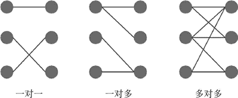
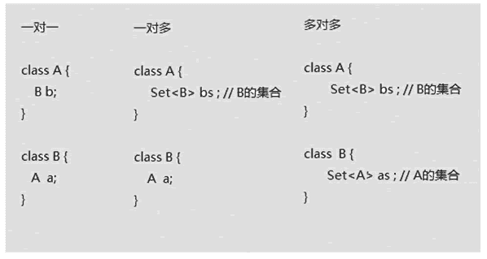

# Hibernate 映射关系：一对一、一对多和多对多

> 原文：[`c.biancheng.net/view/4198.html`](http://c.biancheng.net/view/4198.html)

教程前面所讲的 Hibernate 内容都是针对于单张表的操作。在 Hibernate 中，同样可以对多张存在关联关系的表进行操作，但需要在映射文件中，将对象的关联关系与数据库表的外键关联进行映射。本章将对 Hibernate 的关联关系映射进行详细讲解。

在关系型数据库中，多表之间存在着三种关联关系，分别为一对一、一对多和多对多，如图 1 所示

图 1  关系型数据库中多表之间的三种关联关系这三种关联关系的具体说明如下。

*   一对一：在任意一方引入对方主键作为外键。
*   一对多：在“多”的一方，添加“一”的一方的主键作为外键。
*   多对多：产生中间关系表，引入两张表的主键作为外键，两个主键成为联合主键。

通过数据库表可以描述实体数据之间的关系，同样，通过对象也可以进行描述。在 Hibernate 中，使用 Java 实体对象之间的关系描述数据表之间的关系，如图 2 所示。

从图 2 中可以看出，一对一的关系就是在本类中定义对方类型的对象，如 A 类中定义 B 类类型的属性 b，B 类中定义 A 类类型的属性 a；一对多的关系，在一个 A 类类型对应多个 B 类类型的情况下，需要在 A 类以 Set 集合的方式引入 B 类类型的对象，在 B 类中定义 A 类类型的属性 a；多对多的关系，在 A 类中定义 B 类类型的 Set 集合，在 B 类中定义 A 类类型的 Set 集合，这里用 Set 集合的目的是避免数据的重复。

以上就是 Java 对象中三种实体类之间的关联关系，由于一对一的关联关系在开发中不常使用，所以教程中未单独讲解，读者作为了解即可。
图 2  Java 对象描述数据表之间的关系
由于篇幅有限，关于 Hibernate 的一对多和多对多的映射关系请读者点击下面链接阅读：

*   Hibernate 一对多映射关系详解（附带实例）
*   Hibernate 多对多映射关系详解（附带实例）