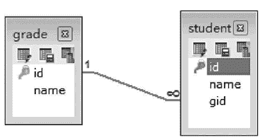
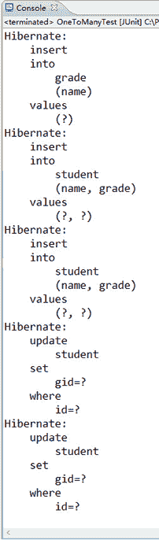
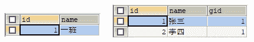
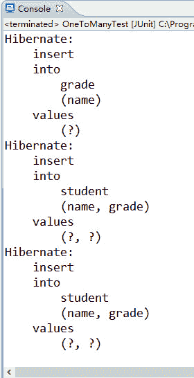

# Hibernate 一对多映射关系详解（附带实例）

> 原文：[`c.biancheng.net/view/4200.html`](http://c.biancheng.net/view/4200.html)

在三种关联关系中，一对多（或多对一）是最为常见的一种关联关系，一对多映射关系是由“多”的一方指向“一”的一方。在表示“多”的一方的数据表中增加一个外键，指向“一”的一方的数据表的主键，“一”的一方称为主表，而“多”的一方称为从表。

以班级和学生的关联关系为例，班级表与学生表的关联关系如图 1 所示。
图 1  班级表和学生表的关联关系
在图 1 中，grade 表为班级表，id 为班级表的主键，name 表示班级名称；student 表为学生表，id 为学生表的主键，name 表示学生名称，gid 表示外键，它对应了班级表中的主键 id。

由于一个班级可以拥有多个学生，那么可以说班级和学生是一对多的关系，在班级类中以集合 Set 的方式引入学生，在映射文件中通过 <set> 标签进行映射。

为了让读者快速掌握一对多关联关系映射的使用，下面通过具体的案例演示如何实现一对多关联关系映射。

#### 1\. 创建项目导入 JAR 包

在 MyEclipse 中创建一个名为 hibernateDemo03 的 Web 项目，并将 Hibernate 所必需的 JAR 包添加到 WEB-INF/lib 目录中，并发布到类路径下。

#### 2\. 创建实体类

#### 1）创建班级实体类。

在项目的 src 目录下创建一个名为 com.mengma.onetomany 的包，在该包下创建一个 Grade 类，编辑后如下所示。

```

package com.mengma.onetomany;

import java.util.HashSet;
import java.util.Set;

public class Grade {
    private Integer id;
    private String name; // 班级名称
    private Set<Student> students = new HashSet<Student>();

    public Integer getId() {
        return id;
    }

    public void setId(Integer id) {
        this.id = id;
    }

    public String getName() {
        return name;
    }

    public void setName(String name) {
        this.name = name;
    }

    public Set<Student> getStudents() {
        return students;
    }

    public void setStudents(Set<Student> students) {
        this.students = students;
    }
}
```

以上代码中，定义了三个属性，分别是 id、name 和 students，并提供了各属性的 getter 和 setter 方法。其中是 students 是一个集合类型对象，用于存储一个班级的学生。

#### 2）创建学生实体类。

在 com.mengma.onetomany 包下创建一个名为 Student 的类，编辑后如下所示。

```

package com.mengma.onetomany;

public class Student {
    private Integer id;
    private String name; // 学生名称
    private Grade grade; // 学生从属于某个班级

    public Integer getId() {
        return id;
    }

    public void setId(Integer id) {
        this.id = id;
    }

    public String getName() {
        return name;
    }

    public void setName(String name) {
        this.name = name;
    }

    public Grade getGrade() {
        return grade;
    }

    public void setGrade(Grade grade) {
        this.grade = grade;
    }
}
```

以上代码中，同样也定义了三个属性，分别是 id、name 和 grade，并提供了各属性的 getter 和 setter 方法。其中 grade 是一个 Grade 类型的对象，用于表示该学生从属于某一个班级。

#### 3\. 创建映射文件

#### 1）创建班级类的映射文件。

在 com.mengma.onetomany 包下创建一个名为 Grade.hbm.xml 的映射文件，如下所示。

```

<?xml version="1.0" encoding="UTF-8"?>
<!DOCTYPE hibernate-mapping PUBLIC "-//Hibernate/Hibernate Mapping DTD 3.0//EN"
"http://hibernate.sourceforge.net/hibernate-mapping-3.0.dtd">
<hibernate-mapping>
    <class name="com.mengma.onetomany.Grade" table="grade">
        <id name="id" column="id">
            <generator class="native" />
        </id>
        <property name="name" column="name" length="40" />
        <!-- 一对多的关系使用 set 集合映射 -->
        <set name="students">
            <!-- 确定关联的外键列 -->
            <key column="gid" />
            <!-- 映射到关联类属性 -->
            <one-to-many class="com.mengma.onetomany.Student" />
        </set>
    </class>
</hibernate-mapping>
```

上述代码中，使用 <set> 标签描述被映射类中的 Set 集合，其中 <key> 标签的 column 属性用于确定关联的外键列，<one-to-many> 标签用于描述持久化类的一对多关联，其中 class 属性表示映射的关联类。

#### 2）创建学生类的映射文件。

在 com.mengma.onetomany 包下创建一个名为 Student.hbm.xml 的映射文件，如下所示。

```

<?xml version="1.0" encoding="UTF-8"?>
<!DOCTYPE hibernate-mapping PUBLIC "-//Hibernate/Hibernate Mapping DTD 3.0//EN"
"http://hibernate.sourceforge.net/hibernate-mapping-3.0.dtd">
<hibernate-mapping>
    <class name="com.mengma.onetomany.Student" table="student">
        <id name="id" column="id">
            <generator class="native" />
        </id>
        <property name="name" column="name" length="40" />
        <!-- 多对一关系映射 -->
        <many-to-one name="grade" class="com.mengma.onetomany.Grade"></many-to-one>
    </class>
</hibernate-mapping>
```

上述代码中，<many-to-one> 标签定义了三个属性，分别是 name、class 和 column 属性。其中，name 属性表示 Student 类中的 grade 属性名称，class 属性表示指定映射的类，column 属性表示表中的外键类名。需要注意的是，该 column 属性与 Grade.hbm.xml 映射文件的 <key> 标签的 column 属性要保持一致。

#### 4\. 创建配置文件和工具类

在 src 目录下创建一个名为 hibernate.cfg.xml 的配置文件，在该文件行中配置数据库基本信息和其他配置信息后，将 Grade.hbm.xml 和 Student.hbm.xml 映射文件添加到配置文件中，具体如下所示：

<mapping resource="com/mengma/onetomany/Grade.hbm.xml" />
<mapping resource="com/mengma/onetomany/Student.hbm.xml" />

在 src 目录下创建一个名为 com.mengma.utils 的包，在包中创建工具类文件 HibernateUtils.java（可参见本书第二十三章中的文件 23-5）。

#### 5\. 创建测试类

在 com.mengma.onetomany 包下创建一个名为 OneToManyTest 的类，编辑后如下所示。

```

// 添加数据
@Test
public void test1() {
    Session session = HibernateUtils.getSession();
    session.beginTransaction();
    // 创建一个班级
    Grade g = new Grade();
    // 创建两个学生对象       
    g.setName("一班");
    Student s1 = new Student();
    s1.setName("张三");
    Student s2 = new Student();
    s2.setName("李四");
    // 描述关系---学生属于某个班级
    s1.setGrade(g);
    s1.setGrade(g);
    // 描述关系---班级里有多个学生
    g.getStudents().add(s1);
    g.getStudents().add(s2);
    // 先存班级再存学生
    session.save(g);
    session.save(s1);
    session.save(s2);
    session.getTransaction().commit();
    session.close();
}
```

上述代码中，首先创建了一个班级对象和两个学生对象，然后分别描述了两个学生与班级之间的关系，又描述了一个班级与两个学生之间的关系，这就是一对多的双向关联关系。

#### 6\. 运行项目并查看结果

在 Hibernate 配置文件中添加自动建表信息后，在运行程序时，程序会自动创建两张表，并且插入数据。使用 JUnit 测试运行 test1() 方法后，控制台显示结果如图 2 所示。

图 2  输出结果
从图 2 的显示结果中可以看出，控制台总共输出了三条 insert 语句和两条 update 语句，此时查询两张表中的数据，如图 3 所示。
图 3  查询结果
从图 3 查询结果中可以看出，grade 表和 student 表都已经成功创建，并插入了相应的数据。

在 Hibernate 中，像班级和学生这种关联关系，使用双向关联会执行两次 SQL 语句，这样会导致程序执行效率降低。

如果将 OneToManyTest 中的第 23 行和第 24 行代码删除，并将 grade 表和 student 表中的数据从数据库中删除，那么重新运行 test1() 方法后，控制台的输出结果如图 4 所示。
图 4  输出结果
从图 4 的显示结果中可以看出，控制台只显示出了三条 insert 语句，而没有显示 update 语句。

此时再次查询数据表中的数据，其查询结果将与图 3 中的显示结果相同。由于删除了两行描述班级有多个学生的代码，实现了班级对学生的一对多单向关联，所以程序只执行了一次 SQL 语句，但达到了同样的效果。在实际开发中，像班级和学生这种关联关系，使用单向关联描述即可。