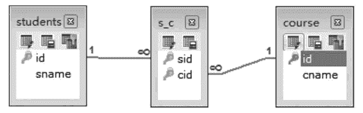
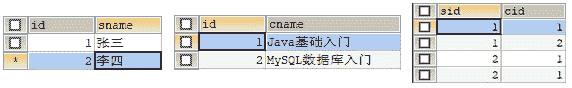

# Hibernate 多对多映射关系详解（附带实例）

> 原文：[`c.biancheng.net/view/4205.html`](http://c.biancheng.net/view/4205.html)

多对多的关联关系映射可以使用学生和课程的关联关系为例进行讲解。通常情况下，为了方便数据的维护，多对多的关系都会产生一张中间表。学生表与课程表的关系如图 1 所示。
图 1  学生表和课程表关系
在图 1 中，各个表的字段意思如下：

*   students 表为学生表，id 为学生表的主键，sname 表示学生名称。
*   course 表为课程表，id 为课程表的主键，cname 表示课程名称。
*   s_c 表为中间表，cid 和 sid 表示外键。

由于一个学生可以学习多门课程，而一门课程也可以被多个学生学习，由此可知，学生和课程的关系是多对多关系。这种关系需要在学生类和课程类中分别以集合的方式引入对方的对象，并在映射文件中通过 <set> 标签进行映射。

为了让读者更好地掌握多对多关联关系映射，下面通过具体的案例演示学生和课程之间多对多关联关系的使用。具体步骤如下。

#### 1\. 创建实体类

#### 1）创建学生实体类。

在 src 目录下创建一个名为 com.mengma.manytomany 的包，在该包下创建一个 Students 类，编辑后如下所示。

```

package com.mengma.manytomany;

import java.util.HashSet;
import java.util.Set;

public class Students {
    private Integer id; // 学生 id
    private String sname; // 学生姓名

    // 一门课程都可以被多个学生学习
    private Set<Course> courses = new HashSet<Course>();

    public Integer getId() {
        return id;
    }

    public void setId(Integer id) {
        this.id = id;
    }

    public String getSname() {
        return sname;
    }

    public void setSname(String sname) {
        this.sname = sname;
    }

    public Set<Course> getCourses() {
        return courses;
    }

    public void setCourses(Set<Course> courses) {
        this.courses = courses;
    }
}
```

上述代码中，courses 是一个集合类型，用于表示一个学生可以学习多门课程。

#### 2）创建课程实体类。

在 com.mengma.manytomany 包下创建一个名为 Course 的类，编辑后如下所示。

```

package com.mengma.manytomany;

import java.util.HashSet;
import java.util.Set;

public class Course {
    private Integer id; // 课程 id
    private String cname; // 课程名称

    // 一个学生可以学习多门课程
    private Set<Students> students = new HashSet<Students>();

    public Integer getId() {
        return id;
    }

    public void setId(Integer id) {
        this.id = id;
    }

    public String getCname() {
        return cname;
    }

    public void setCname(String cname) {
        this.cname = cname;
    }

    public Set<Students> getStudents() {
        return students;
    }

    public void setStudents(Set<Students> students) {
        this.students = students;
    }

}
```

上述代码中，students 是一个集合类型，用于表示一门课程可以被多个学生学习。

#### 2\. 创建映射文件

#### 1）创建学生实体类映射文件。

在 com.mengma.manytomany 包下创建一个名为 Students.hbm.xml 的映射文件，编辑后如下所示。

```

<?xml version="1.0" encoding="UTF-8"?>
<!DOCTYPE hibernate-mapping PUBLIC "-//Hibernate/Hibernate Mapping DTD 3.0//EN"
"http://hibernate.sourceforge.net/hibernate-mapping-3.0.dtd">
<hibernate-mapping>
    <class name="com.mengma.onetomany.Students" table="students">
        <id name="id" column="id">
            <generator class="native" />
        </id>
        <property name="sname" column="sname" length="40" />
        <set name="courses" table="s_c">
            <key column="sid" />
            <many-to-many class="com.mengma.manytomany.Course"
                column="cid" />
        </set>
    </class>
</hibernate-mapping>
```

上述代码中，使用 <set> 标签描述被映射类中的 Set 集合对象，与一对多配置方式不同的是，在 <set> 标签中多了一个 table 属性，该属性表示中间表的名称。

在 <set> 标签内，<key> 标签的 column 属性用于描述 students 表在中间表中的外键名称，<many-to-many> 标签用于表示两个持久化类多对多的关联关系，其中 column 属性用于描述 course 表在中间表中的外键名称。

#### 2）创建课程实体类映射文件。

在 com.mengma.manytomany 包下创建一个名为 Course.hbm.xml 的映射文件，如下所示。

```

<?xml version="1.0" encoding="UTF-8"?>
<!DOCTYPE hibernate-mapping PUBLIC "-//Hibernate/Hibernate Mapping DTD 3.0//EN"
"http://hibernate.sourceforge.net/hibernate-mapping-3.0.dtd">
<hibernate-mapping>
    <class name="com.mengma.onetomany.Course" table="sourse">
        <id name="id" column="id">
            <generator class="native" />
        </id>
        <property name="cname" column="cname" length="40" />
        <set name="students" table="s_c">
            <key column="cid" />
            <many-to-many class="com.mengma.manytomany.Students"
                column="sid" />
        </set>
    </class>
</hibernate-mapping>
```

上述代码中可以看出，Course.hbm.xml 与 Students.hbm.xml 的配置以及属性所表示的含义相同，可参考理解。

#### 3\. 添加映射信息

在 hibernate.cfg.xml 配置文件中添加 Students.hbm.xml 和 Course.hbm.xml 映射文件信息，具体如下所示：

<mapping resource="com/mengma/manytomany/Students.hbm.xml" />
<mapping resource="com/mengma/manytomany/Course.hbm.xml" />

#### 4\. 创建测试类

在 com.mengma.manytomany 包下创建一个名为 ManyToManyTest 的类，编辑后如下所示。

```

package com.mengma.manytomany;

import org.hibernate.classic.Session;
import org.junit.Test;

import com.mengma.utils.HibernateUtils;

public class ManyToManyTest {
    // 添加数据
    @Test
    public void test1() {
        Session session = HibernateUtils.getSession();
        session.beginTransaction();
        // 创建两个学生
        Students s1 = new Students();
        s1.setSname("张三");
        Students s2 = new Students();
        s2.setSname("李四");
        // 创建两门科目
        Course c1 = new Course();
        c1.setCname("Java 基础入门");
        Course c2 = new Course();
        c2.setCname("MySQL 基础入门");
        // 学生关联科目
        s1.getCourses().add(c1);
        s2.getCourses().add(c1);

        s1.getCourses().add(c2);
        s2.getCourses().add(c2);
        // 存储
        session.save(c1);
        session.save(c2);
        session.save(s1);
        session.save(s2);
        session.getTransaction().commit();
        session.close();
    }

}
```

上述代码中，首先创建两个学生对象和两门课程对象，然后用学生对课程进行关联，这就是多对多的单向关联。对于多对多的双向关联教程后面会结合反转的知识进行讲解，这里不再过多赘述。

#### 5\. 运行程序并查看结果

使用 JUnit 测试运行 test1() 方法，运行成功后，分别查询 students 表、course 表和 s_c 表，查询结果如图 2 所示。


图 2  查询结果
从图 2 的查询结果中可以看出，students 表和 course 表的主键分别作为了中间表的外键。由于是两个学生分别学习两门课程，所以可以看到 s_c 表总共有四条记录。