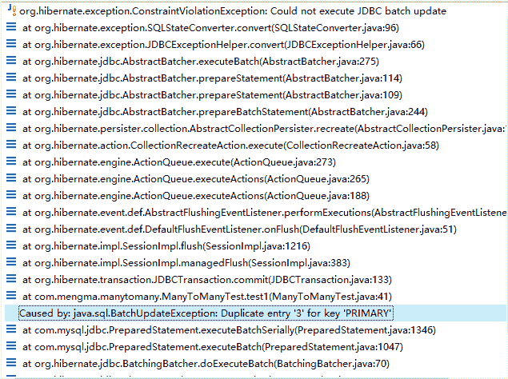
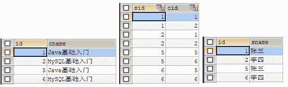
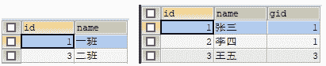
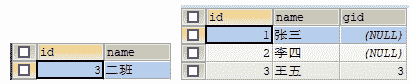
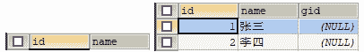
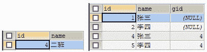
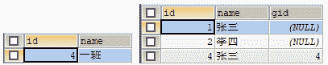
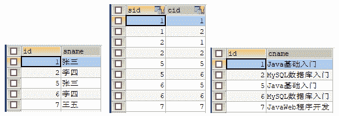

# Hibernate 级联（cascade）与反转（inverse）详解

> 原文：[`c.biancheng.net/view/4207.html`](http://c.biancheng.net/view/4207.html)

在 Hibernate 的关联关系中，可以使用单向关联关系，也可以使用双向关联关系，在双向关联关系中，Hibernate 会同时控制双方的关系，这样在程序操作时，很容易出现重复操作的问题。

为了解决这一问题，Hibernate 提供了反转操作，同时，为了在操作多表时，主表（主控方）操作后的数据能与关联表的数据保持一致，Hibernate 还提供了级联操作。接下来将对这两种操作进行详细讲解。

## 反转操作

在映射文件的 <set> 标签中，有一个 inverse（反转）属性，它的作用是控制关联的双方由哪一方管理关联关系。

inverse 属性值是 boolean 类型的：

*   当取值为 false（默认值）时，表示由当前这一方管理双方的关联关系，如果双方 inverse 属性都为 false 时，双方将同时管理关联关系。
*   取值为 true 时，表示当前一方放弃控制权，由对方管理双方的关联关系。

通常情况下，在一对多关联关系中，会将“一”的一方的 inverse 属性取值为 true，即由“多”的一方维护关联关系，否则会产生多余的 SQL 语句；而在多对多的关联关系中，任意设置一方的 inverse 属性为 true 即可。

通过《Hibernate 多对多映射关系详解》教程的学习，读者已经了解了多对多关联的单向关联，接下来结合反转操作演示多对多双向关联的情况。

#### 1\. 修改 ManyToManyTest 类

在《Hibernate 多对多映射关系详解》教程的 ManyToManyTest 的第 29～30 行代码之间添加课程对学生的关联，具体代码如下所示：

```

//课堂关联学生
c1.getStudents().add(s1);
c1.getStudents().add(s2);
c2.getStudents().add(s1);
c2.getStudents().add(s2);
```

使用 JUnit 测试运行 test1() 方法，其进度条显示为红色，表明运行结果没有通过，此时 JUnit 控制台中的报错信息如图 1 所示。


图 1  JUnit 视图
从图 1 的报错信息中可以看出，相同的主键值出现了重复写入，这是因为在双向关联中会产生一张中间表，由于关联双方都向中间表插入了数据，因此出现了重复写入的情况。

通常情况下，这种问题有两种解决方案：第一种是进行单向关联，第二种是在一方的映射文件中，将 <set> 标签的 inverse 属性设置为 true。

#### 2\. 修改映射文件 Course.hbm.xml

在 Course.hbm.xml 映射文件的 <set> 标签中，添加 inverse 属性，并将其属性值设置为 true，代码如下所示：

```

<set name="students" table="s_c" inverse="true">
    <key column="cid" />
    <many-to-many class="com.mengma.manytomany.Students"
                column="sid" />
</set>
```

#### 3\. 运行程序并查看结果

使用 JUnit 再次运行 test1() 方法，执行成功后，分别查看 students 表、course 表和 s_c 表，查询结果如图 2 所示。
图 2  查询结果
从图 2 的查询结果中可以看出，数据已经成功添加到三张表中。

需要注意的是，inverse 只对 <set>、<one-to-many> 和 <many-to-many> 标签有效，对 <many-to-one> 和 <one-to-one> 标签无效。

## 级联操作

级联操作是指当主控方执行任意操作时，其关联对象也执行相同的操作，保持同步。在映射文件的 <set> 标签中有个 cascade 属性，该属性用于设置是否对关联对象采用级联操作，其常用属性如表 1 所示。

表 1 cascade 属性的属性值

| 属性值 | 描   述 |
| --- | --- |
| save-update | 在执行 save、update 或 saveOrUpdate 吋进行关联操作 |
| delete | 在执行 delete 时进行关联操作 |
| delete-orphan | 删除所有和当前解除关联关系的对象 |
| all | 所有情况下均进行关联操作，但不包含 delete-orphan 的操作 |
| all-delete-orphan | 所有情况下均进行关联操作 |
| none | 所有情况下均不进行关联操作，这是默认值 |

了解了 cascade 的相关属性后，下面通过案例讲解 cascade 属性在实际应用中的级联操作。

#### 1\. 一对多的级联添加操作

在《Hibernate 一对多映射关系详解》教程中，通过班级和学生的关系讲解了一对多的关联关系映射，其案例代码实现了添加班级和学生的操作，下面演示一下仅添加班级的情况。

#### 1）在 OneToManyTest 类中添加一个名为 test2() 的方法，其代码如下所示：

```

// 一对多级联添加操作
@Test
public void test2() {
    Session session = HibernateUtils.getSession();
    session.beginTransaction();
    // 创建一个班级
    Grade g = new Grade();
    g.setName("二班");
    // 创建一个学生
    Student student = new Student();
    student.setName("王五");
    // 班级关联学生
    session.save(g);
    session.getTransaction().commit();
    session.close();
}
```

#### 2）在映射文件 Grade.hbm.xml 中，将 <many-to-one> 标签的 cascade 的属性值设置为 save-update，具体如下所示：

```

<set name="students" cascade="save-update">
    <key column="gid" />
    <one-to-many class="com.mengma.onetomany.Student" />
</set>
```

在上述配置代码中，cascade="save-update" 的含义是在添加 grade 表数据的同时，也向 student 表中添加数据。

#### 3）使用 JUnit 测试运行 test2() 方法，执行成功后，分别查询 grade 表和 student 表，查询结果如图 3 所示。


图 3  查询结果
从图 3 的查询结果中可以看出，班级与学生的级联添加操作已经实现。

#### 2\. 一对多的级联删除操作

在班级和学生的关联关系中，如果使用级联删除了班级，那么该班级对应的学生也会被删除。接下来演示在不使用级联删除操作的情况下，删除班级信息时学生信息的变化情况。在 OneToMany 类中添加一个名为 test3() 的方法，其代码如下所示：

```

// 不使用级联的删除操作
@Test
public void test3() {
    Session session = HibernateUtils.getSession();
    session.beginTransaction();
    Grade grade = (Grade) session.get(Grade.class, 1);    // 查询 id=1 的班级对象
    session.delete(grade);    // 删除班级
    session.getTransaction().commit();
    session.close();
}
```

在上述代码中，首先查询了 id 为 1 的班级对象，然后调用 delete() 方法删除了该班级对象。

使用 JUnit 测试运行 test3() 方法，执行成功后，分别查询 grade 表和 student 表，查询结果如图 4 所示。
图 4  查询结果
从图 4 的查询结果中可以看出，id 为 1 的班级已经成功被删除了，但是该班级的学生依然存在于 student 表中，只是 student 表中对应的外键被设为了 null 值。

这是因为班级被删除后，与其关联的 student 表中的外键值没有了。在删除 grade 表中数据之前，student 表先执行了 update 操作，将其表中的班级外键值设为了 null，然后才删除 grade 表中的班级。

如果希望在删除 grade 表中数据的同时，也删除与其关联的 student 表中的数据，那么就可以使用级联删除操作。设置级联删除操作非常简单，只需要在 Grade.hbm.xml 映射文件的 <set> 标签中，将 cascade 属性值设置为 delete 即可。具体配置如下所示：

```

<set name="students" cascade="delete">
    <key column="gid" />
    <one-to-many class="com.mengma.onetomany.Student" />
</set>
```

在 OneToMany 类中添加一个名为 test4() 的方法，其代码如下所示：

```

// 一对多级联的删除操作
@Test
public void test4() {
    Session session = HibernateUtils.getSession();
    session.beginTransaction();
    Grade grade = (Grade) session.get(Grade.class, 3); // 查询 id=3 的班级对象
    session.delete(grade);  //删除班级
    session.getTransaction().commit();
    session.close();
}
```

使用 JUnit 测试运行 test4() 方法，运行成功后，分别查询 grade 表和 student 表，查询结果如图 5 所示。
图 5  查询结果
从图 5 的查询结果中可以看出，grade 表中 id 为 3 的班级和关联的一个学生都已经被成功删除了。

#### 3\. 孤儿删除操作

在班级和学生的关系中，如果没有设置级联删除，则删除班级后，该班级所关联学生的外键会被设为 null，这时可以将这些学生比喻为孤儿，孤儿删除就是删除与某个班级解除关系的学生。

下面通过示例演示孤儿删除操作。首先执行一次 OneToManyTest 类中的 test1() 方法，向 grade 表和 student 表插入数据，运行成功后，分别查询 grade 表和 student 表，查询结果如图 6 所示。
图 6  查询结果
从图 6 的查询结果中可以看出，grade 表和 student 表中的数据已经成功插入。下面在 OneToManyTest 方法中添加一个名为 test5() 的方法，具体代码如下所示：

```

// 孤儿删除
@Test
public void test5() {
    Session session = HibernateUtils.getSession();
    session.beginTransaction();
    Grade grade = (Grade) session.get(Grade.class, 4); // 查询 id=4 的班级对象
    Student student = (Student) session.get(Student.class, 5); // 查询 id=5 的学生对象
    grade.getStudents().remove(student); // 解除关系
    session.delete(grade);
    session.getTransaction().commit();
    session.close();
}
```

在上述代码中，先查询了 id 为 4 的班级对象和 id 为 5 的学生对象，然后解除了它们之间的关系。

在 Grade.hbm.xml 映射文件中，将 cascade 属性设置为 delete-orphan，具体配置如下所示：

```

<set name="students" cascade="delete-orphan">
    <key column="gid" />
    <one-to-many class="com.mengma.onetomany.Student" />
</set>
```

使用 JUnit 测试运行 test5() 方法，运行成功后，分别查询 grade 表和 student 表，查询结果如图 7 所示。
图 7  查询结果
从图 7 的查询结果中可以看出，id 为 4 的班级和关联的 id 为 4 的学生数据还在，但 id 为 5 的学生数据已经被成功删除了，这表明孤儿删除的功能已经成功实现。

#### 4\. 多对多的级联添加操作

在前面小节中，我们已经学习了一对多的级联添加操作，下面通过具体示例演示多对多的级联添加操作。

#### 1）在 ManyToManyTest 类中添加一个名为 test2() 的方法，其具体代码如下所示：

```

// 多对多级联添加操作
@Test
public void test2() {
    Session session = HibernateUtils.getSession();
    session.beginTransaction();
    // 创建课程对象
    Course c = new Course();
    c.setCname("JavaWeb 程序开发");
    // 创建学生对象
    Students s = new Students();
    s.setSname("王五");
    // 学生关联课程
    s.getCourses().add(c);
    // 存储
    session.save(s);
    session.getTransaction().commit();
    session.close();
}
```

#### 2）在 Students.hbm.xml 映射文件中，将 cascade 属性设置为 save-update，具体配置如下所示：

```

<set name="courses" table="s_c" cascade="save-update">
    <key column="sid" />
    <many-to-many class="com.mengma.manytomany.Course"
                column="cid" />
</set>
```

#### 3）使用 JUnit 测试运行 test2() 方法，运行成功后，分别查询 student 表、course 表和 s_c 表，查询结果如图 8 所示。


图 8  查询结果
从图 8 的查询结果中可以看出，多对多级联添加操作已经成功实现。