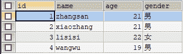
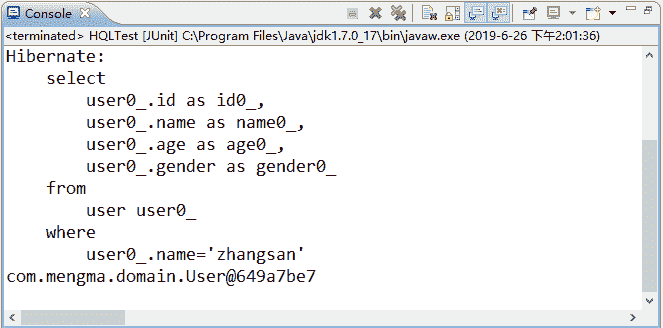
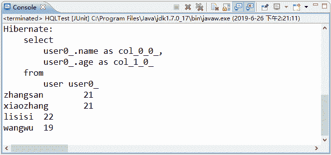
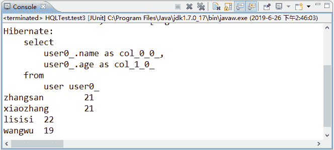
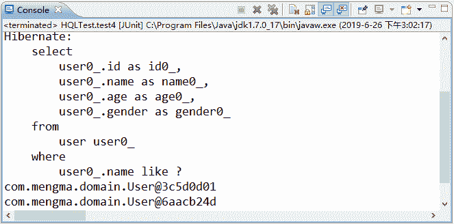
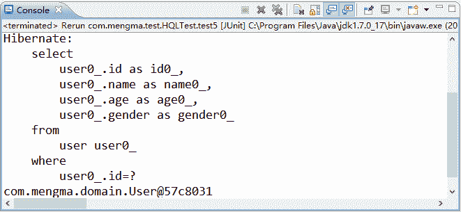
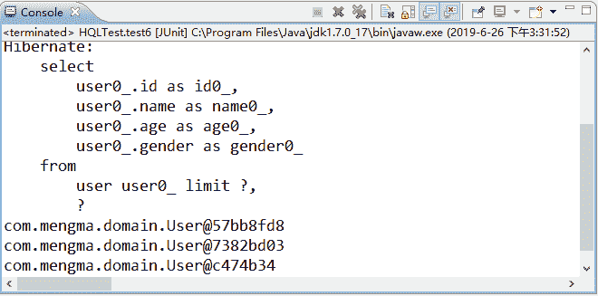

# Hibernate HQL 的 5 种常见检索方式详解

> 原文：[`c.biancheng.net/view/4212.html`](http://c.biancheng.net/view/4212.html)

在 Hibernate 核心 API 中，Query 接口是专门用于 HQL 查询的接口。教程《Hibernate 核心接口》已经讲解过该接口，并通过案例演示了该接口中 list() 方法的使用。本节将针对 HQL 中其他几种常见的检索方式进行详细讲解。

## 指定别名

HQL 语句与 SQL 语句类似，也可以使用 as 关键字指定别名。在使用别名时，as 关键字可以省略。下面通过案例演示如何在 HQL 语句中使用别名。

1）在 MyEclipse 中创建一个名为 hibernateDemo04 的 Web 项目，将 Hibernate 所必需的 JAR 包添加到项目的 lib 目录中，并发布到类路径下。

2）参见《第一个 Hibernate 程序》，分别编写实体类、映射文件和配置文件。参见《Hibernate 核心接口》教程，编写 Hibernate 工具类。

3）在 src 目录下创建包 com.mengma.test，在该包下创建一个名为 HQLTest 的类，并在类中添加一个 test1() 方法，如下所示。

```

package com.mengma.test;
import java.util.List;
import org.hibernate.Query;
import org.hibernate.Session;
import org.junit.Test;
import com.mengma.domain.HibernateUtils;
import com.mengma.domain.User;

public class HQLTest {
    // 指定别名
    @Test
    public void test1() {
        Session session = HibernateUtils.getSession(); // 得到一个 Session
        session.beginTransaction();
        String hql = "from User as u where u.name='zhangsan '"; // 编写 HQL
        Query query = session.createQuery(hql); // 创建 Query 对象
        List<User> list = query.list(); // 执行查询，获得结果
        for (User u : list) {
            System.out.println(u);
        }
        session.getTransaction().commit();
        session.close();
    }
}
```

上述代码中，字母 u 表示 User 对象的别名，在 where 条件后面，使用了别名指定查询条件。运行代码之前，首先查询 user 表中的数据，查询结果如图 1 所示。


图 1  查询结果
使用 JUnit 测试运行 test1() 方法，运行成功后，控制台的输出结果如图 2 所示。


图 2  输出结果

## 投影查询

本节《指定别名》案例查询出了对象的所有属性，但在实际需求中，可能只需要查询对象的部分属性。此时，可以采用 Hibernate 的投影查询方式查询对象的部分属性。

使用投影查询时的语法结构如下所示：

select 需要查询的属性 from 实体类名

下面通过具体示例演示投影查询。在 HQLTest 类中添加一个名为 test2() 的方法，该方法用于查询用户姓名和年龄，具体代码如下所示：

```

// 投影查询
@Test
public void test2() {
    Session session = HibernateUtils.getSession(); // 得到一个 Session
    session.beginTransaction();
    String hql = "select u.name, u.age from User as u"; // 编写 HQL
    Query query = session.createQuery(hql); // 创建 Query 对象
    List<Object[]> list = query.list(); // 执行查询，获得结果
    Iterator<Object[]> iter = list.iterator();
    while (iter.hasNext()) {
        Object[] objs = iter.next();
        System.out.println(objs[0] + " \t" + objs[1]);
    }
    session.getTransaction().commit();
    session.close();
}
```

在上述代码中，使用 select 关键字加上属性 name 和 age 查询数据表中的姓名和年龄信息。当检索对象的部分属性时，Hibernate 返回的 List 中的每一个元素都是一个 Object 数组，而不再是 User 对象。

在 Object 数组中，各个属性是有顺序的。如上述代码中，objs[0] 所对应的就是 name 属性的值，objs[1] 所对应的就是 age 属性的值，这与查询语句中的各个属性的顺序相对应。为了使输出数据整齐明了，在输出语句中使用了水平制表符“\t”。

使用 JUnit 测试运行 test2() 方法，运行成功后，控制台的输出结果如图 3 所示。


图 3  输出结果

## 动态实例查询

使用投影查询时，返回的查询结果是一个对象数组。由于在输出数据时还需要处理顺序，因此操作十分不便。为了方便操作，提高检索效率，可将检索出来的数据重新封装到一个实体的实例中，这种方式就是动态实例查询。

下面通过具体示例演示动态实例查询。在 HQLTest 类中添加一个名为 test3() 的方法，同样用于查询用户的姓名和年龄。具体代码如下所示：

```

// 动态实例查询
@Test
public void test3() {
    Session session = HibernateUtils.getSession();
    session.beginTransaction();
    String hql = "select new User (u.name, u.age) from User as u";
    Query query = session.createQuery(hql);
    List<User> list = query.list();
    for (User u : list) {
        System.out.println(u.getName() + "\t" + u.getAge());
    }
    session.getTransaction().commit();
    session.close();
}
```

从上述代码中可以看出，select 语句后面已经不再是属性，而是一个实体类对象，查询语句会将查询后的结果封装到 User 对象中。需要注意的是，使用此种查询方式，需要在 User 实体类中添加一个有参的构造方法和一个无参的构造方法，具体代码如下所示：

```

public User() {
}

public User(String name, Integer age) {
    this.name = name;
    this.age = age;
}
```

由于需要查询的是 name 和 age，所以需要添加带有 name 和 age 参数的构造方法。又由于在添加此构造方法后，虚拟机将不再默认提供无参的构造方法，所以需要再添加一个无参的构造方法。

使用 JUnit 测试运行 test3() 方法，运行成功后，控制台的输出结果如图 4 所示。


图 4  输出结果
从图 4 的显示结果中可以看出，使用动态实例查询时，查询结果被封装到了 User 对象中，通过 User 对象就可以方便地获取对象的属性了。

## 条件查询

在程序开发中，通常需要指定条件进行查询。此时，可以使用 HQL 语句提供的 where 子句进行查询，或者使用 like 关键字进行模糊查询。根据提供的参数形式，条件查询分为按参数位置查询和按参数名称查询。下面将对这两种条件查询方式进行详细讲解。

#### 1\. 按参数位置查询

按参数位置查询时，需要在 HQL 语句中使用“?”定义参数的位置，然后通过 Query 对象的 setXxx() 方法为其赋值，这类似于 JDBC 的 PreparedStatement 对象的参数绑定方式。在 Query 对象中，为参数赋值的常用方法如表 1 所示。

表 1 Query 对象为参数赋值的常用方法

| 方法名 | 说   明 |
| --- | --- |
| setString() | 给映射类型为 String 的参数赋值 |
| setDate() | 给映射类型为 Date 的参数赋值 |
| setDouble() | 给映射类型为 double 的参数赋值 |
| setBoolean() | 给映射类型为 boolean 的参数赋值 |
| setInteger() | 给映射类型为 int 的参数赋值 |
| setTime() | 给映射类型为 Date 的参数赋值 |
| setParameter() | 给任意类型的参数赋值 |

下面通过具体示例演示按参数位置的查询方式。在 HQLTest 类中添加一个名为 test4() 的方法，该方法用于模糊查询姓名中包含“ang”的用户信息，具体代码如下所示：

```

// 按参数位置的条件查询
@Test
public void test4() {
    Session session = HibernateUtils.getSession(); // 得到一个 Session
    session.beginTransaction();
    String hql = "from User where name like ?"; // 编写 HQL,使用参数查询
    Query query = session.createQuery(hql); // 创建 Query 对象
    query.setString(0, "%ang%"); // 为 HQL 中的”？”代表的参数设置值
    List<User> list = query.list(); // 执行查询，获得结果
    for (User u : list) {
        System.out.println(u);
    }
    session.getTransaction().commit();
    session.close();
}
```

在上述条件查询的代码中，首先在 HQL 语句中使用了 like 关键字进行模糊查询，并使用“?”定义参数的位置。

在 HQL 语句中只定义了一个参数，这个参数的位置用 0 表示。然后使用 Query 提供的 setString() 方法对参数的值进行了设置，其中第一个参数表示 HQL 语句中参数的位置，第二个参数表示 HQL 语句中参数的值。在给参数赋值时，使用了“%”通配符匹配任意类型和任意长度的字符串。如果 HQL 语句中有多个参数时，则可以依次为其赋值。

使用 JUnit 测试运行 test4() 方法，成功运行后，控制台的输出结果如图 5 所示。


图 5  输出结果
从图 5 的显示结果中可以看出，符合模糊查询条件的数据总共有 3 条，id 分别为 2、3、5 的用户信息被输出到了控制台。

#### 2\. 按参数名字查询

按参数名字查询时，需要在 HQL 语句中定义命名参数，命名参数是“：”和自定义参数名的组合。下面通过具体示例演示此种查询方式。在 HQLTest 类中添加一个名为 test5() 的方法，该方法用于查询 id 为 4 的用户信息，具体代码如下所示：

```

// 按参数名称的条件查询
@Test
public void test5() {
    Session session = HibernateUtils.getSession(); // 得到一个 Session
    session.beginTransaction();
    String hql = "from User where id =:id"; // 编写 HQL
    Query query = session.createQuery(hql); // 创建 Query 对象
    query.setParameter("id", 4); // 添加参数
    List<User> list = query.list(); // 执行查询，获得结果
    for (User u : list) {
        System.out.println(u);
    }
    session.getTransaction().commit();
    session.close();
}
```

在上述代码中，首先使用“：id”定义了名称参数，然后使用 Query 对象的 setParameter() 方法为其赋值。最后执行查询获得结果，并输出结果。

使用 JUnit 测试运行 test5() 方法，运行成功后，控制台的输出结果如图 6 所示。


图 6  输出结果
从图 6 的显示结果中可以看出，已经成功输出了 id 为 4 的用户信息。

在 HQL 语句中设定查询条件时，还可以在 where 子句中设定查询运算符。HQL 支持的常用运算符如表 2 所示。

表 2 HQL 支持的常用运算符

| 类   型 | HQL 运算符 |
| --- | --- |
| 比较运算 | >，<，=，>=，<=，<>，!= |
| 逻辑运算 | and，or，not |
| 模式匹配  | like |
| 范围运算 | in，not in，between，not between |
| 其他运算符 | is null，is not null，is empty，is not empty 等 |

## 分页查询

在批量查询数据时，在单个页面上会显示所有的查询结果，这在实际开发中是不合理的。通常情况下，开发人员会对查询结果进行分页显示。在 Hibernate 的 Query 接口中，提供了两个用于分页显示查询结果的方法，具体如下。

*   setFirstResult（int firstResult）：设定从哪个对象开始查询，参数 firstResult 表示这个对象在查询结果中的索引（索引的起始值为 0）。
*   setMaxResult（int maxResult）：设定一次返回多少个对象。通常与 setFirstResult（int firstResult）方法结合使用，从而限制结果集的范围。默认情况下，返回查询结果中的所有对象。

下面通过具体示例演示如何实现分页查询。在 HQLTest 类中添加一个名为 test6() 的方法，该方法用于实现从查询结果的第 2 条记录开始返回 3 个 User 对象。具体代码如下所示：

```

// 分页查询
@Test
public void test6() {
    Session session = HibernateUtils.getSession(); // 得到——个 Session
    session.beginTransaction();
    String hql = "from User"; // 编写 HQL
    Query query = session.createQuery(hql); //创建 Query 对象
    query.setFirstResult(1); // 从第 2 条开始查询
    query.setMaxResults(3); // 查询 3 条数据
    List<User> list = query.list();
    for (User u : list) {
        System.out.println(u);
    }
    session.getTransaction().commit();
    session.close();
}
```

在上述代码中，由于 setFirstResult(int firstResult) 方法中的索引初始值为 0，所以从第 2 条开始查询时，参数 firstResult 的值为 1。

使用 JUnit 测试运行 test6() 方法，运行成功后，控制台的输出结果如图 7 所示。


图 7  输出结果
从图 7 的显示结果中可以看出，使用分页查询已经成功输出了 user 表中第 2 条到第 4 条的用户信息。