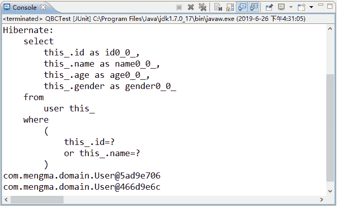
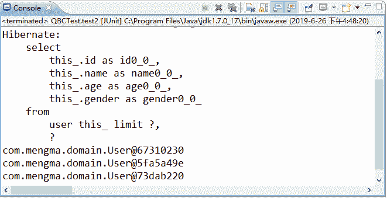

# Hibernate QBC 的检索方式：组合查询和分页查询

> 原文：[`c.biancheng.net/view/4219.html`](http://c.biancheng.net/view/4219.html)

前面我们已经详细介绍过 Criteria 接口的功能及使用步骤，并通过示例演示了条件查询，接下来将对 QBC 中的其他两种常用的检索方式进行讲解。

## 组合查询

组合查询是指通过 Restrictions 工具类的相应方法动态地构造查询条件，并将查询条件加入 Criteria 对象，从而实现查询功能。

下面通过具体案例演示如何实现 QBC 检索中的组合查询。在 com.mengma.test 包下，创建一个名为 QBCTest 的类，在该类下添加一个 test1() 方法，该方法用于查询 id 为 3 或者 name 为 wangwu 的用户信息，如下所示。

```

package com.mengma.test;

import java.util.List;

import org.hibernate.Criteria;
import org.hibernate.Session;
import org.hibernate.criterion.Criterion;
import org.hibernate.criterion.Restrictions;
import org.junit.Test;

import com.mengma.domain.HibernateUtils;
import com.mengma.domain.User;

public class QBCTest {
    // 组合查询
    @Test
    public void testl() {
        Session session = HibernateUtils.getSession();
        session.beginTransaction();
        Criteria criteria = session.createCriteria(User.class);
        Criterion criterion = Restrictions.or(Restrictions.eq("id", 3),
                Restrictions.eq("name", "wangwu")); // 设定查询条件
        criteria.add(criterion); // 添加查询条件
        List<User> list = criteria.list(); // 执行查询，返回查询结果
        for (User u : list) {
            System.out.println(u);

        }
        session.getTransaction().commit();
        session.close();
    }
}
```

上述代码中，使用了 Restrictions 对象编写查询条件，并将查询条件加入到了 Criteria 对象中。使用 JUnit 测试运行 test1() 方法，运行成功后，控制台的输出结果如图 1 所示。


图 1  输出结果
从图 1 的显示结果中可以看出，符合查询条件的记录共有两条。

需要注意的是，QBC 检索是使用 Restrictions 对象编写查询条件的，上述代码中的 Restrictions.or 方法类似于 SQL 语句中的 or 关键字，Restrictions.eq 方法类似于 SQL 语句中的等于。除了这两个方法以外，在 Restrictions 类中还提供了大量的静态方法创建查询条件，如表 1 所示。

表 1 Restrictions 类提供的方法

| 方法名 | 说   明 |
| --- | --- |
| Restrictions.allEq | 使用 Map 和 key/value 进行多个等于的比较 |
| Restrictions.gt  | 大于 > |
| Restrictions.ge | 大于等于 >= |
| Restrictions.lt | 小于 |
| Restrictions.le | 小于等于 <= |
| Restrictions.between | 对应 SQL 的 between 子句 |
| Restrictions.like | 对应 SQL 的 like 子句 |
| Restrictions.in | 对应 SQL 的 IN 子句 |
| Restrictions.and | and 关系 |
| Restrictions.sqlRestriction | SQL 限定查询 |

## 分页查询

除了使用 HQL 可以实现分页功能以外，还可以通过 QBC 实现分页。在 Criteria 对象中，通过 setFirstResult(int firstResult) 和 setMaxResult(int maxResult) 两个方法就可以实现分页查询。

下面通过一个具体示例演示如何使用 QBC 检索实现分页。在 QBCTest 类中添加一个名为 test2() 的方法，具体代码如下所示：

```

// 分页查询
@Test
public void test2() {
    Session session = HibernateUtils.getSession(); // 得到一个 Session
    session.beginTransaction();
    Criteria criteria = session.createCriteria(User.class); // 创建 criteria 对象
    criteria.setFirstResult(1); // 从第 2 条开始查询
    criteria.setMaxResults(3); // 查询 3 条数据
    List<User> list = criteria.list(); // 执行查询，返回查询结果
    for (User u : list) {
        System.out.println(u);
    }
    session.getTransaction().commit();
    session.close();
}
```

在上述代码中，使用 setFirstResult(int firstResult) 方法指定从哪个对象开始检索，这里是从第 2 条开始的，所以索引值为 1。使用 setMaxResult(int maxResult) 方法指定一次最多检索对象的数量为 3，所以会查询出 3 条数据。

使用 JUnit 测试运行 test2() 方法，运行成功后，控制台的输出结果如图 2 所示。


图 2  输出结果