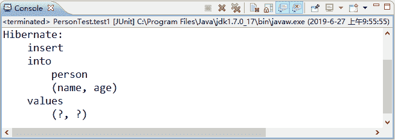
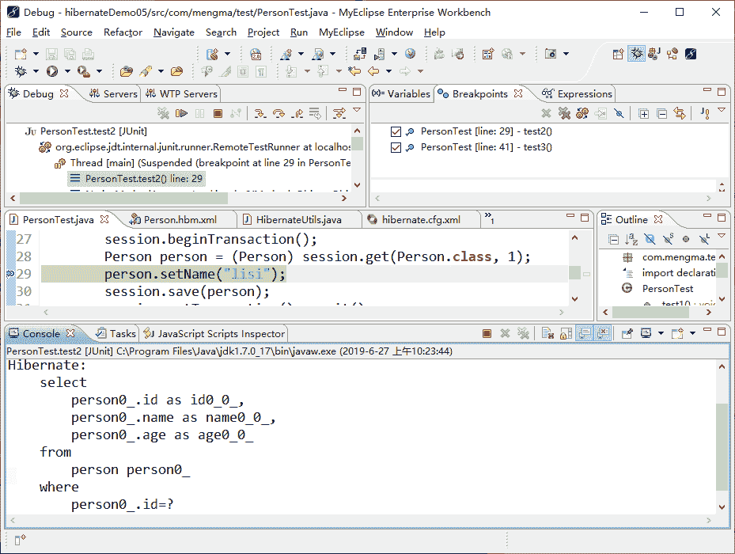
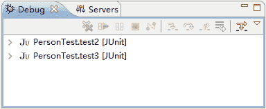
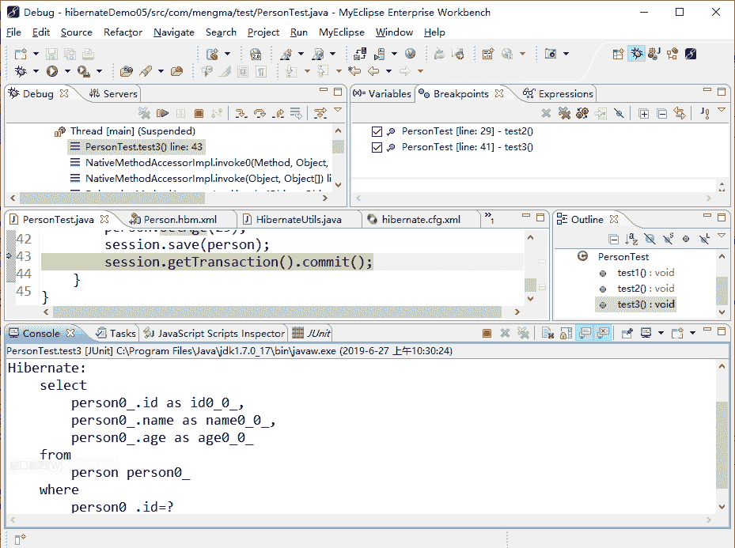

# Hibernate 悲观锁（pessimistic lock）实例详解

> 原文：[`c.biancheng.net/view/4225.html`](http://c.biancheng.net/view/4225.html)

悲观锁（pessimistic lock）是指在每次操作数据时，总是悲观地认为会有其他事务操作同一数据，因此，在整个数据处理过程中，会把数据处于锁定状态。

悲观锁具有排他性，一般由数据库实现。在锁定时间内，其他事务不能对数据进行存取等操作，这可能导致长时间的等待问题。

在 Hibernate 中，用户可以显示地设定锁模式，通常在应用中会设定如下两种锁模式。

#### 1）LockMode.UPGRADE

该模式不管缓存中是否存在对象，总是通过 select 语句到数据库中加载该对象，如果映射文件中设置了版本元素，则执行版本检查，比较缓存中的对象是否与数据库中对象的版本一致，如果数据库系统支持悲观锁（如 MySQL），则执行 select...for update 语句，如果不支持（如 Sybase），则执行普通 select 语句。

#### 2）LockMode.UPGRADE_NOWAIT

该模式与 LockMode.UPGRADE 具有同样的功能，是 Oracle 数据库特有的锁模式，会执行 select...for update nowait 语句。

nowait 表示如果执行 select 语句的事务不成立则获得悲观锁，它不会等待其他事务释放锁，而是立刻抛出锁定异常。

下面通过丢失更新的案例演示悲观锁的使用。

#### 1\. 创建项目并引入 JAR 包

在 MyEclipse 中创建一个名称为 hibernateDemo05 的 Web 项目，将 Hibernate 所必需的 JAR 包添加到 lib 目录中，并发布到类路径下。

#### 2\. 创建实体类

在 src 目录下创建一个名为 com.mengma.domain 的包，在该包下创建一个 Person 类，定义 id、name 和 age 三个属性，并实现各属性的 getter 和 setter 方法以及 toString() 方法，如下所示。

```

package com.mengma.domain;

public class Person {
    private Integer id;
    private String name; // 姓名
    private Integer age; // 年龄

    public Integer getId() {
        return id;
    }

    public void setId(Integer id) {
        this.id = id;
    }

    public String getName() {
        return name;
    }

    public void setName(String name) {
        this.name = name;
    }

    public Integer getAge() {
        return age;
    }

    public void setAge(Integer age) {
        this.age = age;
    }

}
```

#### 3\. 创建映射文件

在 com.mengma.domain 包中创建一个名为 Person.hbm.xml 的映射文件，将实体类 Person 映射到数据表中，如下所示。

```

<?xml version="1.0" encoding="UTF-8"?>
<!DOCTYPE hibernate-mapping PUBLIC "-//Hibernate/Hibernate Mapping DTD 3.0//EN"
"http://hibernate.sourceforge.net/hibernate-mapping-3.0.dtd">
<hibernate-mapping>
    <class name="com.mengma.domain.Person" table="person">
        <id name="id" column="id">
            <generator class="native" />
        </id>
        <property name="name" column="name" type="string" />
        <property name="age" column="age" type="integer" />
    </class>
</hibernate-mapping>
```

#### 4\. 创建配置文件

在 src 目录下创建一个名为 hibernate.cfg.xml 的配置文件，该文件中包含数据库的连接信息，以及关联的映射文件信息等，如下所示。

```

<?xml version="1.0" encoding="UTF-8"?>
<!DOCTYPE hibernate-configuration PUBLIC
          "-//Hibernate/Hibernate Configuration DTD 3.0//EN"
          "http://hibernate.sourceforge.net/hibernate-configuration-3.0.dtd">
<hibernate-configuration>
<session-factory>
  <!-- 指定方言 -->
  <property name="dialect">
   org.hibernate.dialect.MySQL5Dialect
  </property>
  <!-- 链接数据库 url -->
  <property name="connection.url">
              <![CDATA[jdbc:mysql://localhost:3306/hibernate?useUnicode=true&characterEncoding=utf-8]]>
  </property>
  <!-- 连接数据库的用户名 -->
  <property name="connection.username">
   root
  </property>
  <!-- 数据库的密码 -->
  <property name="connection.password">
   1128
  </property>
  <!-- 数据库驱动 -->
  <property name="connection.driver_class">
   com.mysql.jdbc.Driver
  </property>
  <!-- 显示 sql 语句 -->
  <property name="show_sql">
   true
  </property>
  <!-- 格式化 sql 语句 -->
  <property name="format_sql">true</property>
  <!-- 映射文件配置 -->
  <mapping resource="com/mengma/domain/Person.hbm.xml" />
</session-factory>
</hibernate-configuration>
```

#### 5\. 创建工具类

在 src 目录下创建一个名为 com.mengma.utils 的包，并在该包下创建一个名为 HibernateUtils 的工具类，该工具类的实现代码如下所示。

```

package com.mengma.utils;

import org.hibernate.Session;
import org.hibernate.SessionFactory;
import org.hibernate.cfg.Configuration;

public class HibernateUtils {
    // 声明一个私有的静态 final 类型的 Configuration 对象
    private static final Configuration config;
    // 声明一个私有的静态的 final 类型的 SessionFactory 对象
    private static final SessionFactory factory;
    // 通过静态代码块构建 SessionFactory
    static {
        config = new Configuration().configure();
        factory = config.buildSessionFactory();
    }

    // 提供一个公有的静态方法供外部获取，并返回一个 session 对象
    public static Session getSession() {
        return factory.openSession();
    }
}
```

#### 6\. 创建测试类

在 src 目录下创建一个名为 com.mengma.test 的包，在该包下创建一个名为 PersonTest 的类。在类中编写一个 test1()方法，用于添加一条记录，并检查项目是否可以正常运行。然后再分别编写一个 test2() 方法和 test3() 方法，其中 test2() 方法用于修改 name 属性，test3() 方法用于修改 age 属性。其具体实现代码如下所示。

```

package com.mengma.test;

import org.hibernate.Session;
import org.junit.Test;

import com.mengma.domain.Person;
import com.mengma.utils.HibernateUtils;

public class PersonTest {
    // 添加数据
    @Test
    public void test1() {
        Session session = HibernateUtils.getSession();
        session.beginTransaction();
        Person person = new Person();
        person.setName("zhangsan");
        person.setAge(20);
        session.save(person);
        session.getTransaction().commit();
        session.close();
    }

    // 修改 name 屈性
    @Test
    public void test2() {
        Session session = HibernateUtils.getSession();
        session.beginTransaction();
        Person person = (Person) session.get(Person.class, 1);
        person.setName("lisi");
        session.save(person);
        session.getTransaction().commit();
        session.close();
    }

    // 修改 age 属性
    @Test
    public void test3() {
        Session session = HibernateUtils.getSession();
        session.beginTransaction();
        Person person = (Person) session.get(Person.class, 1);
        person.setAge(25);
        session.save(person);
        session.getTransaction().commit();
    }
}
```

#### 7\. 运行程序并查看结果

使用 JUnit 测试运行 test1() 方法，运行成功后，控制台的显示结果如图 1 所示。


图 1  输出结果
从图 1 中可以看出，使用 Hibernate 已经成功向 person 表中添加数据，说明项目可以正常运行。接下来在 PersonTest 的第 29 行和第 41 行分别设置一个断点，然后采用 Debug 模式运行 test2() 方法，MyEclipse 的显示如图 2 所示。


图 2  调试 test2() 方法
从图 2 中可以看出，程序代码已经停在了第 29 行，接下来按 F6 键，使代码依次向下执行，在第 30 行代码处（提交事务前）停止运行。然后以同样的方式运行 test3() 方法，这时代码会停在第 41 行。

由于同时运行了两个方法，但是在 MyEclipse 中，当前窗口只能显示一个运行方法，所以需要手动单击需要显示的方法。此时可以在窗口左上方的 Debug 窗口中看到 test2() 和 test3() 方法，如图 3 所示。


图 3  Debug 窗口
单击展开图 3 中的 PersonTest.test3[JUnit] 后，再次单击 Thread[main]（Suspended）下面的 PersonTest.test3() 即可进入 test3() 方法的 Debug 调试模式。按 F6 键依次向下执行代码，直到第 38 行代码处停止运行，如图 4 所示。


图 4  调试 test3()方法
接下来，单击展开图 4 中的 PersonTest.test2[JUnit]，回到 test2() 方法，并单击 Debug 窗口上方的 `` 按钮，使 MyEclipse 自动运行完后面的代码。此时 Debug 窗口上方的按钮会变成灰色的不可操作状态。再次回到 test3() 方法，以同样的方式执行完 test3() 方法。此时查询 person 表数据时，其查询结果如图 5 所示。


图 5  查询结果
从图 5 中可以看出，此时 person 表中的数据已经发生了变化。Test2() 提交后，name 字段变为 lisi，但是 test3() 方法提交后，会将 test2() 方法提交的数据覆盖，导致 name 字段变回了原来的 zhangsan，而 age 字段被修改为 25，这就是并发访问数据时的数据丢失。

要解决这一问题，只需在 test2() 和 test3() 方法的 Person person=(Person)session.get(Person.class，1) 中加入 LockMode.UPGRADE 参数即可，具体实现代码如下所示：

Person person=(Person)session.get(Person.class,1,LockMode.UPGRADE);

此时再次通过 Debug 调试运行 test2() 和 test3() 方法，就不会出现数据丢失的情况了，这是因为使用了 Hibernate 的悲观锁模式，当某条数据被锁定时，其他方法无法对此条数据进行操作，直到事务提交后才会被解锁，这时其他方法才可以对这条数据进行操作。