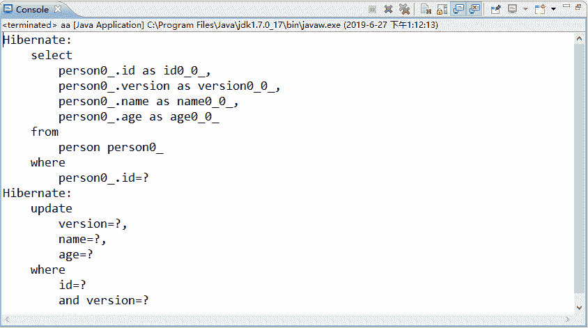

# Hibernate 乐观锁（optimistic lock）实例详解

> 原文：[`c.biancheng.net/view/4226.html`](http://c.biancheng.net/view/4226.html)

相对于悲观锁而言，乐观锁（optimistic lock）通常认为多个事务同时操作同一数据的情况很少发生，因此乐观锁不进行数据库层次上的锁定，而是基于数据版本（Version）标识实现应用程序级别上的锁定机制，这既能保证多个事务的并发操作，又能有效防止第二类丢失更新的发生。

数据版本标识是通过为数据表增加一个 version 字段实现的。增加 version 字段后，程序在读取数据时，会将版本号一同读出，之后在更新此数据时，会将此版本号加一。

在提交数据时，将现有的版本号与数据表对应记录的版本号进行对比，如果提交数据的版本号大于数据表中的版本号，则允许更新数据，否则禁止更新数据。

本节案例在《Hibernate 悲观锁》教程的案例的基础上修改，演示基于 Version 乐观锁的使用。具体实现步骤如下。

#### 1\. 修改表结构

在 person 表中增加一个 version 字段，并在 version 字段插入一条数据 1，修改表结构和表中数据的 SQL 语句如下所示：

```

ALTER TABLE person ADD VERSION INT(10);
UPDATE person SET version = 1;
UPDATE person SET age = 20;
```

修改后，person 表中的数据如图 1 所示。
图 1  修改后的 person 表

#### 2\. 修改实体类 Person

在 Person 类中添加一个 Integer 类型的 version 属性，并提供相应的 getter 和 setter 方法。

#### 3\. 修改映射文件 Person.hbm.xml

在 Person.hbm.xml 中添加一个 <version> 标签元素，该元素用于将 Person 类的 version 属性和 person 表的 version 字段进行映射，具体如下所示。

```

<?xml version="1.0" encoding="UTF-8"?>
<!DOCTYPE hibernate-mapping PUBLIC "-//Hibernate/Hibernate Mapping DTD 3.0//EN"
"http://hibernate.sourceforge.net/hibernate-mapping-3.0.dtd">
<hibernate-mapping>
<class name="com.mengma.domain.Person" table="person">
  <id name="id" column="id">
   <generator class="native" />
  </id>
  <!-- Person 类中的 version 属性与 person 表中的 version 字段进行关联映射 -->
  <property name="version" column="version" type="integer" />
  <property name="name" column="name" type="string" />
  <property name="age" column="age" type="integer" />
</class>
</hibernate-mapping>
```

需要注意的是，<version> 标签必须位于 <id> 标签之后，否则该文件会报错。

#### 4\. 运行程序并测试结果

同样在 PersonTest（《Hibernate 悲观锁》教程实例中 PersonTest.java） 的第 29 行和第 41 行代码处添加断点，使用《Hibernate 悲观锁》教程中的 Debug 调试模式运行 test2() 方法和 test3() 方法，执行完 test3() 方法后，控制台的输出结果如图 2 所示。


图 2  运行结果
从图 2 的 where 子句中可以看出，Hibernate 的乐观锁是以 id 和 version 决定更新对象的。当 test2() 方法和 test3() 方法执行修改操作未提交时，所查询出的 version 值都是 1，当 test2() 方法先提交后，其数据库中的 version 值就会变为 2。

此时 test3() 方法再执行提交时，会先将之前获取到的 version 值与现状数据库中的 version 值相匹配，由于 id 为 1 的 person 记录的版本号已被 test2() 方法中的事务修改，因此找不到匹配的记录，并且会抛出异常 org.hibernate.StaleObjectStateException。


图 3  修改后的 person 表数据
从图 3 中可以看到，person 表中的 name 字段已修改为 lisi，并且 version 字段的值变为 2，由此可知，test2() 方法已将数据修改成功，这就是 Hibernate 乐观锁的原理和机制。

需要注意的是，在实际应用中应该捕获 org.hibernate.StaleObjectStateException 异常，然后通过自动回滚事务或者通知用户的方式进行相应处理。