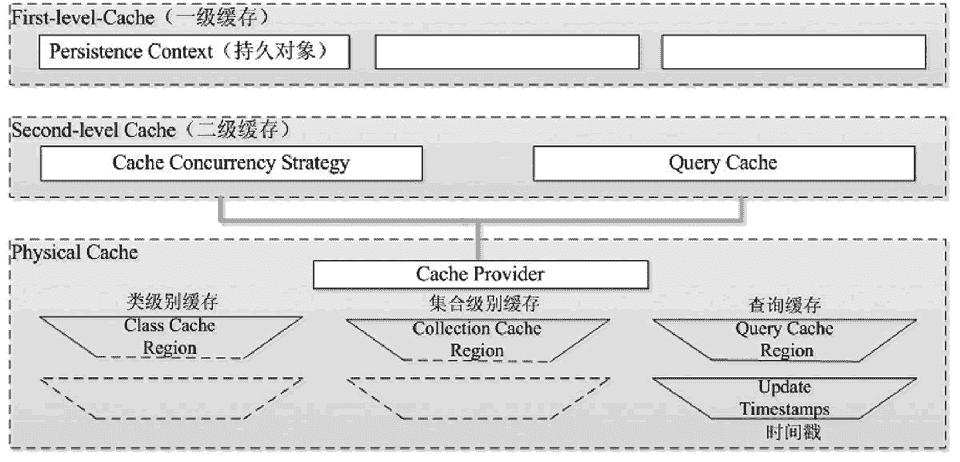

# Hibernate 二级缓存详解

> 原文：[`c.biancheng.net/view/4231.html`](http://c.biancheng.net/view/4231.html)

Hibernate 提供了一级缓存和二级缓存两种缓存。一级缓存是 Session 级别的缓存，它是属于事务范围的缓存，这一级别的缓存由 Hibernate 管理，一般情况下无须进行干预。二级缓存是 SessionFactory 级别的缓存，它是属于进程范围的缓存，这一级别的缓存可以进行配置和更改，以及动态地加载和卸载，它是由 SessionFactory 负责管理的。

二级缓存与一级缓存一样，也是根据对象的 ID 加载和缓存数据的。当执行某个查询获得的结果集为实体对象时，Hibernate 就会把获得的实体对象按照 ID 加载到二级缓存中。

在访问指定的对象时，首先从一级缓存中查找，找到就直接使用，找不到则转到二级缓存中查找（必须配置和启用二级缓存）。如果在二级缓存中找到，就直接使用，否则会查询数据库，并将查询结果根据对象的 ID 放到一级缓存和二级缓存中。

SessionFactory 中的缓存可以分为两类，具体如下。

#### 1）内置缓存

Hibernate 自带的只读属性的缓存，不可以被卸载。通常在 Hibernate 的初始化阶段会把映射的元数据和预定义的 SQL 语句放到 SessionFactory 的缓存中，映射元数据是映射文件中数据的复制，而预定义 SQL 语句是 Hibernate 根据映射元数据推导出来的。

#### 2）外置缓存（二级缓存）

一个可配置的缓存插件。在默认情况下，SessionFactory 不会启用这个缓存插件，外置缓存中的数据是数据库数据的复制，外置缓存的物理介质可以是内存或硬盘。

Hibernate 中的二级缓存可以分为四类，分别为类级别的缓存、集合级别的缓存、查询缓存和更新时间戳。二级缓存的内部结构如图 1 所示。
图 1  二级缓存的内部结构
图 1 展示了二级缓存的内部结构，关于图 1 中的四类缓存的介绍如下表所示。

| 名称 | 说明 |
| --- | --- |
| Class Cache Region | 类级别的缓存，主要用于存储 PO（实体）对象。 |
| Collection Cache Region | 集合级别的缓存，用于存储集合数据。 |
| Query Cache Region | 查询缓存，会缓存一些常用查询语句的查询结果。 |
| Update Timestamps | 更新时间戳缓存，该区域存放了与查询结果相关的表在进行插入、更新或删除操作的时间戳，Hibernate 通过更新时间戳缓存区域判断被缓存的查询结果是否过期。 |