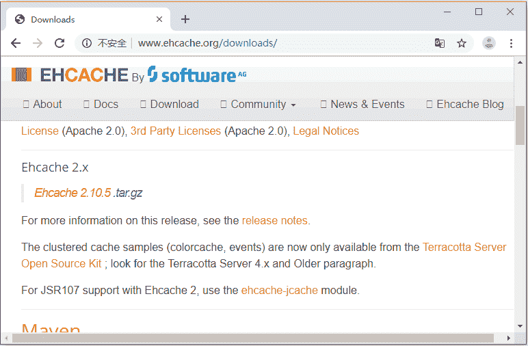
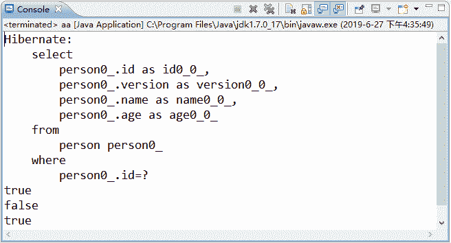

# Hibernate 整合 EHCache 插件实现二级缓存

> 原文：[`c.biancheng.net/view/4235.html`](http://c.biancheng.net/view/4235.html)

在《Hibernate 二级缓存的并发访问策略和常用插件》教程介绍的几种常用的二级缓存插件中，EHCache 缓存插件是理想的进程范围的缓存插件。本小节将以 EHCache 缓存插件为例，介绍二级缓存的配置和使用。本节在教程前几节实例的基础上进行整合，具体步骤如下：

#### 1\. 引入 EHCache 相关的 JAR 包

读者可以从官方网址 [`www.ehcache.org/downloads/`](http://www.ehcache.org/downloads/) 中下载 EHCache 的 JAR 包，成功访问后的页面显示如图 1 所示。


图 1  EHCache 的下载
从图 1 中可以看出，目前 EHCache 的最新版本为 ehcache-3.7，本教程使用的是 ehcache-2.10.5，单击图中 Ehcache 2.x 下方的链接，即可下载此版本的 EHCache。下载并解压后，在压缩包文件中找到 ehcache-2.10.5.jar，将其复制到 hibernateDemo05 项目的 lib 目录中，并发布到类路径下即可。

#### 2\. 引入 EHCache 的配置文件 ehcache.xml

读者可以直接从 Hibernate 的解压包的 hibernate-distribution-3.6.10.Final\project\etc 目录中找到 ehcache.xml，找到后，将此文件复制到项目的 src 目录下。ehcache.xml 文件中的主要代码如下所示：

```

<?xml version="1.0" encoding="UTF-8"?>
<ehcache xmlns:xsi="http://www.w3.org/2001/XMLSchema-instance"
    xsi:noNamespaceSchemaLocation="http://ehcache.org/ehcache.xsd"
    updateCheck="false">
    <diskStore path="java.io.tmpdir/Tmp_EhCache" />
    <defaultCache
        eternal="false"
        maxElementsInMemory="10000"
        overflowToDisk="false"
        diskPersistent="false"
        timeToIdleSeconds="1800"
        timeToLiveSeconds="259200"
        memoryStoreEvictionPolicy="LRU" />

    <cache name="cloud_user"
        eternal="false"
        maxElementsInMemory="5000"
        overflowToDisk="false"
        diskPersistent="false"
        timeToIdleSeconds="1800"
        timeToLiveSeconds="1800"
        memoryStoreEvictionPolicy="LRU" />
</ehcache>
```

在上述配置代码中，各个元素作用如下表所示：

| 名称 | 说明 |
| --- | --- |
| <diskStore>元素 | 用于设置缓存数据文件的存储目录 |
| <defaultCache>元素 | 用于设置缓存的默认数据过期策略。 |
| <cache>元素 | 用于设置具体的命名缓存的数据过期策略。 |
| maxElementsInMemory 属性 | 用于设置缓存对象的最大数目 |
| eternal 属性 | 用于指定是否永不过期，true 为不过期，false 为过期。 |
| timeToIdleSeconds 属性 | 用于设置对象处于空闲状态的最大秒数。 |
| timeToLiveSeconds 属性 | 用于设置对象处于缓存状态的最大秒数。 |
| overflowToDisk 属性 | 用于设置内存溢出时是否将溢出对象写入硬盘。 |

#### 3\. 启用二级缓存

在 Hibernate 的核心配置文件中启用二级缓存，并指定哪些实体类需要存储到二级缓存中。其配置代码如下所示：

```

<property name ="hibernate.cache.use_second_level_cache">true </property>
<property name ="hibernate.cache.provider_class">
    org.hibernate.cache.EhCacheProvider
</property >
<mapping resource ="com/mengma/domain/Person.hbm.xml"/>
<class-cache usage ="read-write" class ="com.mengma.domain.Person"/>
```

在上述配置代码中，hibernate.cache.use_second_level_cache 用于开启二级缓存，hibernate.cache.provider_class 用于指定二级缓存的供应商。

<class-cache> 标签用于指定将哪些数据存储到二级缓存中，其中 usage 属性表示指定缓存策略。需要注意的是，<class-cache> 标签必须放在 <mapping> 标签的后面。

#### 4\. 创建测试类

在 com.mengma.test 包下创建一个名为 SecondEHChcheTest 的测试类，并在类中添加一个 testCache() 方法。在 testCache() 方法中，需要开启两个 Session 对象，然后使用 get() 方法查询四次，通过比较查询结果，观察二级缓存的使用情况。其实现代码如下所示。

```

package com.mengma.test;

import org.hibernate.Session;
import org.hibernate.Transaction;
import org.junit.Test;

import com.mengma.domain.Person;
import com.mengma.utils.HibernateUtils;

public class SecondEHChcheTest {
    @Test
    public void testCache() {
        Session session1 = HibernateUtils.getSession(); // 开启第一个 Session 对象
        Transaction tx1 = session1.beginTransaction(); // 开启第一个事务
        Person p1 = (Person) session1.get(Person.class, 1); // 获取 p1 对象
        Person p2 = (Person) session1.get(Person.class, 1); // 获取 p2 对象
        System.out.println(p1 == p2); // 第一次比较
        tx1.commit(); // 提交事务
        session1.close(); // sesison1 对象关闭，一级缓存被清理
        Session session2 = HibernateUtils.getSession(); // 开启第二个 Session 对象
        Transaction tx2 = session2.beginTransaction();// 开启第二个事务
        Person p3 = (Person) session2.get(Person.class, 1); // 获取 p3 对象
        System.out.println(p1 == p3); // 第二次比较
        Person p4 = (Person) session2.get(Person.class, 1); // 获取 p4 对象
        System.out.println(p3 == p4); // 第三次比较
        tx2.commit(); // 提交事务 2
        session2.close(); // session2 关闭
    }
}
```

#### 5\. 运行程序并查看结果

使用 JUnit 测试运行 testCache() 方法，运行成功后，控制台的输出结果如图 2 所示。


图 2  testCache() 方法的测试结果
从图 2 中可以看到，控制台只输出了一个查询 SQL，这说明 Hibernate 只在数据库中查询了一次。而下面的 true、false 和 true 是三次比较输出的结果。详细解释具体如下。

1）在上述代码中，开启了两个 Session 和事务，从第一个 Session 中获取 p1 对象时，由于一级缓存和二级缓存中没有相应的数据，需要从数据库中查询，所以发出了 SQL 语句。

2）查询出 p1 对象后，p1 对象会保存到一级缓存和二级缓存中。当获取 p2 对象时，因为 Session 没有关闭，所以会从一级缓存中取出该对象。由于 p1 和 p2 对象都保存在一级缓存中，而且指向的是同一实体对象，所以第一次输出结果为 true。

3）接着提交事务 tx1，并关闭 session1，此时一级缓存中的数据会被清除。

4）接下来开启第二个 Session 和事务，获取 p3 对象，此时控制台没有产生 SQL 语句是因为 p3 对象是从二级缓存中获取的。取出后，二级缓存会将数据同步到一级缓存中，这时 p3 对象又在一级缓存中存在了。

5）因为 p3 对象是从二级缓存中获取的，而二级缓存中存储的都是对象的散装数据，它们会重新 new 出一个新的对象，所以第二次输出的结果为 false。

6）最后获取 p4 对象时，由于一级缓存中已经存在了 Person 对象，Hibernate 会直接从一级缓存中获取，所以输出结果为 true。