# Java JDK 下载与安装教程

万事开头难。在了解什么是 Java、Java 语言的特点以及学习方法之后，本节将介绍如何搭建编写 Java 程序所需要的开发环境——JDK（Java Development Kit）。

JDK 是一种用于构建在 Java 平台上发布的应用程序、Applet 和组件的开发环境，即编写 Java 程序必须使用 JDK，它提供了编译和运行 Java 程序的环境。

在安装 JDK 之前，首先要到 Oracle 网站获取 JDK 安装包。JDK 安装包被集成在 Java SE 中，因此下载 Java SE 即可，具体步骤如下。

(1) 在浏览器中输入 www.oracle.com，打开 Oracle 公司的官方网站。在首页的栏目中选择 Downloads 选项，如图 1 所示。

[点此查看原图](http://c.biancheng.net/uploads/allimg/181109/3-1Q109105433127.gif)）
在转向的页面中选择 Java for Developers 选项，如图 2 所示。单击 Java for Developers 超链接，进入 Java SE 的下载页面。

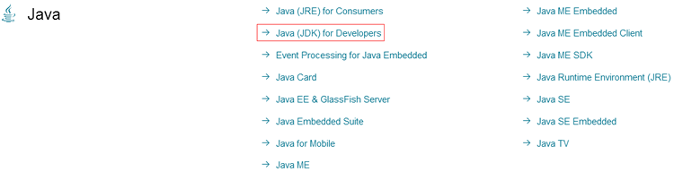
图 2
提示：由于 Java 版本不断更新，当读者浏览 JavaSE 的下载页面时，显示的是当前最新的版本。

(2) 在页面的 JDK 下方单击 DOWNLOAD 按钮，如图 3 所示。在进入的 JDK 下载页面中包括 Windows、Solaris 和 Linux 等平台的不同环境 JDK 的下载链接。

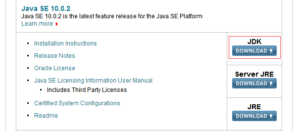
图 3 JDK 的下载页
(3) 在下载之前需要选中 Accept License Agreement 单选按钮，接受许可协议。由于本教程中使用的是 64 位版的 Windows 操作系统，因此这里需要选择与平台相对应的 Windows x64 类型的 jdlo8u92-windows-x64.exe 超链接，对 JDK 进行下载，如图 4 所示。

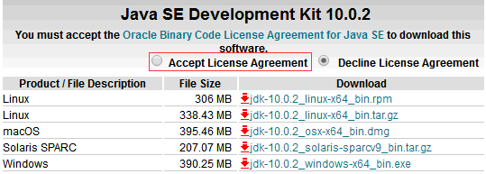
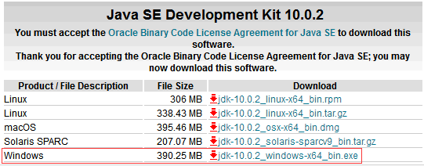图 4 JDK 的下载页面
(4) 下载完成后，在磁盘中会发现一个名称为 jdk-8u92-windows-x64.exe 的可执行文件。双击该文件，打开 JDK 的欢迎界面，如图 5 所示。

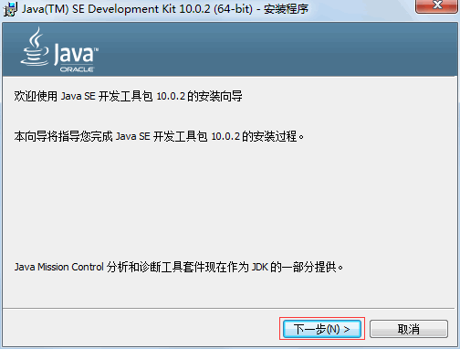
图 5 欢迎界面
(5) 单击“下一步”按钮，打开定制安装对话框。选择安装的 JDK 组件，如图 6 所示。

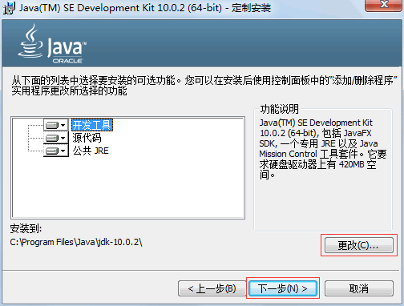
图 6 定制安装对话框
(6) 单击“更改”按钮，可以更改 JDK 的安装路径，如图 7 所示。更改完成之后，单击“下一步”按钮，打开安装进度界面，如图 8 所示。

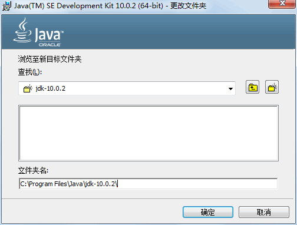
图 7 更改安装位置
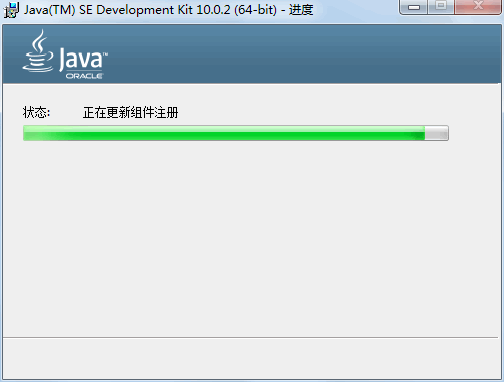
图 8 显示安装进度
(7) 在安装过程中会打开如图 9 所示的目标文件夹对话框，选择 JRE 的安装路径，这里使用默认值。

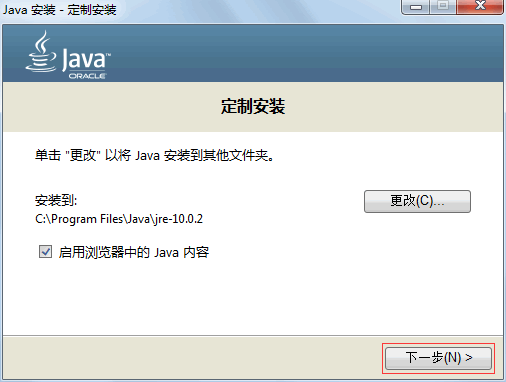
图 9 选择 JRE 安装位置
(8) 单击“下一步”按钮，安装 JRE。当 JRE 安装完成之后，将打开 JDK 安装完成界面，如图 10 所示。

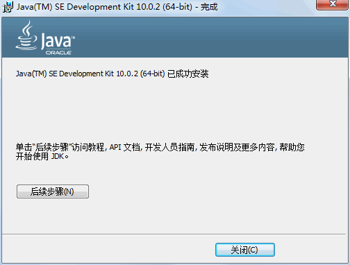
图 10 安装完成
安装完成后，在安装位置打开 JDK 的文件夹，内容和目录结构如图 11 所示。

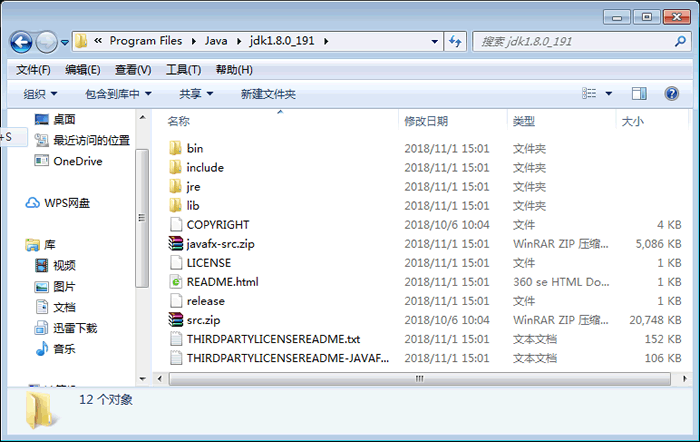
图 11 JDK 安装目录
从图 11 可以看出，JDK 安装目录下具有多个子目录和一些网页文件，其中重要目录和文件的说明如下。

*   `bin`：提供 JDK 工具程序，包括 javac、java、javadoc、appletviewer 等可执行程序。
*   `include`：存放用于本地访问的文件。
*   `jre`：存放 Java 运行环境文件。
*   `lib`：存放 Java 的类库文件，工具程序实际上使用的是 Java 类库。JDK 中的工具程序，大多也由 Java 编写而成。
*   `src.zip`：Java 提供的 API 类的源代码压缩文件。如果需要查看 API 的某些功能是如何实现的，可以査看这个文件中的源代码内容。