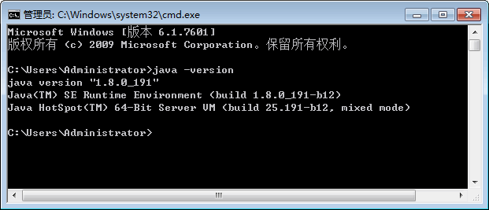
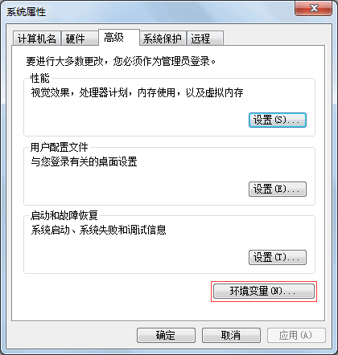
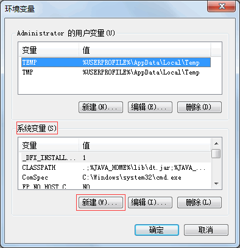
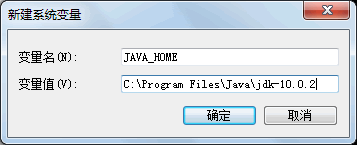
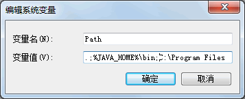

# Java JDK 环境变量配置

JDK 安装和配置完成后，可以测试其是否能够正常运行。选择“开始”|“运行”命令，在打开的“运行”对话框中输入 cmd 命令，按 Enter 键进入到 DOS 环境下。

在命令提示符后输入并执行 java -version 命令，系统如果输出类似图 1 所示的 JDK 版本信息，说明 JDK 已经配置成功。

图 1 查看 JDK 版本
提示：在命令提示符后输入测试命令时，需要注意 java 和减号之间有一个空格，而减号和 version 之间没有空格。

如果没有出现图 1 所示内容，说明 JDK 没有安装成功。另外，一些 Java 程序会通过环境变量搜索 JDK 的路径，使用压缩包安装 JDK 的方式也需要配置环境变量。下面以 Windows 7 系统为例，配置环境变量的具体步骤如下。

(1) 从桌面上右击“计算机”图标，从快捷菜单中选择“属性”命令，在打开的“系统属性”对话框中单击“环境变量”按钮，如图 2 所示。

图 2 “系统属性”对话框
(2) 从弹出的“环境变量”对话框中单击“系统变量”列表框下方的“新建”按钮，如图 3 所示。

图 3 “环境变量”对话框
(3) 此时会弹出“新建系统变量”对话框。在“变量名”文本框中输入 JAVA_HOME，在“变量值”文本框中输入 JDK 的安装路径，图 4 所示。最后单击“确定”按钮，保存 JAVA_HOME 变量。

图 4 新建 JAVA_HOME 系统变量
(4) 在图 3 所示的“系统变量”列表框中双击 Path 变量，进入“编辑系统变量”对话框。在“变量值”文本框的最前端添加`.;％JAVA__HOME%\bin;`内容，如图 5 所示。最后单击“确定”按钮。

图 5 编辑 Path 系统变量
提示：字符串“`.;％JAVA_HOME%\bin;`”中的两个分号是不可缺少的，它们用于分隔多个环境变量。第一个分号前是一个英文状态半角下的句号，表示命令行下的当前目录；第二个分号前则是 JDK 的 bin 目录。