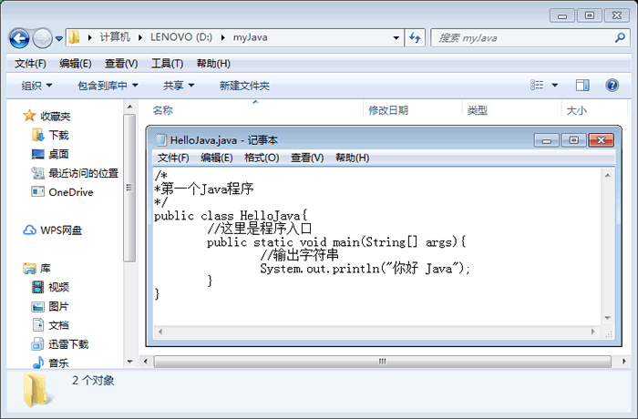
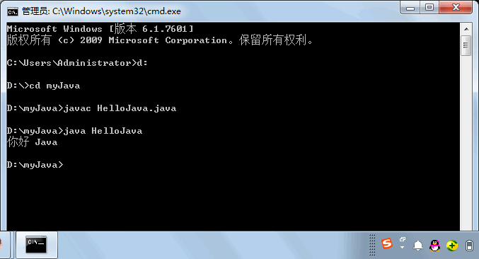
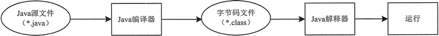
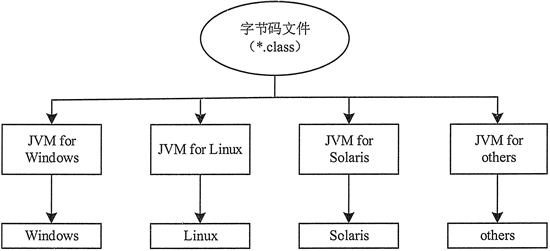

# Java 程序应用实例：“你好 Java”

经过上节的操作已经配置完了 Java 的开发环境，但并不清楚所配置的开发环境是否真的可以运行 Java 应用程序。为了解除这个疑虑，也为了使读者对开发 Java 应用程序的步骤有一个初步的了解，本节将展示一个完整 Java 应用程序的开发过程。

## 编写 Java 源程序

Java 源程序可以使用任何一个文本编辑器来编写，这里以 Windows 下的记事本为例。

#### 例 1

(1) 新建一个空白记事本，然后如实地输入下列内容。

```
/*
*第一个 java 程序
*/
public class HelioJava
{
    //这里是程序入口
    public static void main(String[] args)
    {
        //输出字符串
        System.out.println("你好 Java");
    }
}
```

很多初学者可能不明白此程序的全部意义，没关系，请完全按照实例的样式输入，包括各种括号与标点符号。

下面对源代码中的重要组成元素进行简单介绍。

*   关键字 public 表示访问说明符，表明该类是一个公共类，可以控制其他对象对类成员的访问。
*   关键字 class 用于声明一个类，其后所跟的字符串是类的名称。
*   关键字 static 表示该方法是一个静态方法，允许调用 main() 方法，无须创建类的实例。
*   关键字 void 表示 main() 方法没有返回值。
*   main() 方法是所有程序的入口，最先开始执行。
*   “/*”“*/”之间的内容和以“//”开始的内容为 Java 程序的注释。

(2) 将写完代码后的文件另存为 HelloJava.java，保存类型选择“所有文件”，接着单击“保存”按钮，保存文件到 D:\myjava 文件夹中，如图 1 所示。


图 1 保存 HelloJava.java 文件
提示：保存的文件名中不能出现空格，类似“Hello Java.java”的文件名在编译时会出现找不到文件的錯误。

## 编译和运行

将 Java 源程序编写并保存到文件之后，还需要进行编译才能运行。编译 Java 源程序使用的是 JDK 中的 javac 命令，例如编译上节的 HelloJava.java，完整命令如下。

```
javac HelloJava.java
```

javac HelloJavajava 命令的作用是让 Java 编译器获取 Java 应用程序 HelloJava.java 的源代码，把它编译成符合 Java 虚拟机规范的字节码文件。这时会生成一个新文件 HelioJava.class，此文件便是我们所说的字节码文件，它也是 JVM 上的可执行文件。

运行 Java 程序需要使用 JDK 中的 java 命令，例如运行上步生成的 .class 文件，完整命令如下：

```
java HelloJava
```

具体的执行效果如图 2 所示。


图 2 HelloJava 执行效果

1.  选择“开始”|“运行”命令，打开“运行”对话框后输入 cmd 命令，按 Enter 键进入到 DOS 环境。
2.  输入 d: 按 Enter 键，切换到 Java 源程序所在的 D 盘。
3.  输入 cd myjava 命令，进入 Java 源程序所在的目录，即 d:\myjava。
4.  输入 javac HelloJava.java 命令进行编译，此时如果没有任何其他信息，表示该源程序通过了编译；反之便说明程序中存在错误，必须在记事本中打开 HelloJavajava 文件进行修改，再次保存此文件后回到命令提示符窗口重新编译（可能要反复几次），直到编译通过为止。
5.  输入 java HelloJava 命令执行程序，如果出现“你好 Java”字符，说明程序执行成功。

## 编译常见错误解决方法

在使用 javac 编译器编译源代码文件时，可能会出现下面几个常见问题。

(1) Error:cannot read:HelloJava.java javac。
工具程序找不到指定的 java 文件，需要检查文件是否存储在当前目录中，或文件名是否错误。

(2) HelloJava.java:4:class HelloJava is public,should be declared in a file named MyApplication.java。
源文件中类的名称和源文件名称不符，需要确定源文件名称和类名称是否相同。

(3) HelloJava.java:6:cannot find symbol。
源程序文件中某些代码部分输入错了，最常产生的原因可能是没有注意到字母的大小写。

(4) Javac 不是内部或外部命令、可执行程序或批量文件。
path 设置有误或没有在 path 系统变量中加入 JDK 的 bin 目录。

如果没有出现上述所列问题，即成功编译了该 Java 文件。在解释执行 .dass 文件时，可能会出现下面几个常见问题。

(1) Exception in thread “main” java.lang.NoClassDe£FoundError。
Java 工具程序找不到所指定的 .class 类，需要确定指定的类是否存储在当前目录中，名称是否正确。

(2) Exception in thread “main” java.lang.NoSuchMetliodError:main。
没有指定 Java 程序的入口。Java 工具程序指定的类必须有一个程序入口，也就是必须包括 main(String args[]) 这个方法。

提示：在后面的章节中，如果不是特别强调，就不再重复介绍如何编译与解释执行 Java 程序。

## Java 程序运行流程

从上述案例可以看出，Java 程序的运行必须经过编写、编译和运行 3 个步骤。

1.  编写：是指在 Java 开发环境中进行程序代码的输入，最终形成后缀名为 java 的 Java 源文件。
2.  编译：是指使用 Java 编译器对源文件进行错误排査的过程，编译后将生成后缀名为 .class 的字芾码文件，不像 C 语言那样生成可执行文件。
3.  运行：是指使用 Java 解释器将字节码文件翻译成机器代码，执行并显示结果。

Java 程序运行流程如图 3 所示。


图 3 Java 程序运行流程
字节码文件是一种和任何具体机器环境及操作系统环境无关的中间代码。它是一种二进制文件，是 Java 源文件由 Java 编译器编译后生成的目标代码文件。编程人员和计算机都无法直接读懂字节码文件，它必须由专用的 Java 解释器来解释执行，因此 Java 是一种在编译基础上进行解释运行的语言。

Java 解释器负责将字节码文件翻译成具体硬件环境和操作系统平台下的机器代码，以便执行。因此 Java 程序不能直接运行在现有的操作系统平台上，它必须运行在被称为 Java 虚拟机的软件平台之上。

Java 虚拟机（JVM）是运行 Java 程序的软件环境，Java 解释器是 Java 虚拟机的一部分。在运行 Java 程序时，首先会启动 JVM，然后由它来负责解释执行 Java 的字节码程序，并且 Java 字节码程序只能运行于 JVM 之上。这样利用 JVM 就可以把 Java 字节码程序和具体的硬件平台以及操作系统环境分隔开来，只要在不同的计算机上安装了针对特定平台的 JVM，Java 程序就可以运行，而不用考虑当前具体的硬件平台及操作系统环境，也不用考虑字节码文件是在何种平台上生成的。

JVM 把这种不同软、硬件平台的具体差别隐藏起来，从而实现了真正的二进制代码级的跨平台移植。JVM 是 java 平台架构的基础，Java 的跨平台特性正是通过在 JVM 中运行 Java 程序实现的。Java 的这种运行机制可以通过图 4 来说明。


图 4 JVM 工作方式
Java 语言这种“一次编写，到处运行”的方式，有效地解决了目前大多数高级程序设计语言需要针对不同系统来编译产生不同机器代码的问题，即硬件环境和操作平台的异构问题，大大降低了程序开发、维护和管理的开销。

提示：Java 程序通过 JVM 可以实现跨平台特性，但 JVM 是不跨平台的。也就是说，不同操作系统之上的 JVM 是不同的，Windows 平台之上的 JVM 不能用在 Linux 平台，反之亦然。