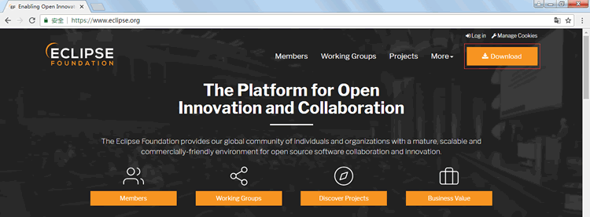
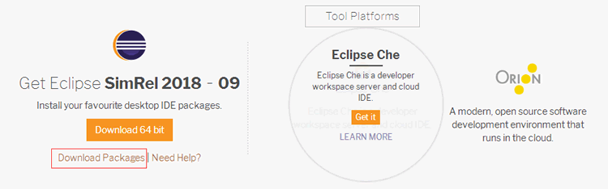
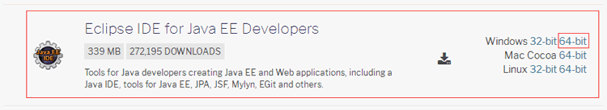
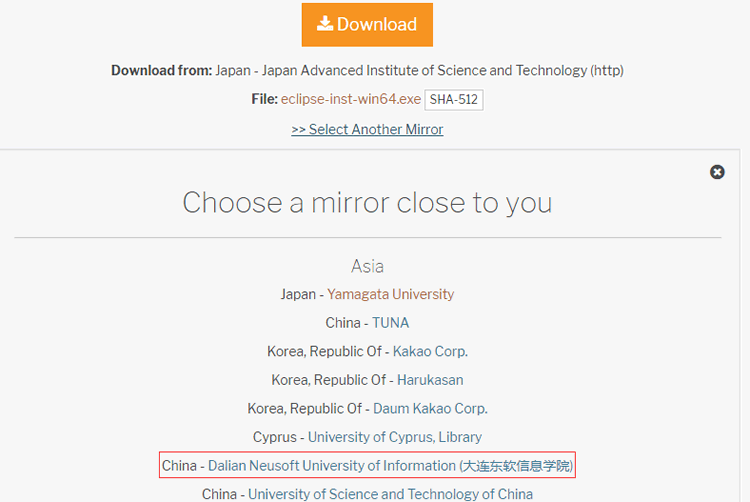
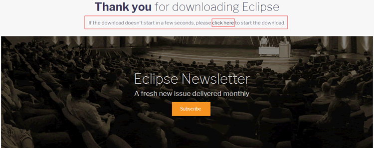
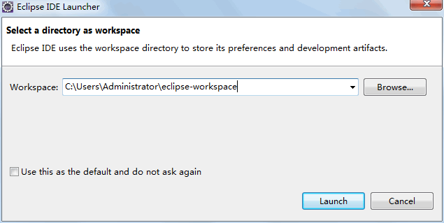
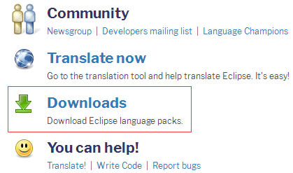
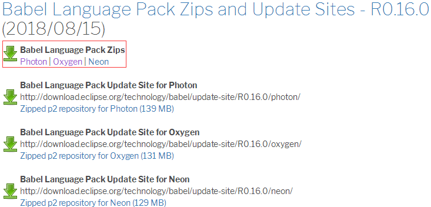
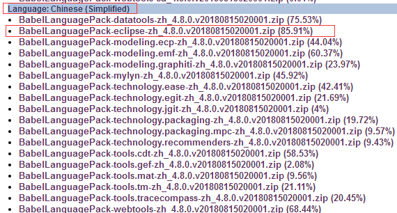

# Java Eclipse 下载安装教程

在《Java 简介：什么是 Java？及 Java 语言的特点》一节中曾提到，学习 Java 语言程序设计必须选择一个功能强大、使用简单，能够辅助程序设计的 IDE。

Eclipse 是目前最流行的 Java 语言开发工具，它强大的代码辅助功能，可以帮助开发人员自动完成语法修正、补全文字、代码修复、API 提示等编码工作，大量节省程序开发所需的时间。

本教程使用 Eclipse 为开发工具，下面介绍它的安装。

(1) Eclipse 是一个开放源代码的项目，其官方网站是 www.eclipse.org。图 1 所示为 Eclipse 官方网站的首页。

图 1 Eclipse 官网首页
(2) 从首页中单击 DOWNLOAD 按钮，进入图 2 所示的页面。

图 2 跳转页面
(3) 点击 Download Packages，进入 Eclipse 下载页面。从 Eclipse IDE for Java EE Developers 后面选择适合当前系统的版本，这里单击 64 bit 按钮，下载 64 位的安装包，如图 3 所示。

图 3 下载 Eclipse
(4) 点击“64-bit”后跳转到“Choose a mirror close to you”界面。点击“Sellect Another Mioor”，选择“大连东软信息学院”，如图 4 所示。

图 4 Choose a mirror close to you 界面
(5) 下载完成后或者下载没有开始，进入如下所示的页面。如果下载没有开始，点击“click here”重新开始下载。

图 5 下载完成
下载完成后会得到一个名为 eclipse_java_mars_2_win32_x86_64.zip 的压缩文件。虽然 Eclipse 本身是用 Java 语言编写，但下载的压缩包中并不包含 Java 运行环境（即安装 Eclipse，应首先安装 JDK），需要用户自己另行安装 JRE，并且要在操作系统的环境变量中指明 JRE 中 bin 的路径。

(6) Eclipse 的安装非常简单，只需将下载的压缩包进行解压，然后双击 eclipse.exe 文件即可。Eclipse 第一次启动时会要求用户选择一个工 作空间（Workspace），如图 6 所示。

图 6 选择 Eclipse 的工作空间
由于 Eclipse 是一个开源项目，因此所有社区和开发者都可以为 Eclipse 开发扩展功能。下面介绍为 Eclipse 安装汉化包的方法。

(7) Eclipse 有一个子项目 Babel，专门负责 Eclipse 程序的多国语言包，其官方网站是 www.eclipse.org/babel，进入后的 Babel 项目首页如图 7 所示。

图 7 Babel 项目首页
(8) 从页面导航中单击 Downloads 链接进入下载页面。在下载页面的 Babel Language Pack Zips 标题下选择对应 Eclipse 版本的超链接下载语言包。前面下载 Eclipse 的安装文件是 eclipse_java_mars_2_win32_x86_64.zip，因此这里单击 Mars 链接，如图 8 所示。

图 8 选择 Eclipse 版本
(9) 在进入的语言选择页面中列出了当前支持的所有语言列表，从中单击 Chinese(Simplified) 链接进入简体中文的下载列表，在这里又针对不同插件和功能分为多个 ZIP 压缩包。从列表中单击 BabelLanguagePack_birt_zh_4.5.0.v20151128060001.zip 链接，下载完整版语言包，如图 9 所示。

图 9 选择简体中文语言包
(10) 下载后会得到 BabelLanguagePack_birt_zh_4.5.0.v20151128060001.zip 文件，将其解压并覆盖 Eclipse\drogins 文件夹中同名的 features 目录和 plugins 目录，这样下次启动 Eclipse 时便会自动加载语言包。

(11) 在工作空间选择页面中，单击“浏览”按钮，将工作空间放到 E:\java_workspace，然后选中“将此值用作缺省值并且不再询问”复选框，再单击“确定”按钮。

(12) 启动 Eclipse，进入 Eclipse 的欢迎界面。选择“帮助”|“关于 Eclipse”命令，可以在弹出的对话框中查看当前 Eclipse 的详细信息。